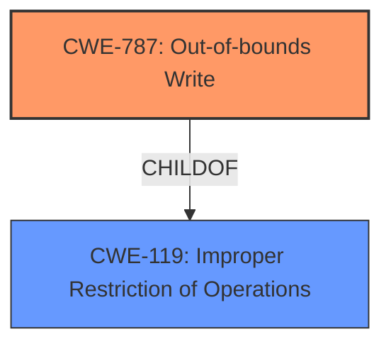

# Raw Analyzer Response for CVE-2021-34448

# Summary
| CWE ID | CWE Name | Confidence | CWE Abstraction Level | CWE Vulnerability Mapping Label | CWE-Vulnerability Mapping Notes |
|---|---|---|---|---|---|
| CWE-787 | Out-of-bounds Write | 1.0 | Base | Primary | Allowed |

## Evidence and Confidence

*   **Confidence Score:** 1.0
*   **Evidence Strength:** HIGH

## Relationship Analysis
The primary CWE is CWE-787, which is a base-level CWE. It is a child of CWE-119 (Improper Restriction of Operations Within the Bounds of a Memory Buffer), indicating a more general class of memory safety issues. No other relationships significantly influenced the selection, as the description clearly points to an out-of-bounds write scenario leading to **memory corruption**.

## Vulnerability Chain
The vulnerability chain is straightforward: the scripting engine contains a flaw that allows for an **out-of-bounds write**, leading to **memory corruption**.

## Summary of Analysis
The analysis is based on the provided evidence, specifically the **Vulnerability Description Key Phrases** which indicates "**weakness:** **memory corruption**" in the **Scripting Engine**. The **CWE for similar CVE Descriptions** section lists CWE-787 as the primary and top CWE. The Retriever Results also strongly support CWE-787 with a score of 1.000.

The relationship analysis confirms that CWE-787 is at the appropriate level of specificity (Base) and is a type of memory safety issue. The provided information is sufficient to confidently map this vulnerability to CWE-787. The "Alternative Terms" for CWE-787 mentions "Memory Corruption" which further confirms the selection.

Relevant CWE Information:

# Enhanced Context (25 CWEs)

## CWE-787: Out-of-bounds Write
**Abstraction:** Base
**Status:** Draft

### Description
The product writes data past the end, or before the beginning, of the intended buffer.

### Extended Description
Not provided

### Alternative Terms
Memory Corruption: Often used to describe the consequences of writing to memory outside the bounds of a buffer, or to memory that is otherwise invalid.

### Relationships
ChildOf -> CWE-119
ChildOf -> CWE-119
ChildOf -> CWE-119
ChildOf -> CWE-119

### Mapping Guidance
**Usage:** Allowed
**Rationale:** This CWE entry is at the Base level of abstraction, which is a preferred level of abstraction for mapping to the root causes of vulnerabilities.
**Comments:** Carefully read both the name and description to ensure that this mapping is an appropriate fit. Do not try to 'force' a mapping to a lower-level Base/Variant simply to comply with this preferred level of abstraction.
**Reasons:**
- Acceptable-Use

### Observed Examples
- **CVE-2023-1017:** The reference implementation code for a Trusted Platform Module does not implement length checks on data, allowing for an attacker to write 2 bytes past the end of a buffer.
- **CVE-2021-21220:** Chain: insufficient input validation (CWE-20) in browser allows heap corruption (CWE-787), as exploited in the wild per CISA KEV.
- **CVE-2021-28664:** GPU kernel driver allows memory corruption because a user can obtain read/write access to read-only pages, as exploited in the wild per CISA KEV.

## Other Considered CWEs:

*   CWE-416: Use After Free was considered but rejected because the description indicates a **memory corruption** issue, not a use-after-free.
*   CWE-125: Out-of-bounds Read was considered but rejected because the description indicates a **memory corruption** issue, which implies a write operation.
*   CWE-415: Double Free was considered but rejected because there is no evidence of double freeing in the description.
*   CWE-123: Write-what-where Condition was considered, but is less specific than CWE-787 which directly addresses out-of-bounds writes.