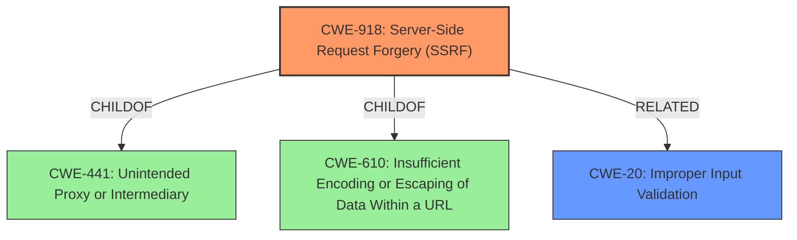

# Raw Analyzer Response for CVE-2021-34473

# Summary
| CWE ID | CWE Name | Confidence | CWE Abstraction Level | CWE Vulnerability Mapping Label | CWE-Vulnerability Mapping Notes |
|---|---|---|---|---|---|
| CWE-918 | Server-Side Request Forgery (SSRF) | 0.9 | Base | Allowed | Primary CWE. The application is making a request to a server based on a URI provided by the user, but it does not properly validate that URI. |
| CWE-20 | Improper Input Validation | 0.6 | Class | Discouraged | Secondary Candidate. The **rootcause** of the vulnerability is **improper input validation** of URIs, but CWE-918 is more specific. |

## Evidence and Confidence

*   **Confidence Score:** 0.8
*   **Evidence Strength:** HIGH

## Relationship Analysis
The primary relationship influencing the decision is that CWE-918, Server-Side Request Forgery, is a specific type of vulnerability that arises due to **improper input validation**. While CWE-20, Improper Input Validation, is a broader class, CWE-918 directly addresses the scenario described in the vulnerability, where a server makes a request to another server based on an improperly validated URI. CWE-918 is also a child of CWE-441 and CWE-610, indicating its relationship to other web-related vulnerabilities.

## Vulnerability Chain
The vulnerability chain starts with the **improper input validation** (CWE-20) of a URI, leading to a Server-Side Request Forgery (CWE-918). The chain culminates in remote code execution (impact).

## Summary of Analysis
The analysis indicates that the primary weakness is CWE-918, Server-Side Request Forgery (SSRF), due to the **improper validation** of URIs within the Autodiscover service of Microsoft Exchange Server. This allows for remote attackers to potentially execute arbitrary code.

The vulnerability description explicitly mentions **improper input validation** as the root cause. The "CVE Reference Links Content Summary" elaborates on this, stating that the vulnerability stems from a lack of proper validation of URIs.

CWE-918 aligns well with these details: "The web server receives a URL or similar request from an upstream component and retrieves the contents of this URL, but it does not sufficiently ensure that the request is being sent to the expected destination."

CWE-20, Improper Input Validation, was considered, but it is a broader, more abstract category. The MITRE mapping guidance discourages using CWE-20 when more specific CWEs are available.

Therefore, CWE-918 is the most appropriate and specific classification, as it directly reflects the SSRF vulnerability resulting from the **improper URI validation**.

Relevant CWE Information:
- CWE-918: Server-Side Request Forgery (SSRF)
- CWE-20: Improper Input Validation