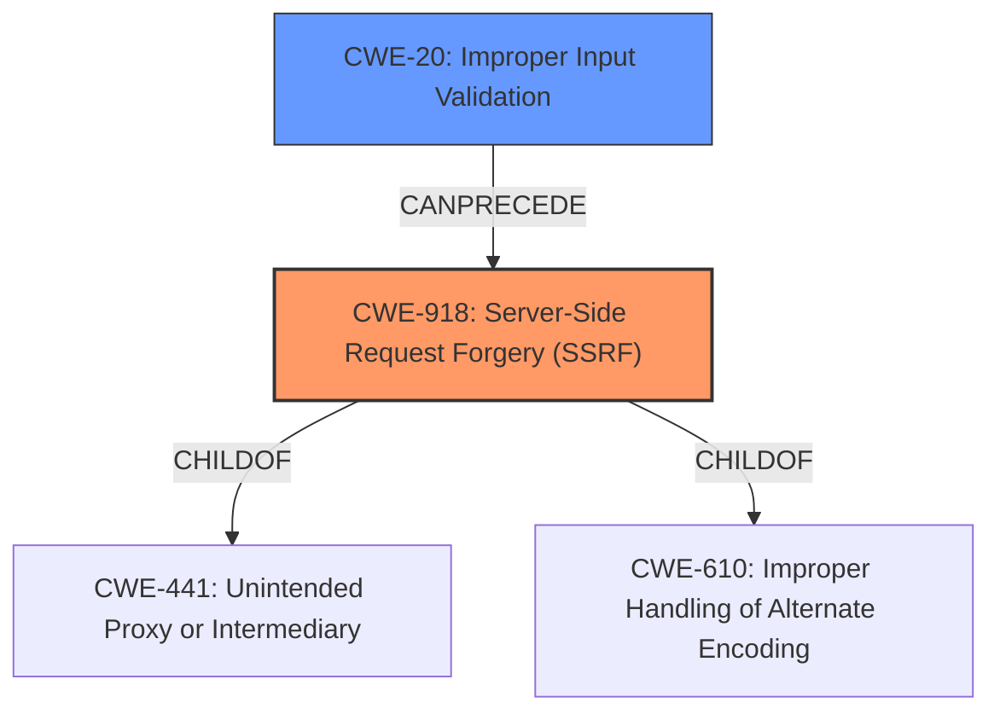

# Analysis Report for CVE-2021-34473

# Vulnerability Analysis Report: CVE-2021-34473

## Description


## Analysis (with Relationship Data)

# Summary
| CWE ID | CWE Name | Confidence | CWE Abstraction Level | CWE Vulnerability Mapping Label | CWE-Vulnerability Mapping Notes |
|---|---|---|---|---|---|
| CWE-918 | Server-Side Request Forgery (SSRF) | 0.9 | Base | Allowed | Primary CWE |
| CWE-20 | Improper Input Validation | 0.7 | Class | Discouraged | Secondary CWE |

## Evidence and Confidence

*   **Confidence Score:** 0.8
*   **Evidence Strength:** HIGH

## Relationship Analysis
The primary CWE is CWE-918, which is a Base level CWE. CWE-918 is related to CWE-441 (Unintended Proxy or Intermediary) and CWE-610 (Improper Handling of Alternate Encoding). CWE-20 is a Class level CWE and parent of more specific CWEs related to input validation. I've chosen CWE-918 as the primary because the description explicitly mentions SSRF and improper URI validation. While CWE-20 is related, it's a broader category and less specific than CWE-918 in this context.



## Vulnerability Chain
The vulnerability chain begins with **improper input validation** (CWE-20) of URIs within the Autodiscover service, leading to a Server-Side Request Forgery (SSRF) vulnerability (CWE-918). This allows remote attackers to execute arbitrary code on affected Microsoft Exchange Server installations.

## Summary of Analysis
The initial assessment identified both CWE-918 and CWE-20 as potential candidates. CWE-918 directly addresses the Server-Side Request Forgery (SSRF) aspect, while CWE-20 covers the **improper input validation** that leads to it. The provided information explicitly mentions both SSRF and **improper URI validation**, making CWE-918 a strong primary candidate.

The decision to include CWE-20 as a secondary CWE acknowledges the **rootcause** of the vulnerability. The vulnerability description key phrases highlights "**improper input validation**" as a **rootcause**, and the CVE Reference Links Content Summary mentions "Improper URI validation."

The final selection of CWE-918 as primary and CWE-20 as secondary reflects the vulnerability's nature and the provided evidence. The relationship graph highlights the connection between the **improper input validation** and the resulting SSRF.

Relevant CWE Information:

# Enhanced Context (25 CWEs)
The following CWEs were identified as potentially relevant to this vulnerability:

## CWE-1289: Improper Validation of Unsafe Equivalence in Input
**Abstraction Level**: Base
**Similarity Score**: 0.78

## CWE-41: Improper Resolution of Path Equivalence
**Abstraction Level**: Base
**Similarity Score**: 0.77

## CWE-74: Improper Neutralization of Special Elements in Output Used by a Downstream Component ('Injection')
**Abstraction Level**: Class
**Similarity Score**: 0.76

## CWE-807: Reliance on Untrusted Inputs in a Security Decision
**Abstraction Level**: Base
**Similarity Score**: 0.76

## CWE-23: Relative Path Traversal
**Abstraction Level**: Base
**Similarity Score**: 0.76

## CWE-184: Incomplete List of Disallowed Inputs
**Abstraction Level**: Base
**Similarity Score**: 0.75

## CWE-138: Improper Neutralization of Special Elements
**Abstraction Level**: Class
**Similarity Score**: 0.75

## CWE-73: External Control of File Name or Path
**Abstraction Level**: Base
**Similarity Score**: 0.74

## CWE-668: Exposure of Resource to Wrong Sphere
**Abstraction Level**: Class
**Similarity Score**: 0.74

## CWE-274: Improper Handling of Insufficient Privileges
**Abstraction Level**: Base
**Similarity Score**: 0.74

## CWE-22: Improper Limitation of a Pathname to a Restricted Directory ('Path Traversal')
**Abstraction Level**: Base
**Similarity Score**: 7418.16

## CWE-23: Relative Path Traversal
**Abstraction Level**: Base
**Similarity Score**: 7091.68

## CWE-88: Improper Neutralization of Argument Delimiters in a Command ('Argument Injection')
**Abstraction Level**: Base
**Similarity Score**: 7078.41

## CWE-116: Improper Encoding or Escaping of Output
**Abstraction Level**: Class
**Similarity Score**: 6957.03

## CWE-502: Deserialization of Untrusted Data
**Abstraction Level**: Base
**Similarity Score**: 6846.79

## CWE-190: Integer Overflow or Wraparound
**Abstraction Level**: base
**Similarity Score**: 4.33

## CWE-22: Improper Limitation of a Pathname to a Restricted Directory ('Path Traversal')
**Abstraction Level**: base
**Similarity Score**: 4.33

## CWE-770: Allocation of Resources Without Limits or Throttling
**Abstraction Level**: base
**Similarity Score**: 4.33

## CWE-79: Improper Neutralization of Input During Web Page Generation ('Cross-site Scripting')
**Abstraction Level**: base
**Similarity Score**: 4.33

## CWE-94: Improper Control of Generation of Code ('Code Injection')
**Abstraction Level**: base
**Similarity Score**: 3.89

## CWE-502: Deserialization of Untrusted Data
**Abstraction Level**: base
**Similarity Score**: 3.64

## CWE-915: Improperly Controlled Modification of Dynamically-Determined Object Attributes
**Abstraction Level**: base
**Similarity Score**: 3.64

## CWE-611: Improper Restriction of XML External Entity Reference
**Abstraction Level**: base
**Similarity Score**: 3.64

## CWE-78: Improper Neutralization of Special Elements used in an OS Command ('OS Command Injection')
**Abstraction Level**: base
**Similarity Score**: 3.57

## CWE-123: Write-what-where Condition
**Abstraction Level**: base
**Similarity Score**: 3.36

**CWE-918: Server-Side Request Forgery (SSRF)**
The web server receives a URL or similar request from an upstream component and retrieves the contents of this URL, but it does not sufficiently ensure that the request is being sent to the expected destination.
*Evidence:* The vulnerability stems from a lack of proper validation of URIs within the Autodiscover service of Microsoft Exchange Server before accessing resources. This aligns with the description of CWE-918, where the server fails to validate the destination of the request.

**CWE-20: Improper Input Validation**
The product receives input or data, but it does not validate or incorrectly validates that the input has the properties that are required to process the data safely and correctly.
*Evidence:* The **rootcause** is **improper input validation**. The Autodiscover service does not properly validate URIs, leading to the vulnerability. This is a high-level classification, but accurate.

**CWEs Considered But Not Used**

*   **CWE-84, Improper Neutralization of Encoded URI Schemes in a Web Page:** While URI encoding might be a factor, the primary issue is the lack of validation of the URI itself, rather than the encoding. Therefore, it is less applicable than CWE-918 and CWE-20.
*   **CWE-502, Deserialization of Untrusted Data:** This is not a deserialization issue. The vulnerability is about making requests to untrusted servers, not deserializing data.
*   **CWE-36, Absolute Path Traversal and CWE-22, Improper Limitation of a Pathname to a Restricted Directory ('Path Traversal'):** These are related to file path manipulation, which is not the primary issue here. The vulnerability concerns network requests.
*   **CWE-94, Improper Control of Generation of Code ('Code Injection'):** While the impact includes code execution, the root cause is not the generation of code, but rather the **improper input validation** leading to SSRF.
*   **CWE-287, Improper Authentication:** While the summary mentions "Authentication Bypass", the root cause is the SSRF from lack of


## CWE Relationship Analysis

Current CWEs represent these abstraction levels: .


### Vulnerability Chain Analysis

**Chain starting from CWE-502:**
- 502 (Deserialization of Untrusted Data) - ROOT


**Chain starting from CWE-36:**
- 36 (Absolute Path Traversal) - ROOT


### CWE Relationship Diagram

```mermaid
graph TD
    classDef primary fill:#f96,stroke:#333,stroke-width:2px
    classDef secondary fill:#69f,stroke:#333
    classDef tertiary fill:#9e9,stroke:#333
```


*Report generated on 2025-04-01 16:17:02*
