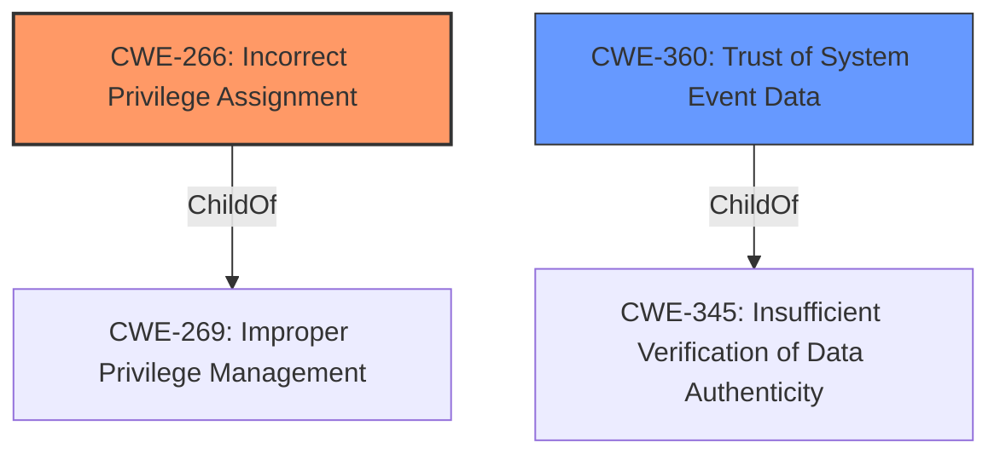

# Enhanced Analysis for CVE-2021-34486

# Summary
| CWE ID | CWE Name | Confidence | CWE Abstraction Level | CWE Vulnerability Mapping Label | CWE-Vulnerability Mapping Notes |
|---|---|---|---|---|---|
| CWE-266 | Incorrect Privilege Assignment | 0.6 | Base | Primary | Allowed |
| CWE-360 | Trust of System Event Data | 0.4 | Base | Secondary | Allowed |

## Evidence and Confidence

*   **Confidence Score:** 0.6
*   **Evidence Strength:** LOW

## Relationship Analysis
The analysis focuses on identifying the root cause of the Elevation of Privilege vulnerability. CWE-266 (Incorrect Privilege Assignment) is chosen as the primary CWE because the vulnerability involves the **incorrect** assignment of privileges, leading to an unintended sphere of control. CWE-360 (Trust of System Event Data) is considered a possible secondary CWE as event data might be the source of the **incorrect** privilege assignment.



## Vulnerability Chain
The vulnerability chain starts with a potential **incorrect** privilege assignment (CWE-266), possibly stemming from trusting system event data (CWE-360), leading to the Elevation of Privilege.

## Summary of Analysis
The analysis is based on the provided evidence, specifically the "Elevation of Privilege" impact and the "Event Tracing" component. The primary CWE, CWE-266, is chosen because it directly addresses the **incorrect** privilege assignment. CWE-360 is a possible secondary CWE, as the vulnerability could be caused by trusting system event data without proper validation. The limited information makes it difficult to provide a higher confidence score.

The selection of CWE-266 is at the optimal level of specificity, as it directly describes the **incorrect** privilege assignment, while CWE-360 suggests a possible cause related to trusting system event data.

Relevant CWE Information:

# Enhanced Context (25 CWEs)

## CWE-59: Improper Link Resolution Before File Access ('Link Following')
CWE-59 was considered but rejected because the vulnerability description does not involve link resolution or file access via links.

## CWE-73: External Control of File Name or Path
CWE-73 was considered but rejected because the vulnerability description does not involve external control of file names or paths.

## CWE-41: Improper Resolution of Path Equivalence
CWE-41 was considered but rejected because the vulnerability description does not involve path equivalence issues.

## CWE-23: Relative Path Traversal
CWE-23 was considered but rejected because the vulnerability description does not involve relative path traversal.

## CWE-427: Uncontrolled Search Path Element
CWE-427 was considered but rejected because the vulnerability description does not involve uncontrolled search paths.

## CWE-665: Improper Initialization
CWE-665 was considered but rejected because the vulnerability description does not explicitly mention improper initialization.

## CWE-212: Improper Removal of Sensitive Information Before Storage or Transfer
CWE-212 was considered but rejected because the vulnerability description does not involve the removal of sensitive information.

## CWE-552: Files or Directories Accessible to External Parties
CWE-552 was considered but rejected because the vulnerability description does not involve making files or directories accessible to external parties.

## CWE-668: Exposure of Resource to Wrong Sphere
CWE-668 was considered but rejected because the vulnerability description does not provide sufficient detail to determine if a resource is exposed to the wrong sphere, and CWE-266 is a better fit.

## CWE-824: Access of Uninitialized Pointer
CWE-824 was considered but rejected because the vulnerability description does not involve uninitialized pointers.

## CWE-1386: Insecure Operation on Windows Junction / Mount Point
CWE-1386 was considered but rejected because the vulnerability description does not involve Windows Junctions or Mount Points.

## CWE-367: Time-of-check Time-of-use (TOCTOU) Race Condition
CWE-367 was considered but rejected because the vulnerability description does not involve a TOCTOU race condition.

## CWE-61: UNIX Symbolic Link (Symlink) Following
CWE-61 was considered but rejected because the vulnerability description does not involve UNIX Symbolic Links.

## CWE-22: Improper Limitation of a Pathname to a Restricted Directory ('Path Traversal')
CWE-22 was considered but rejected because the vulnerability description does not involve path traversal.

## CWE-123: Write-what-where Condition
CWE-123 was considered but rejected because the vulnerability description does not involve an attacker's ability to write arbitrary values to arbitrary locations.

## CWE-416: Use After Free
CWE-416 was considered but rejected because the vulnerability description does not explicitly involve use-after-free conditions.

## CWE-120: Buffer Copy without Checking Size of Input ('Classic Buffer Overflow')
CWE-120 was considered but rejected because the vulnerability description does not explicitly involve buffer overflows.

## CWE-825: Expired Pointer Dereference
CWE-825 was considered but rejected because the vulnerability description does not involve expired pointer dereferences.

## CWE-787: Out-of-bounds Write
CWE-787 was considered but rejected because the vulnerability description does not explicitly involve out-of-bounds writes.

## CWE-1284: Improper Validation of Specified Quantity in Input
CWE-1284 was considered but rejected because the vulnerability description does not explicitly involve improper validation of specified quantities in input.

## CWE-190: Integer Overflow or Wraparound
CWE-190 was considered but rejected because the vulnerability description does not explicitly involve integer overflows or wraparounds.

## CWE-456: Missing Initialization of a Variable
CWE-456 was considered but rejected because the vulnerability description does not explicitly involve missing initialization of a variable.

## CWE-40: Path Traversal: '\\UNC\share\name\' (Windows UNC Share)
CWE-40 was considered but rejected because the vulnerability description does not involve Windows UNC shares.

## CWE-1285: Improper Validation of Specified Index, Position, or Offset in Input
CWE-1285 was considered but rejected because the vulnerability description does not explicitly involve improper validation of indices, positions, or offsets.

## CWE-454: External Initialization of Trusted Variables or Data Stores
CWE-454 was considered but rejected because the vulnerability description does not explicitly involve external initialization of trusted variables or data stores.


## CWE Relationship Analysis

Current CWEs represent these abstraction levels: .


### Vulnerability Chain Analysis

**Chain starting from CWE-787:**
- 787 (Out-of-bounds Write) - ROOT


**Chain starting from CWE-123:**
- 123 (Write-what-where Condition) - ROOT


### CWE Relationship Diagram

```mermaid
graph TD
    classDef primary fill:#f96,stroke:#333,stroke-width:2px
    classDef secondary fill:#69f,stroke:#333
    classDef tertiary fill:#9e9,stroke:#333
```