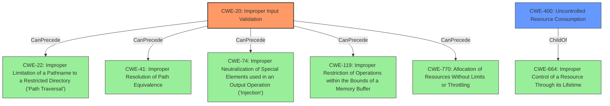

# Enhanced Analysis for CVE-2021-34704

# Summary
| CWE ID  | CWE Name                                                                           | Confidence | CWE Abstraction Level | CWE Vulnerability Mapping Label | CWE-Vulnerability Mapping Notes |
| :-------- | :----------------------------------------------------------------------------------- | :---------- | :----------------------- | :------------------------------ | :-------------------------------- |
| CWE-20   | Improper Input Validation                                                            | 0.9         | Class                     | Primary                        | Discouraged                      |
| CWE-400  | Uncontrolled Resource Consumption                                                  | 0.7         | Class                     | Secondary                      | Discouraged                      |

## Evidence and Confidence

*   **Confidence Score:** 0.8
*   **Evidence Strength:** HIGH

## Relationship Analysis
The primary CWE is CWE-20, which is a class-level CWE. It has child CWEs that could be more specific, but the information available does not point to a specific type of input validation issue. CWE-20 can precede CWE-22, CWE-41, CWE-74, CWE-119, and CWE-770, indicating a potential for downstream vulnerabilities. CWE-400 is also a class-level CWE and a child of CWE-664. It is related to resource management issues, which can be a consequence of **improper input validation**.



## Vulnerability Chain
The vulnerability chain starts with **improper input validation** (CWE-20), which allows a malicious HTTPS request to be processed. This leads to a denial of service (DoS) condition due to the device reloading, which can be seen as uncontrolled resource consumption (CWE-400).

## Summary of Analysis
The initial assessment identified the root cause as **improper input validation** (CWE-20), which aligns with the "Vulnerability Description Key Phrases" and the "CVE Reference Links Content Summary". The impact is a denial-of-service (DoS) condition, which suggests uncontrolled resource consumption (CWE-400) as a secondary weakness.

The evidence explicitly states: "This vulnerability is due to **improper input validation** when parsing HTTPS requests." This directly supports the selection of CWE-20. The consequence, "A successful exploit could allow the attacker to cause the device to reload, resulting in a DoS condition," suggests CWE-400 as a potential secondary weakness.

While CWE-20 is a class-level CWE and discouraged for direct mapping, the provided information does not offer enough detail to specify a more precise variant. The high-level nature of the description limits the ability to pinpoint the exact type of **improper input validation** occurring. However, the DoS condition does lend itself to CWE-400 as a consequence of the **improper input validation**, making it a reasonable, if also high-level, secondary classification.

CWE-787, mentioned in "CWE for similar CVE Descriptions", is not appropriate because there's no evidence of memory corruption. Other retriever results like CWE-617, CWE-119, CWE-1284, CWE-401, CWE-444, CWE-190, CWE-755 and CWE-22 are less relevant given the available information.

Therefore, the selection of CWE-20 as the primary CWE and CWE-400 as a secondary CWE is justified based on the available evidence and the high-level nature of the vulnerability description.


## CWE Relationship Analysis

Current CWEs represent these abstraction levels: .


### Vulnerability Chain Analysis

**Chain starting from CWE-190:**
- 190 (Integer Overflow or Wraparound) - ROOT


**Chain starting from CWE-400:**
- 400 (Uncontrolled Resource Consumption) - ROOT


### CWE Relationship Diagram

```mermaid
graph TD
    classDef primary fill:#f96,stroke:#333,stroke-width:2px
    classDef secondary fill:#69f,stroke:#333
    classDef tertiary fill:#9e9,stroke:#333
```