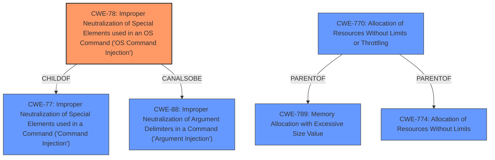

# Analysis for CVE-2021-34735

# Summary
| CWE ID | CWE Name | Confidence | CWE Abstraction Level | CWE Vulnerability Mapping Label | CWE-Vulnerability Mapping Notes |
|---|---|---|---|---|---|
| CWE-78 | Improper Neutralization of Special Elements used in an OS Command ('OS Command Injection') | 1.0 | Base | Allowed | Primary CWE - Matches the vulnerability description and root cause. |
| CWE-770 | Allocation of Resources Without Limits or Throttling | 0.6 | Base | Allowed | Secondary CWE - Root cause of the Denial of Service. |
| CWE-184 | Incomplete List of Disallowed Inputs | 0.4 | Base | Allowed | Secondary CWE - Could explain how the attacker was able to do command injection. |

## Evidence and Confidence

*   **Confidence Score:** 0.8
*   **Evidence Strength:** MEDIUM

## Relationship Analysis
The primary CWE is CWE-78, which is a Base level CWE. It is a child of CWE-77, which is a Class level CWE. CWE-78 is also related to CWE-88 (Improper Neutralization of Argument Delimiters in a Command), which is a peer relationship. This means that CWE-88 could also be a possible classification, but CWE-78 is more specific. The secondary CWE, CWE-770 is a parent to CWE-789 (Memory Allocation with Excessive Size Value) and CWE-774 (Allocation of Resources Without Limits)

## Vulnerability Chain
The vulnerability chain starts with the **improper neutralization** (CWE-78) of special elements in an OS command, leading to **command injection**, which results in remote code execution. Another vulnerability is the **insufficient rate limiting** (CWE-770) of ICMP packets, leading to a denial of service (DoS) condition. A possible further step could be **incomplete list of disallowed inputs** (CWE-184) that allows **command injection**.
  - Root Cause: **Improper Neutralization** (CWE-78) / **Insufficient Rate Limiting** (CWE-770)
  - Weakness: **Command Injection**
  - Impact: Remote Code Execution / Denial of Service (DoS)

## Summary of Analysis
The initial assessment focused on the **command injection** vulnerability, which is directly mentioned in the description. The retriever results and similar CVE descriptions strongly suggest CWE-78 (Improper Neutralization of Special Elements used in an OS Command) as the primary CWE. The CVE Reference Links Content Summary provides additional information about a denial-of-service vulnerability, specifically due to a **lack of proper rate limiting of ICMP packets**.

The selection of CWE-78 is based on the clear indication of **command injection** in the vulnerability description. The retriever results and similar CVE descriptions support this classification. The hierarchical relationships and mapping guidance confirm that CWE-78 is the most specific and appropriate choice.

The addition of CWE-770 is based on the evidence from CVE Reference Links Content Summary of the **lack of proper rate limiting of ICMP packets**. This aligns with the description of CWE-770 as "Allocation of Resources Without Limits or Throttling".

CWE-184 was considered because there might be an incomplete list of disallowed inputs that an attacker could use to inject commands.

The selected CWEs are at the optimal level of specificity because they directly address the root causes of the vulnerabilities described in the advisory. CWE-78 accurately represents the command injection vulnerability, while CWE-770 captures the denial-of-service condition caused by insufficient rate limiting.

Relevant CWE Information:

# Enhanced Context (25 CWEs)
The following CWEs were identified as potentially relevant to this vulnerability:

## CWE-73: External Control of File Name or Path
**Abstraction Level**: Base
**Similarity Score**: 0.80
**Source**: dense

**Description**:
The product allows user input to control or influence paths or file names that are used in filesystem operations.

**Mapping Guidance**:
- Usage: Allowed
- Rationale: This CWE entry is at the Base level of abstraction, which is a preferred level of abstraction for mapping to the root causes of vulnerabilities.

**Why Not Selected:** This is not related to the **command injection** vulnerability described.

## CWE-41: Improper Resolution of Path Equivalence
**Abstraction Level**: Base
**Similarity Score**: 0.80
**Source**: dense

**Description**:
The product is vulnerable to file system contents disclosure through path equivalence. Path equivalence involves the use of special characters in file and directory names. The associated manipulations are intended to generate multiple names for the same object.

**Mapping Guidance**:
- Usage: Allowed
- Rationale: This CWE entry is at the Base level of abstraction, which is a preferred level of abstraction for mapping to the root causes of vulnerabilities.

**Why Not Selected:** This is not related to the **command injection** vulnerability described.

## CWE-23: Relative Path Traversal
**Abstraction Level**: Base
**Similarity Score**: 0.79
**Source**: dense

**Description**:
The product uses external input to construct a pathname that should be within a restricted directory, but it does not properly neutralize sequences such as ".." that can resolve to a location that is outside of that directory.

**Mapping Guidance**:
- Usage: Allowed
- Rationale: This CWE entry is at the Base level of abstraction, which is a preferred level of abstraction for mapping to the root causes of vulnerabilities.

**Why Not Selected:** This is not related to the **command injection** vulnerability described.

## CWE-59: Improper Link Resolution Before File Access ('Link Following')
**Abstraction Level**: Base
**Similarity Score**: 0.78
**Source**: dense

**Description**:
The product attempts to access a file based on the filename, but it does not properly prevent that filename from identifying a link or shortcut that resolves to an unintended resource.

**Mapping Guidance**:
- Usage: Allowed
- Rationale: This CWE entry is at the Base level of abstraction, which is a preferred level of abstraction for mapping to the root causes of vulnerabilities.

**Why Not Selected:** This is not related to the **command injection** vulnerability described.

## CWE-24: Path Traversal: '../filedir'
**Abstraction Level**: Variant
**Similarity Score**: 0.78
**Source**: dense

**Description**:
The product uses external input to construct a pathname that should be within a restricted directory, but it does not properly neutralize "../" sequences that can resolve to a location that is outside of that directory.

**Mapping Guidance**:
- Usage: Allowed
- Rationale: This CWE entry is at the Variant level of abstraction, which is a preferred level of abstraction for mapping to the root causes of vulnerabilities.

**Why Not Selected:** This is not related to the **command injection** vulnerability described.

## CWE-1289: Improper Validation of Unsafe Equivalence in Input
**Abstraction Level**: Base
**Similarity Score**: 0.77
**Source**: dense

**Description**:
The product receives an input value that is used as a resource identifier or other type of reference, but it does not validate or incorrectly validates that the input is equivalent to a potentially-unsafe value.

**Mapping Guidance**:
- Usage: Allowed
- Rationale: This CWE entry is at the Base level of abstraction, which is a preferred level of abstraction for mapping to the root causes of vulnerabilities.

**Why Not Selected:** This is not related to the **command injection** vulnerability described.

## CWE-184: Incomplete List of Disallowed Inputs
**Abstraction Level**: Base
**Similarity Score**: 0.77
**Source**: dense

**Description**:
The product implements a protection mechanism that relies on a list of inputs (or properties of inputs) that are not allowed by policy or otherwise require other action to neutralize before additional processing takes place, but the list is incomplete.

**Mapping Guidance**:
- Usage: Allowed