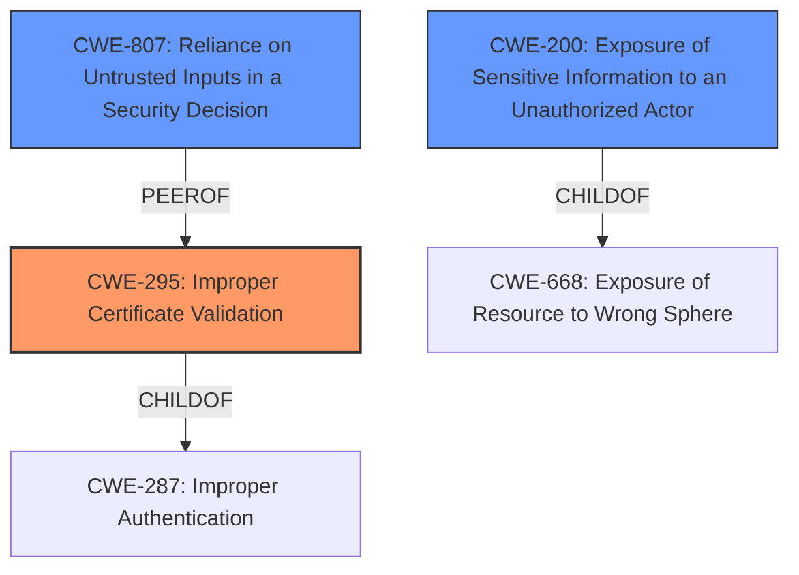

# Raw Analyzer Response for CVE-2021-34749

# Summary
| CWE ID    | CWE Name                                                               | Confidence | CWE Abstraction Level | CWE Vulnerability Mapping Label | CWE-Vulnerability Mapping Notes |
| :--------- | :--------------------------------------------------------------------- | :--------- | :-------------------- | :------------------------------ | :------------------------------ |
| CWE-295     | Improper Certificate Validation                                        | 0.75      | Base                  | Primary                         | Allowed                       |
| CWE-200    | Exposure of Sensitive Information to an Unauthorized Actor           | 0.60       | Class                 | Secondary                       | Discouraged                   |
| CWE-807    | Reliance on Untrusted Inputs in a Security Decision           | 0.50       | Base                 | Secondary                       | Allowed                   |

## Evidence and Confidence

*   **Confidence Score:** 0.70
*   **Evidence Strength:** MEDIUM

## Relationship Analysis
The primary CWE is CWE-295, which is a base level CWE.
CWE-295 is related to CWE-287 (Improper Authentication) as a child.
CWE-200 is a class level CWE and is a child of CWE-668.
CWE-203 is a base level CWE and a child of CWE-200.

## Vulnerability Chain
The vulnerability chain starts with **inadequate filtering of the SSL handshake** (CWE-295), which leads to bypassing filtering technology (CWE-807) and finally to data exfiltration (CWE-200).

## Summary of Analysis
The vulnerability description indicates that the **inadequate filtering of the SSL handshake** is the root cause. The **inadequate inspection of the Server Name Identification (SNI) header in the SSL/TLS handshake** is the root cause from the CVE reference link content summary. This leads to the ability to bypass filtering technology and exfiltrate data.

The primary CWE selected is CWE-295 Improper Certificate Validation because the vulnerability stems from **inadequate filtering of the SSL handshake**. The SSL handshake involves certificate validation, and the description indicates that this process is not being done correctly, leading to the bypass of security measures.

CWE-200 Exposure of Sensitive Information to an Unauthorized Actor is considered as a secondary CWE because the impact of the vulnerability is data exfiltration, which falls under the category of exposing sensitive information. However, CWE-200 is a high-level class and is often misused. The actual weakness lies in the **inadequate filtering**, not necessarily in the exposure itself.

CWE-807 Reliance on Untrusted Inputs in a Security Decision is another secondary CWE. The vulnerability allows an attacker to bypass filtering technology because the system relies on the SSL handshake data, which is essentially an untrusted input, to make security decisions.

The evidence supporting these mappings comes directly from the vulnerability description and the CVE reference links content summary. The description explicitly mentions the **inadequate filtering of the SSL handshake** and the ability to bypass filtering technology and exfiltrate data.

The graph relationships influenced the decision by providing context on how the different CWEs relate to each other. For example, CWE-295 is related to CWE-287 (Improper Authentication), which highlights the importance of proper authentication in security.

The selected CWEs are at the optimal level of specificity because they directly address the root cause and the immediate impact of the vulnerability. CWE-295 captures the **inadequate filtering of the SSL handshake**, while CWE-200 and CWE-807 capture the impact of data exfiltration and the reliance on untrusted inputs, respectively.

Relevant CWE Information:

# Enhanced Context (25 CWEs)
The following CWEs were identified as potentially relevant to this vulnerability:

## CWE-1289: Improper Validation of Unsafe Equivalence in Input
**Abstraction Level**: Base
**Similarity Score**: 0.75
**Source**: dense

**Description**:
The product receives an input value that is used as a resource identifier or other type of reference, but it does not validate or incorrectly validates that the input is equivalent to a potentially-unsafe value.

**Mapping Guidance**:
- Usage: Allowed
- Rationale: This CWE entry is at the Base level of abstraction, which is a preferred level of abstraction for mapping to the root causes of vulnerabilities.

## CWE-668: Exposure of Resource to Wrong Sphere
**Abstraction Level**: Class
**Similarity Score**: 0.74
**Source**: dense

**Description**:
The product exposes a resource to the wrong control sphere, providing unintended actors with inappropriate access to the resource.

**Mapping Guidance**:
- Usage: Discouraged
- Rationale: CWE-668 is high-level and is often misused as a catch-all when lower-level CWE IDs might be applicable. It is sometimes used for low-information vulnerability reports [REF-1287]. It is a level-1 Class (i.e., a child of a Pillar). It is not useful for trend analysis.

## CWE-405: Asymmetric Resource Consumption (Amplification)
**Abstraction Level**: Class
**Similarity Score**: 0.74
**Source**: dense

**Description**:
The product does not properly control situations in which an adversary can cause the product to consume or produce excessive resources without requiring the adversary to invest equivalent work or otherwise prove authorization, i.e., the adversary's influence is "asymmetric."

**Mapping Guidance**:
- Usage: Allowed-with-Review
- Rationale: This CWE entry is a Class and might have Base-level children that would be more appropriate

## CWE-807: Reliance on Untrusted Inputs in a Security Decision
**Abstraction Level**: Base
**Similarity Score**: 0.74
**Source**: dense

**Description**:
The product uses a protection mechanism that relies on the existence or values of an input, but the input can be modified by an untrusted actor in a way that bypasses the protection mechanism.

**Mapping Guidance**:
- Usage: Allowed
- Rationale: This CWE entry is at the Base level of abstraction, which is a preferred level of abstraction for mapping to the root causes of vulnerabilities.

## CWE-404: Improper Resource Shutdown or Release
**Abstraction Level**: Class
**Similarity Score**: 0.73
**Source**: dense

**Description**:
The product does not release or incorrectly releases a resource before it is made available for re-use.

**Mapping Guidance**:
- Usage: Allowed-with-Review
- Rationale: This CWE entry is a Class and might have Base-level children that would be more appropriate

## CWE-41: Improper Resolution of Path Equivalence
**Abstraction Level**: Base
**Similarity Score**: 0.73
**Source**: dense

**Description**:
The product is vulnerable to file system contents disclosure through path equivalence. Path equivalence involves the use of special characters in file and directory names. The associated manipulations are intended to generate multiple names for the same object.

**Mapping Guidance**:
- Usage: Allowed
- Rationale: This CWE entry is at the Base level of abstraction, which is a preferred level of abstraction for mapping to the root causes of vulnerabilities.

## CWE-297: Improper Validation of Certificate with Host Mismatch
**Abstraction Level**: Variant
**Similarity Score**: 0.73
**Source**: dense

**Description**:
The product communicates with a host that provides a certificate, but the product does not properly ensure that the certificate is actually associated with that host.

**Mapping Guidance**:
- Usage: Allowed
- Rationale: This CWE entry is at the Variant level of abstraction, which is a preferred level of abstraction for mapping to the root causes of vulnerabilities.

## CWE-653: Improper Isolation or Compartmentalization
**Abstraction Level**: Class
**Similarity Score**: 0.73
**Source**: dense

**Description**:
The product does not properly compartmentalize or isolate functionality, processes, or resources that require different privilege levels, rights, or permissions.

**Mapping Guidance**:
- Usage: Allowed
- Rationale: This CWE entry is at the Base level of abstraction, which is a preferred level of abstraction for mapping to the root causes of vulnerabilities.

## CWE-226: Sensitive Information in Resource Not Removed Before Reuse
**Abstraction Level**: Base
**Similarity Score**: 0.73
**Source**: