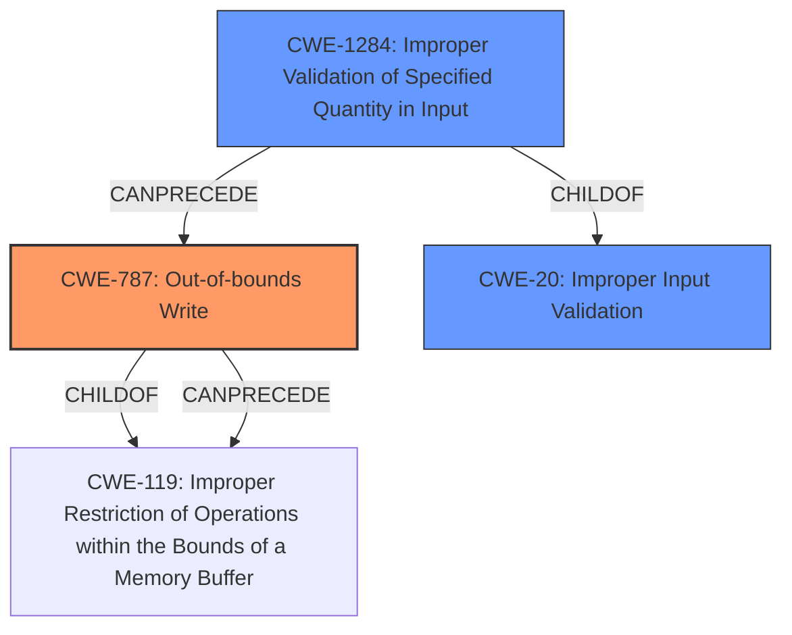

# Enhanced Analysis for CVE-2021-34874

# Summary
| CWE ID | CWE Name | Confidence | CWE Abstraction Level | CWE Vulnerability Mapping Label | CWE-Vulnerability Mapping Notes |
|---|---|---|---|---|---|
| CWE-787 | Out-of-bounds Write | 1.0 | Base | Allowed | Primary CWE |
| CWE-20 | Improper Input Validation | 0.7 | Class | Discouraged | Secondary Candidate |
| CWE-1284 | Improper Validation of Specified Quantity in Input | 0.7 | Base | Allowed | Secondary Candidate |

## Evidence and Confidence

*   **Confidence Score:** 0.9
*   **Evidence Strength:** HIGH

## Relationship Analysis
The primary CWE is CWE-787 **(Out-of-bounds Write)**, a **Base** level CWE. It is a child of CWE-119 **(Improper Restriction of Operations within the Bounds of a Memory Buffer)**, which is a **Class** level CWE and is generally **Discouraged**. The vulnerability arises from a **lack of proper validation of user-supplied data**, that leads to **memory corruption** by writing data past the end of the intended buffer. CWE-20 **(Improper Input Validation)** is related because the vulnerability originates from failing to validate user-supplied data. CWE-1284 **(Improper Validation of Specified Quantity in Input)** is more specific to the validation failure since the user-supplied data is not validated to ensure the quantity has the required properties, which could lead to out-of-bounds write.



## Vulnerability Chain
The vulnerability chain starts with **lack of proper validation of user-supplied data**. This leads to a **memory corruption** condition specifically an out-of-bounds write. The ultimate impact is the ability to execute arbitrary code.

## Summary of Analysis
The analysis identified the primary weakness as CWE-787 **(Out-of-bounds Write)**. This aligns with the description of **memory corruption** stemming from a **lack of proper validation of user-supplied data**. The evidence for this is found in the vulnerability description key phrases, " **lack of proper validation of user-supplied data**" and "**memory corruption**", and the "CVE Reference Links Content Summary", which states "The vulnerability stems from a lack of proper validation of user-supplied data when processing 3DS files, leading to memory corruption. Specifically, the issue is related to out-of-bounds and use-after-free errors when parsing maliciously crafted 3DS files."

CWE-20 **(Improper Input Validation)** was considered since the root cause is the **lack of proper validation of user-supplied data**, however, the mapping guidance discourages the use of CWE-20, in favor of a more specific CWE. CWE-1284 **(Improper Validation of Specified Quantity in Input)** is more specific than CWE-20, but the **memory corruption** is specifically an **out-of-bounds write**, so the best fit is CWE-787.

CWE-787 is at the **Base** level of abstraction and is the best fit for the vulnerability based on the available evidence. The primary CWE match from the "CWE for similar CVE Descriptions" section is also CWE-787, further supporting this classification.

Relevant CWE Information:

# Enhanced Context (25 CWEs)

## CWE-805: Buffer Access with Incorrect Length Value
**Abstraction Level**: Base
**Similarity Score**: 0.77
**Source**: dense

**Description**:
The product uses a sequential operation to read or write a buffer, but it uses an incorrect length value that causes it to access memory that is outside of the bounds of the buffer.
**Rationale**: This CWE isn't selected because the root cause is **lack of proper validation of user-supplied data**, not directly an incorrect length value used.

## CWE-131: Incorrect Calculation of Buffer Size
**Abstraction Level**: Base
**Similarity Score**: 0.77
**Source**: dense

**Description**:
The product does not correctly calculate the size to be used when allocating a buffer, which could lead to a buffer overflow.
**Rationale**: This CWE isn't selected because the root cause is **lack of proper validation of user-supplied data**, not an incorrect calculation of buffer size during allocation.

## CWE-125: Out-of-bounds Read
**Abstraction Level**: Base
**Similarity Score**: 0.76
**Source**: dense

**Description**:
The product reads data past the end, or before the beginning, of the intended buffer.
**Rationale**: The "CVE Reference Links Content Summary" mentions out-of-bounds read, however the vulnerability description focuses on **memory corruption** without explicitly stating whether it's a read or write issue. Given that the primary CWE match is CWE-787, and the vulnerability description highlights the ability to *execute code*, an out-of-bounds write is more likely than an out-of-bounds read.

## CWE-191: Integer Underflow (Wrap or Wraparound)
**Abstraction Level**: Base
**Similarity Score**: 0.76
**Source**: dense

**Description**:
The product subtracts one value from another, such that the result is less than the minimum allowable integer value, which produces a value that is not equal to the correct result.
**Rationale**: This CWE isn't selected as there's no indication of integer underflow in the vulnerability description.

## CWE-126: Buffer Over-read
**Abstraction Level**: Variant
**Similarity Score**: 0.76
**Source**: dense

**Description**:
The product reads from a buffer using buffer access mechanisms such as indexes or pointers that reference memory locations after the targeted buffer.
**Rationale**: Same rationale as CWE-125.

## CWE-130: Improper Handling of Length Parameter Inconsistency
**Abstraction Level**: Base
**Similarity Score**: 0.75
**Source**: dense

**Description**:
The product parses a formatted message or structure, but it does not handle or incorrectly handles a length field that is inconsistent with the actual length of the associated data.
**Rationale**: This CWE isn't selected because the root cause is **lack of proper validation of user-supplied data**, not an improper handling of length parameter inconsistency.

## CWE-823: Use of Out-of-range Pointer Offset
**Abstraction Level**: Base
**Similarity Score**: 0.75
**Source**: dense

**Description**:
The product performs pointer arithmetic on a valid pointer, but it uses an offset that can point outside of the intended range of valid memory locations for the resulting pointer.
**Rationale**: This CWE isn't selected because the root cause is **lack of proper validation of user-supplied data**, not specifically related to pointer arithmetic.

## CWE-119: Improper Restriction of Operations within the Bounds of a Memory Buffer
**Abstraction Level**: Class
**Similarity Score**: 0.75
**Source**: dense

**Description**:
The product performs operations on a memory buffer, but it reads from or writes to a memory location outside the buffer's intended boundary. This may result in read or write operations on unexpected memory locations that could be linked to other variables, data structures, or internal program data.
**Rationale**: This CWE is too general. The more specific CWE-787 is a better fit. The mapping guidance for CWE-119 discourages its use when lower-level CWEs are available.

## CWE-788: Access of Memory Location After End of Buffer
**Abstraction Level**: Base
**Similarity Score**: 0.75
**Source**: dense

**Description**:
The product reads or writes to a buffer using an index or pointer that references a memory location after the end of the buffer.
**Rationale**: CWE-787 is preferred because it covers writes before *or* after the buffer, while CWE-788 is only after the buffer.

## CWE-197: Numeric Truncation Error
**Abstraction Level**: Base
**Similarity Score**: 0.74
**Source**: dense

**Description**:
Truncation errors occur when a primitive is cast to a primitive of a smaller size and data is lost in the conversion.
**Rationale**: There's no indication of numeric truncation in the vulnerability description.


## CWE Relationship Analysis

Current CWEs represent these abstraction levels: .


### Vulnerability Chain Analysis

**Chain starting from CWE-131:**
- 131 (Incorrect Calculation of Buffer Size) - ROOT


**Chain starting from CWE-130:**
- 130 (Improper Handling of Length Parameter Inconsistency) - ROOT


### CWE Relationship Diagram

```mermaid
graph TD
    classDef primary fill:#f96,stroke:#333,stroke-width:2px
    classDef secondary fill:#69f,stroke:#333
    classDef tertiary fill:#9e9,stroke:#333
```