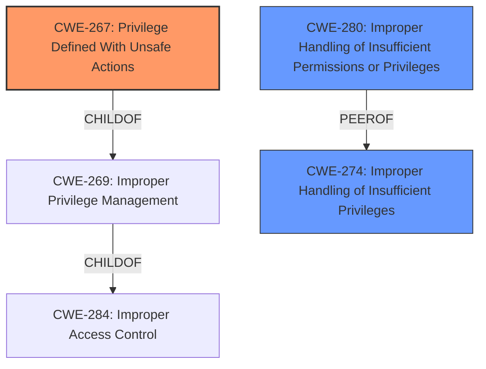

# Analysis for CVE-2021-3493

# Summary
| CWE ID  | CWE Name                                                                | Confidence | CWE Abstraction Level | CWE Vulnerability Mapping Label | CWE-Vulnerability Mapping Notes |
| :------- | :---------------------------------------------------------------------- | :--------- | :---------------------- | :------------------------------ | :------------------------------ |
| CWE-267 | Privilege Defined With Unsafe Actions                                 | 0.85       | Base                    | Primary                           | Allowed                       |
| CWE-280 | Improper Handling of Insufficient Permissions or Privileges           | 0.75       | Base                    | Secondary                         | Allowed                       |
| CWE-274 | Improper Handling of Insufficient Privileges                          | 0.70       | Base                    | Secondary                         | Discouraged                   |

## Evidence and Confidence

*   **Confidence Score:** 0.80
*   **Evidence Strength:** HIGH

## Relationship Analysis

The analysis focuses on the root cause of the vulnerability, which is the **improper validation** of file capabilities. CWE-267 represents the core issue of a privilege being defined with unsafe actions. CWE-280 and CWE-274 represent improper handling of privileges. The parent-child relationship shows how these CWEs relate to broader privilege management issues. The abstraction levels indicate that the focus is on the base level causes.

## Vulnerability Chain

The vulnerability chain starts with the **improper validation** of file capabilities in the overlayfs implementation. This leads to a situation where an attacker can manipulate file capabilities and gain elevated privileges.

Initial Flaw: **Improper validation** of file capabilities.
Weakness: Privilege defined with unsafe actions (CWE-267).
Impact: Privilege escalation, leading to elevated privileges.

## Summary of Analysis

The initial analysis identified the **improper validation** as the root cause, leading to privilege escalation. The retriever results pointed to CWE-267 as a primary candidate. The final decision is based on the evidence from the vulnerability description, CVE reference links, and the retriever results.

The vulnerability description highlights the **improper validation** of file capabilities: "the overlayfs implementation in the linux kernel did not properly validate with respect to user namespaces the setting of file capabilities on files in an underlying file system".

The CVE reference links confirm this, stating that "the application of file capabilities was not properly validated against user namespaces" and "This lack of validation allowed an attacker to bypass intended security restrictions".

The selection of CWE-267 is at the optimal level of specificity because it directly addresses the root cause of the vulnerability: a privilege (file capabilities) being defined in a way that allows unsafe actions (privilege escalation).

Relevant CWE Information:

# Enhanced Context (25 CWEs)

## CWE-267: Privilege Defined With Unsafe Actions

**CWE-267: Privilege Defined With Unsafe Actions** is the primary CWE. The vulnerability description clearly states that the **improper validation** of file capabilities allows an attacker to gain elevated privileges. This aligns with the definition of CWE-267, which states: "A particular privilege, role, capability, or right can be used to perform unsafe actions that were not intended, even when it is assigned to the correct entity." The evidence directly supports this mapping. Confidence: 0.85. The key point here is that the "privilege" (file capabilities) is being used in an unsafe manner due to the **improper validation**.

## CWE-280: Improper Handling of Insufficient Permissions or Privileges

**CWE-280: Improper Handling of Insufficient Permissions or Privileges** is a secondary CWE to consider. The description mentions that the product "does not handle or incorrectly handles when it has insufficient privileges to access resources or functionality as specified by their permissions." While the primary issue is with the **improper validation**, this CWE captures the aspect of insufficient privilege handling that contributes to the vulnerability. Confidence: 0.75.

## CWE-274: Improper Handling of Insufficient Privileges

**CWE-274: Improper Handling of Insufficient Privileges** is also considered as a secondary CWE. The description states that "The product does not handle or incorrectly handles when it has insufficient privileges to perform an operation, leading to resultant weaknesses." This aligns with the privilege escalation aspect of the vulnerability. Confidence: 0.70. However, it's important to note that CWE-274 is marked as "Discouraged".

## Rejected CWEs

CWE-20: Improper Input Validation was considered, but it is too broad. The vulnerability is more specific than general input validation, focusing on the validation of file capabilities.

CWE-269: Improper Privilege Management was also considered, but it is a class-level CWE and less specific than CWE-267. The vulnerability is not simply about improper privilege management but specifically about a privilege being defined with unsafe actions.

CWE-190: Integer Overflow or Wraparound was considered based on retriever results, but it is not relevant to the vulnerability description. There is no mention of integer overflows in the provided information.

CWE-782 and CWE-781: Exposed IOCTL and Improper Address Validation in IOCTL were also considered based on retriever results, but they are not relevant to the vulnerability description. There is no mention of IOCTLs in the provided information.