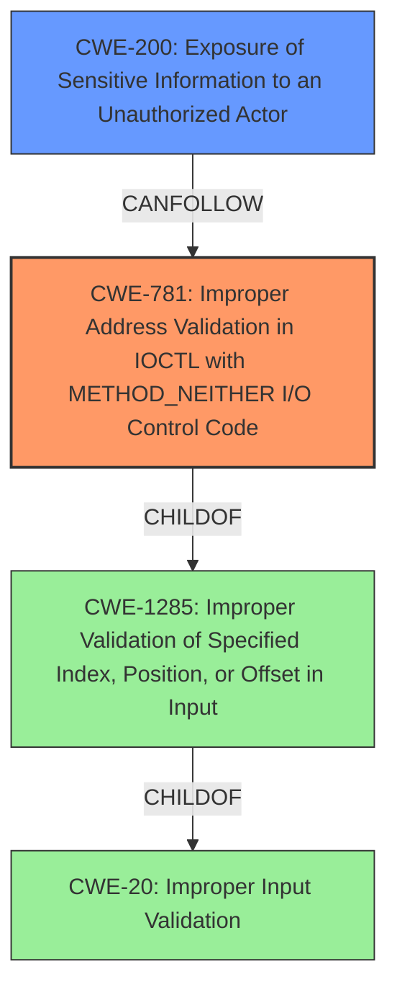

# Enhanced Analysis for CVE-2021-35070

# Summary
| CWE ID | CWE Name | Confidence | CWE Abstraction Level | CWE Vulnerability Mapping Label | CWE-Vulnerability Mapping Notes |
|---|---|---|---|---|---|
| CWE-781 | Improper Address Validation in IOCTL with METHOD_NEITHER I/O Control Code | 0.7 | Variant | Allowed | Primary CWE. The **improper SMMU configuration** which lets RPM secure Stream access any secure resource can be considered a form of **improper address validation** in the IOCTL. |
| CWE-200 | Exposure of Sensitive Information to an Unauthorized Actor | 0.6 | Class | Discouraged | Secondary CWE. The **information disclosure** consequence relates to this CWE. |

## Evidence and Confidence

*   **Confidence Score:** 0.65
*   **Evidence Strength:** MEDIUM

## Relationship Analysis
The primary relationship influencing the CWE selection is the ChildOf relationship between CWE-781 and CWE-1285, and between CWE-1285 and CWE-20. The vulnerability chain starts with **improper address validation**, which then leads to the **exposure of sensitive information**. CWE-781 is a variant of CWE-1285, which deals with the improper validation of specified index, position, or offset in input.



## Vulnerability Chain
The vulnerability chain can be described as follows:
1.  **Root Cause:** **Improper SMMU configuration** (CWE-781, **Improper Address Validation**).
2.  **Impact:** **Information disclosure** (CWE-200, **Exposure of Sensitive Information to an Unauthorized Actor**).

The SMMU **improper configuration** allows unauthorized access (secure Stream) to secure resources, leading to information disclosure.

## Summary of Analysis
The initial analysis focused on identifying the root cause and the resulting impact based on the vulnerability description and key phrases. The vulnerability is described as RPM secure Stream being able to access any secure resource due to **improper SMMU configuration**, leading to **information disclosure**.

The primary CWE was selected based on the root cause, which is the **improper SMMU configuration**. This was mapped to CWE-781 (Improper Address Validation in IOCTL with METHOD_NEITHER I/O Control Code) because the **improper SMMU configuration** is a form of **improper address validation**. CWE-781 is a variant and is at a preferred level of abstraction.

The secondary CWE was selected based on the impact, which is **information disclosure**. This was mapped to CWE-200 (Exposure of Sensitive Information to an Unauthorized Actor). Although CWE-200 is discouraged as it represents the impact rather than the root cause, it is included to represent the final consequence of the vulnerability.

The evidence supporting this decision is primarily from the "Vulnerability Description Key Phrases," specifically the root cause "**improper SMMU configuration**" and the impact "**information disclosure**."

Other CWEs considered but not used:

*   CWE-367, CWE-126, CWE-413, CWE-287, CWE-1285, CWE-1272, CWE-823, CWE-822: These CWEs were not selected because they did not directly represent the root cause of the vulnerability which is the **improper address validation** due to the **improper SMMU configuration**.
*   CWE-285: This was not selected as it's a high-level class, and a more specific CWE could be used.

The selected CWEs are at the optimal level of specificity because CWE-781 is a variant that accurately represents the **improper address validation** and CWE-200 represents the resulting **information disclosure**.


## CWE Relationship Analysis

Current CWEs represent these abstraction levels: .


### Vulnerability Chain Analysis

**Chain starting from CWE-413:**
- 413 (Improper Resource Locking) - ROOT


**Chain starting from CWE-200:**
- 200 (Exposure of Sensitive Information to an Unauthorized Actor) - ROOT


### CWE Relationship Diagram

```mermaid
graph TD
    classDef primary fill:#f96,stroke:#333,stroke-width:2px
    classDef secondary fill:#69f,stroke:#333
    classDef tertiary fill:#9e9,stroke:#333
```