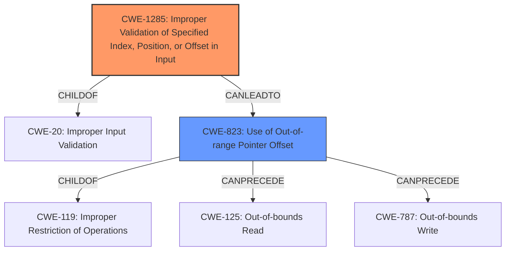

# Enhanced Analysis for CVE-2021-35092

# Summary
| CWE ID | CWE Name | Confidence | CWE Abstraction Level | CWE Vulnerability Mapping Label | CWE-Vulnerability Mapping Notes |
|---|---|---|---|---|---|
| CWE-1285 | Improper Validation of Specified Index, Position, or Offset in Input | 0.9 | Base | Allowed | Primary CWE |
| CWE-823 | Use of Out-of-range Pointer Offset | 0.7 | Base | Allowed | Secondary Candidate |

## Evidence and Confidence

*   **Confidence Score:** 0.8
*   **Evidence Strength:** HIGH

## Relationship Analysis
The primary CWE, CWE-1285, is a base-level CWE that describes the **improper validation of input** specifying an index, position, or offset. It is a child of CWE-20 (Improper Input Validation). CWE-823, a secondary candidate, represents the **use of an out-of-range pointer offset**, which can result from the **improper input validation** described by CWE-1285. CWE-823 is a child of CWE-119 (Improper Restriction of Operations Within the Bounds of a Memory Buffer).



## Vulnerability Chain
The vulnerability chain starts with an **invalid queue index from IOCTL request**. This **invalid index** is then used to access a memory location. Because the **index is not properly validated**, it can lead to **arbitrary address modification**.
- **Root Cause:** **Invalid queue index from IOCTL request** (CWE-1285)
- **Weakness:** **Arbitrary address modification** (CWE-823)

## Summary of Analysis
The primary weakness is the **lack of validation of the queue index** received from the IOCTL request, which can lead to **arbitrary address modification**.

The vulnerability description states that processing the DCB/AVB algorithm with an **invalid queue index from IOCTL request** could lead to **arbitrary address modification**. This directly aligns with CWE-1285 (Improper Validation of Specified Index, Position, or Offset in Input), which describes a situation where input is expected to specify an index, position, or offset but is not properly validated.

CWE-823 (Use of Out-of-range Pointer Offset) was considered as a secondary candidate because the **arbitrary address modification** implies the use of a pointer with an invalid offset. However, the root cause is the **lack of validation** of the index (CWE-1285), which then leads to the possibility of using an **out-of-range pointer offset** (CWE-823).

CWE-1285 is the most appropriate because the root cause is the **missing input validation**. Both CWE-1285 and CWE-823 are at the Base level of abstraction, which is preferred.

Other CWEs considered but not selected:

*   CWE-126 (Buffer Over-read): This CWE was not selected because the vulnerability description focuses on **arbitrary address modification**, not specifically reading beyond buffer boundaries.
*   CWE-415 (Double Free): This CWE was not selected because there is no mention of freeing the same memory twice.
*   CWE-822 (Untrusted Pointer Dereference): While the **arbitrary address modification** could involve an untrusted pointer, the root cause is still the **improper validation** of the index.
*   CWE-1332 (Improper Handling of Faults that Lead to Instruction Skips): Not relevant as the description doesn't include fault injection.
*   CWE-781 (Improper Address Validation in IOCTL with METHOD_NEITHER I/O Control Code): While this vulnerability involves IOCTL, it doesn't specifically mention METHOD_NEITHER, making CWE-1285 a more general and fitting root cause.
*   CWE-367 (Time-of-check Time-of-use (TOCTOU) Race Condition): No evidence of a race condition.
*   CWE-390 (Detection of Error Condition Without Action): There is no indication of an error being detected but not handled.
*   CWE-124 (Buffer Underwrite ('Buffer Underflow')): This CWE was not selected because the vulnerability description focuses on **arbitrary address modification**, not specifically writing before buffer boundaries.

The primary CWE selected, CWE-1285, is at the optimal level of specificity, as it directly addresses the **root cause** of the vulnerability. The confidence in this assessment is high (0.8) due to the clear evidence provided in the vulnerability description.

Relevant CWE Information:
INSERT


## CWE Relationship Analysis

Current CWEs represent these abstraction levels: .


### Vulnerability Chain Analysis

**Chain starting from CWE-823:**
- 823 (Use of Out-of-range Pointer Offset) - ROOT


**Chain starting from CWE-20:**
- 20 (Improper Input Validation) - ROOT


### CWE Relationship Diagram

```mermaid
graph TD
    classDef primary fill:#f96,stroke:#333,stroke-width:2px
    classDef secondary fill:#69f,stroke:#333
    classDef tertiary fill:#9e9,stroke:#333
```