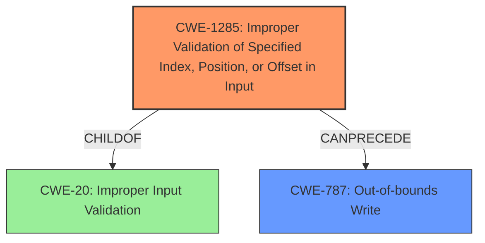

# Analysis Report for CVE-2021-35098

# Vulnerability Analysis Report: CVE-2021-35098

## Description


## Analysis (with Relationship Data)

# Summary
| CWE ID | CWE Name | Confidence | CWE Abstraction Level | CWE Vulnerability Mapping Label | CWE-Vulnerability Mapping Notes |
|---|---|---|---|---|---|
| CWE-1285 | Improper Validation of Specified Index, Position, or Offset in Input | 0.9 | Base | Allowed | Primary CWE |
| CWE-787 | Out-of-bounds Write | 0.7 | Base | Allowed | Secondary Candidate |

## Evidence and Confidence

*   **Confidence Score:** 0.8
*   **Evidence Strength:** MEDIUM

## Relationship Analysis
The primary CWE, CWE-1285, is a base-level weakness that falls under the broader category of improper input validation (CWE-20). It describes a scenario where an index, position, or offset in input is not properly validated, which can lead to out-of-bounds access and memory corruption. CWE-787, Out-of-bounds Write, is considered as a secondary candidate because the **improper validation** can directly lead to writing data outside the intended memory region. CWE-1285 can precede CWE-787. The relationships between CWEs helped narrow down the selection to these two, as they accurately capture the cause-and-effect relationship in the vulnerability.



## Vulnerability Chain
The vulnerability chain starts with **improper validation of the session ID**, which is the root cause (CWE-1285). This leads to a flawed PCM routing process that allows writing data to unintended memory locations (CWE-787), ultimately causing memory corruption.

## Summary of Analysis
The initial analysis focused on the **improper validation** of the session ID in the PCM routing process, which can lead to memory corruption. The primary CWE identified is CWE-1285 (Improper Validation of Specified Index, Position, or Offset in Input), as the **root cause** is the lack of proper validation. The description explicitly mentions this **improper validation**, which directly aligns with CWE-1285.

The evidence from the vulnerability description is: "**Improper validation of session id in PCM routing process** can lead to memory corruption".

CWE-787 (Out-of-bounds Write) was also considered, as the **improper validation** can lead to writing data outside the intended memory region, causing memory corruption. While memory corruption is the impact, the immediate cause is the out-of-bounds write.

CWE-126 (Buffer Over-read), CWE-822 (Untrusted Pointer Dereference), CWE-367 (Time-of-check Time-of-use (TOCTOU) Race Condition), and CWE-823 (Use of Out-of-range Pointer Offset) were considered but not selected. CWE-126 wasn't selected because the problem isn't reading out of bounds, but an **improper validation** which leads to memory corruption. CWE-822 and CWE-823 weren't chosen because there's no direct evidence of untrusted pointer dereference or out-of-range pointer offset usage in the provided description. CWE-367 doesn't fit because there is no race condition indicated.

The selection of CWE-1285 as the primary and CWE-787 as a secondary candidate is based on the available evidence, the relationships between CWEs, and the desire to accurately represent the vulnerability's root cause and immediate consequence at an appropriate level of specificity.
Relevant CWE Information:

# Enhanced Context (25 CWEs)
The following CWEs were identified as potentially relevant to this vulnerability:

## CWE-1285: Improper Validation of Specified Index, Position, or Offset in Input
**Abstraction Level**: Base
**Similarity Score**: 0.80
**Source**: dense

**Description**:
The product receives input that is expected to specify an index, position, or offset into an indexable resource such as a buffer or file, but it does not validate or incorrectly validates that the specified index/position/offset has the required properties.

**Mapping Guidance**:
- Usage: Allowed
- Rationale: This CWE entry is at the Base level of abstraction, which is a preferred level of abstraction for mapping to the root causes of vulnerabilities.

## CWE-787: Out-of-bounds Write
**Abstraction Level**: base
**Similarity Score**: 4.33
**Source**: graph

**Description**:
CWE-787: Out-of-bounds Write

**Mapping Guidance**:
- Usage: Allowed
- Rationale: This CWE entry is at the Base level of abstraction, which is a preferred level of abstraction for mapping to the root causes of vulnerabilities.


## CWE Relationship Analysis

Current CWEs represent these abstraction levels: .


### Vulnerability Chain Analysis

**Chain starting from CWE-823:**
- 823 (Use of Out-of-range Pointer Offset) - ROOT


**Chain starting from CWE-822:**
- 822 (Untrusted Pointer Dereference) - ROOT


### CWE Relationship Diagram

```mermaid
graph TD
    classDef primary fill:#f96,stroke:#333,stroke-width:2px
    classDef secondary fill:#69f,stroke:#333
    classDef tertiary fill:#9e9,stroke:#333
```


*Report generated on 2025-03-30 15:33:59*
