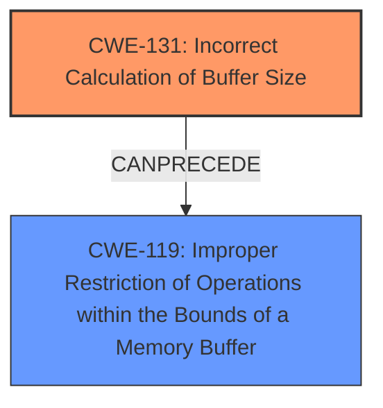

# Analysis for CVE-2021-35110

# Summary
| CWE ID | CWE Name | Confidence | CWE Abstraction Level | CWE Vulnerability Mapping Label | CWE-Vulnerability Mapping Notes |
|---|---|---|---|---|---|
| CWE-131 | Incorrect Calculation of Buffer Size | 0.75 | Base | Primary | Allowed |
| CWE-119 | Improper Restriction of Operations within the Bounds of a Memory Buffer | 0.6 | Class | Secondary | Discouraged |

## Evidence and Confidence

*   **Confidence Score:** 0.7
*   **Evidence Strength:** MEDIUM

## Relationship Analysis
The primary CWE is CWE-131, which can lead to CWE-119. CWE-119 is a more general class. CWE-131 is a base level CWE which is the preferred level.

## Vulnerability Chain
The vulnerability chain starts with an **improper validation of hash segment of file while allocating memory**, leading to an **incorrect calculation of buffer size** (CWE-131), and potentially resulting in a **buffer overflow** (CWE-119).

## Summary of Analysis
The initial assessment identified a **buffer overflow** due to **improper validation of hash segment of file while allocating memory**. The retriever results suggested CWE-119, CWE-190, and CWE-120. However, considering the root cause of the vulnerability - **improper validation of hash segment of file while allocating memory** - CWE-131 (Incorrect Calculation of Buffer Size) is the most appropriate primary CWE. It directly addresses the **incorrect calculation of buffer size** during memory allocation, which is a more specific root cause than a general **buffer overflow**.

CWE-119 is considered as a secondary CWE because the **improper calculation** can lead to operations outside the buffer's intended boundary, which aligns with the description of CWE-119.

The graph relationships influenced the decision by showing how CWE-131 can precede CWE-119.

The selected CWEs are at the optimal level of specificity because CWE-131 pinpoints the root cause of the vulnerability, while CWE-119 describes the general consequence.

Relevant CWE Information:

# Enhanced Context (25 CWEs)
The following CWEs were identified as potentially relevant to this vulnerability:

## CWE-131: Incorrect Calculation of Buffer Size
**Abstraction Level**: Base
**Similarity Score**: 0.80
**Source**: dense

**Description**:
The product does not correctly calculate the size to be used when allocating a buffer, which could lead to a buffer overflow.

**Mapping Guidance**:
- Usage: Allowed
- Rationale: This CWE entry is at the Base level of abstraction, which is a preferred level of abstraction for mapping to the root causes of vulnerabilities.

### Technical Explanation for CWE-131
The vulnerability description mentions **improper validation of hash segment of file while allocating memory**, which directly aligns with the description of CWE-131: "The product does not correctly calculate the size to be used when allocating a buffer, which could lead to a buffer overflow." This suggests that the root cause is an **incorrect calculation** of the buffer size during memory allocation, rather than a generic buffer overflow. The security implication is that an undersized buffer could be allocated, leading to a potential buffer overflow when data is written to it. CWE-131 is selected as the primary CWE due to its focus on the **incorrect calculation**, which is the underlying issue. Confidence is 0.75.

### Technical Explanation for CWE-119
CWE-119 (Improper Restriction of Operations within the Bounds of a Memory Buffer) is a more general description of a buffer overflow. While the vulnerability can manifest as a **buffer overflow**, the root cause is the **incorrect calculation** of the buffer size (CWE-131). CWE-119 is included as a secondary CWE to indicate the potential consequence of the primary weakness. Confidence is 0.6.

### CWEs Considered But Not Used
- CWE-190 (Integer Overflow or Wraparound): While an integer overflow could potentially contribute to an incorrect buffer size calculation, there is no direct evidence in the description to support this. Therefore, CWE-190 is not selected.
- CWE-120 (Buffer Copy without Checking Size of Input): The description mentions a **buffer overflow**, but the root cause is more specifically related to the **improper validation while allocating memory**. This suggests that the size calculation itself is the problem, not necessarily the buffer copy operation. Therefore, CWE-120 is not selected.
- CWE-129 (Improper Validation of Array Index): The description does not mention array indexing. Therefore, CWE-129 is not selected.