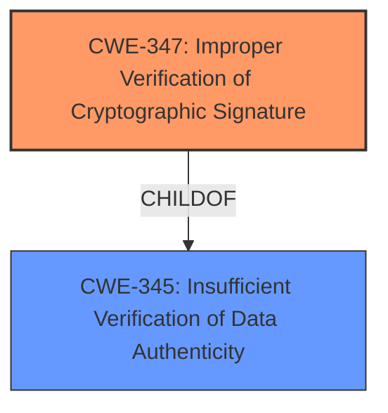

# Analysis Report for CVE-2021-35113

# Vulnerability Analysis Report: CVE-2021-35113

## Description


## Analysis (with Relationship Data)

# Summary
| CWE ID | CWE Name | Confidence | CWE Abstraction Level | CWE Vulnerability Mapping Label | CWE-Vulnerability Mapping Notes |
|---|---|---|---|---|---|
| CWE-347 | Improper Verification of Cryptographic Signature | 0.9 | Base | Allowed | Primary CWE |

## Evidence and Confidence

*   **Confidence Score:** 0.9
*   **Evidence Strength:** HIGH

## Relationship Analysis
The primary relationship considered here is the direct match of the vulnerability description to the definition of CWE-347. There are no clear chain or hierarchical relationships that strongly influence this decision, as the description focuses on a single, specific flaw: the **improper order of signature verification and hashing**. The Abstraction Level is Base.



## Vulnerability Chain
The vulnerability chain is relatively simple:

1.  **Root Cause:** **Improper order of signature verification and hashing**.
2.  **Impact:** Authentication bypass.

## Summary of Analysis
The initial analysis strongly suggests CWE-347, and upon review, this remains the most appropriate classification. The decision is primarily based on the **Vulnerability Description Key Phrases** which indicate the **rootcause** as "**improper order of signature verification and hashing**". This directly aligns with CWE-347's description: "The product does not verify, or incorrectly verifies, the cryptographic signature for data."

The evidence supporting this is the explicit mention of "signature verification" as the area of concern, and "improper order" indicating an incorrect verification process. The "Retriever Results" also list CWE-347 as the top combined result.

The graph relationships influenced the final selection by highlighting that CWE-347 is a base level CWE, and is a child of CWE-345 Insufficient Verification of Data Authenticity.

CWE-347 is at the optimal level of specificity because it directly addresses the flawed signature verification process described in the vulnerability.

Relevant CWE Information:

# Enhanced Context (25 CWEs)

## CWE-347: Improper Verification of Cryptographic Signature
**Abstraction:** Base
**Status:** Draft

### Description
The product does not verify, or incorrectly verifies, the cryptographic signature for data.

### Extended Description
Not provided

### Alternative Terms
None

### Relationships
ChildOf -> CWE-345
ChildOf -> CWE-345

### Mapping Guidance
**Usage:** Allowed
**Rationale:** This CWE entry is at the Base level of abstraction, which is a preferred level of abstraction for mapping to the root causes of vulnerabilities.
**Comments:** Carefully read both the name and description to ensure that this mapping is an appropriate fit. Do not try to 'force' a mapping to a lower-level Base/Variant simply to comply with this preferred level of abstraction.
**Reasons:**
- Acceptable-Use

### Observed Examples
- **CVE-2002-1796:** Does not properly verify signatures for "trusted" entities.
- **CVE-2005-2181:** Insufficient verification allows spoofing.
- **CVE-2005-2182:** Insufficient verification allows spoofing.

### Other CWEs Considered and Rejected:

*   **CWE-367: Time-of-check Time-of-use (TOCTOU) Race Condition:** While race conditions can sometimes be relevant to cryptographic vulnerabilities, there is no evidence in the description to suggest a TOCTOU issue is present. It is related to the ordering of operations, but not in a time-sensitive way.
*   **CWE-126: Buffer Over-read:** The vulnerability description doesn't mention anything related to buffer overflows or reads, so this is not applicable.
*   **CWE-822: Untrusted Pointer Dereference and CWE-823: Use of Out-of-range Pointer Offset:** These CWEs are related to memory corruption, and there's no evidence to suggest memory corruption issues are involved.
*   **CWE-1285: Improper Validation of Specified Index, Position, or Offset in Input:** Again, the description doesn't suggest any issues with input validation related to indices, positions, or offsets.
*   **CWE-781: Improper Address Validation in IOCTL with METHOD_NEITHER I/O Control Code:** This is very specific to IOCTLs, which is not mentioned or implied in the vulnerability description.
*   **CWE-124: Buffer Underwrite ('Buffer Underflow'):** Similar to buffer over-read, there's no mention of buffer underflows.
*   **CWE-390: Detection of Error Condition Without Action:** The description focuses on the **improper** execution of a process, not failing to act on an error, so this CWE is not appropriate.
*   **CWE-415: Double Free:** There is no evidence of memory management issues.


## CWE Relationship Analysis

Current CWEs represent these abstraction levels: .


### Vulnerability Chain Analysis

**Chain starting from CWE-823:**
- 823 (Use of Out-of-range Pointer Offset) - ROOT


**Chain starting from CWE-822:**
- 822 (Untrusted Pointer Dereference) - ROOT


### CWE Relationship Diagram

```mermaid
graph TD
    classDef primary fill:#f96,stroke:#333,stroke-width:2px
    classDef secondary fill:#69f,stroke:#333
    classDef tertiary fill:#9e9,stroke:#333
```


*Report generated on 2025-03-30 22:51:26*
