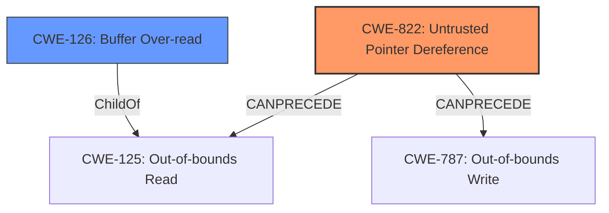

# Raw Analyzer Response for CVE-2021-35116

# Summary
| CWE ID | CWE Name | Confidence | CWE Abstraction Level | CWE Vulnerability Mapping Label | CWE-Vulnerability Mapping Notes |
|---|---|---|---|---|---|
| CWE-822 | Untrusted Pointer Dereference | 0.75 | Base | Allowed | Primary CWE. Loading a crafted model into CDSP leads to dereferencing of untrusted pointer, leading to compromise of CDSP and other APK's data. |
| CWE-126 | Buffer Over-read | 0.50 | Variant | Allowed | Secondary candidate. Loading a crafted model into CDSP leads to reading beyond the buffer, leading to compromise of CDSP and other APK's data. |

## Evidence and Confidence

*   **Confidence Score:** 0.70
*   **Evidence Strength:** MEDIUM

## Relationship Analysis
The primary CWE is CWE-822, Untrusted Pointer Dereference, which is at the Base level. CWE-822 can precede CWE-125 (Out-of-bounds Read) and CWE-787 (Out-of-bounds Write). CWE-126 is a variant of CWE-125 and describes the specific case of reading beyond the buffer.

## Vulnerability Chain
The vulnerability chain starts with loading a crafted model into the CDSP. This leads to an **improper** or **unvalidated** pointer that is then dereferenced (CWE-822). This dereference leads to a compromise of CDSP and other APK's data, possibly through an out-of-bounds read (CWE-126).

## Summary of Analysis
The initial analysis identified CWE-822 (Untrusted Pointer Dereference) as the primary weakness, with CWE-126 (Buffer Over-read) as a secondary candidate.

The vulnerability description states that loading a **crafted model** into the CDSP can lead to a compromise of the CDSP and other APK's data. This indicates that the crafted model contains **untrusted pointers** that, when dereferenced, cause the vulnerability.

The graph relationships confirm that CWE-822 can precede out-of-bounds read/write issues.

Based on the provided evidence, CWE-822 is the most appropriate primary CWE because the root cause is the dereferencing of an untrusted pointer. The possibility of a Buffer Over-read (CWE-126) is a consequence of this dereference but is less certain.

The selection of CWE-822 is at the optimal level of specificity because it directly addresses the **root cause** of the vulnerability, which is the **untrusted pointer dereference**.

Other CWEs considered but not used:

*   CWE-124: Buffer Underwrite ('Buffer Underflow') - Not applicable because the description mentions a compromise and crafted model, suggesting an over-read/write rather than an underwrite.
*   CWE-131: Incorrect Calculation of Buffer Size - While possible, there's no explicit mention of incorrect size calculations.
*   CWE-191: Integer Underflow (Wrap or Wraparound) - Not applicable as the issue isn't related to integer underflow.
*   CWE-367: Time-of-check Time-of-use (TOCTOU) Race Condition - This is less likely as the primary issue seems to be related to an untrusted pointer rather than a race condition.
*   CWE-390: Detection of Error Condition Without Action - No evidence suggests an error is detected without any action.
*   CWE-415: Double Free - There is no mention of double free.
*   CWE-781: Improper Address Validation in IOCTL with METHOD\_NEITHER I/O Control Code - Not applicable because the description doesn't have IOCTL context.
*   CWE-805: Buffer Access with Incorrect Length Value - While possible, the **root cause** seems to be an untrusted pointer.
*   CWE-823: Use of Out-of-range Pointer Offset - Similar to CWE-822, but less specific.
*   CWE-926: Improper Export of Android Application Components - Not directly relevant to the **root cause**, which is related to memory corruption.
*   CWE-1314: Missing Write Protection for Parametric Data Values - Not directly relevant.