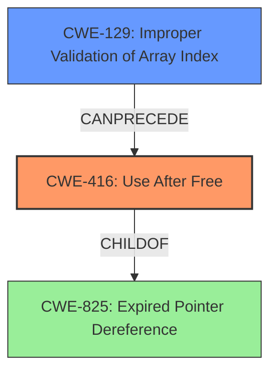

# Raw Analyzer Response for CVE-2021-35121

# Summary
| CWE ID | CWE Name | Confidence | CWE Abstraction Level | CWE Vulnerability Mapping Label | CWE-Vulnerability Mapping Notes |
|---|---|---|---|---|---|
| CWE-416 | Use After Free | 0.9 | Variant | Primary | Allowed |
| CWE-129 | Improper Validation of Array Index | 0.8 | Variant | Secondary | Allowed |

## Evidence and Confidence

*   **Confidence Score:** 0.85
*   **Evidence Strength:** HIGH

## Relationship Analysis
The primary weakness is **Use After Free (CWE-416)**, which occurs because an **array index is improperly used to lock and unlock a mutex**. This leads to memory corruption and the use of freed memory.

**CWE-416 (Use After Free)** is a variant of **CWE-825 (Expired Pointer Dereference)**. **CWE-129 (Improper Validation of Array Index)** can precede memory corruption by allowing out-of-bounds access.

## Vulnerability Chain
1.  **Root Cause:** **Improper Validation of Array Index (CWE-129)**: An **array index is improperly used**.
2.  **Weakness:** **Improper Resource Locking (CWE-413)**: The **array index is improperly used to lock and unlock a mutex**.
3.  **Vulnerability:** **Use After Free (CWE-416)**: The improper locking/unlocking leads to a **Use After Free** condition.
4.  **Impact:** Memory corruption and potential for exploitation.

## Summary of Analysis
The analysis is based on the provided evidence, which includes the vulnerability description highlighting the **improper use of an array index** in the Synx driver, leading to a **Use After Free** condition.

The primary CWE is **CWE-416 (Use After Free)**, as it directly reflects the described vulnerability where freed memory is accessed. This is supported by the explicit mention of "Use After Free" in the vulnerability description key phrases.

**CWE-129 (Improper Validation of Array Index)** is a secondary CWE, representing the root cause of the issue. The vulnerability description states that the **array index is improperly used to lock and unlock a mutex**, indicating a failure in validating the array index.

The relationship graph shows how **CWE-129** can precede **CWE-416**. The selected CWEs are at the optimal level of specificity, with **CWE-416** being a variant that directly matches the vulnerability, and **CWE-129** representing the root cause.

Other CWEs Considered:

*   **CWE-413 (Improper Resource Locking)**: While the description mentions locking and unlocking a mutex, the core issue is the use of an invalid index, which makes **CWE-129 (Improper Validation of Array Index)** more appropriate as the root cause. The "improper locking" is a consequence of the invalid index.
*   **CWE-123 (Write-what-where Condition)**, **CWE-415 (Double Free)**, **CWE-822 (Untrusted Pointer Dereference)**: These are less directly related to the provided vulnerability description. While a **Use After Free** could potentially lead to a write-what-where condition or double free, the initial cause is the **improper array index use** leading to the **Use After Free**.
*   **CWE-823 (Use of Out-of-range Pointer Offset)**: This is similar to **CWE-129**, but **CWE-129** is more specific to array indices, making it a slightly better fit given the description. **CWE-129** is also in the retriever results.
*   **CWE-126 (Buffer Over-read)**: This is not the primary issue, as the vulnerability focuses on memory being freed and then used, rather than simply being read out of bounds.
*   **CWE-367 (Time-of-check Time-of-use (TOCTOU) Race Condition)**: This is a possible scenario, but the description focuses on the improper index use and the resulting memory corruption, rather than a race condition between check and use.

Relevant CWE Information:

# Enhanced Context (25 CWEs)
The following CWEs were identified as potentially relevant to this vulnerability:

## CWE-131: Incorrect Calculation of Buffer Size
**Abstraction Level**: Base
**Similarity Score**: 0.82
**Source**: dense

**Description**:
The product does not correctly calculate the size to be used when allocating a buffer, which could lead to a buffer overflow.

**Mapping Guidance**:
- Usage: Allowed
- Rationale: This CWE entry is at the Base level of abstraction, which is a preferred level of abstraction for mapping to the root causes of vulnerabilities.

## CWE-805: Buffer Access with Incorrect Length Value
**Abstraction Level**: Base
**Similarity Score**: 0.79
**Source**: dense

**Description**:
The product uses a sequential operation to read or write a buffer, but it uses an incorrect length value that causes it to access memory that is outside of the bounds of the buffer.

**Mapping Guidance**:
- Usage: Allowed
- Rationale: This CWE entry is at the Base level of abstraction, which is a preferred level of abstraction for mapping to the root causes of vulnerabilities.

## CWE-191: Integer Underflow (Wrap or Wraparound)
**Abstraction Level**: Base
**Similarity Score**: 0.79
**Source**: dense

**Description**:
The product subtracts one value from another, such that the result is less than the minimum allowable integer value, which produces a value that is not equal to the correct result.

**Mapping Guidance**:
- Usage: Allowed
- Rationale: This CWE entry is at the Base level of abstraction, which is a preferred level of abstraction for mapping to the root causes of vulnerabilities.

## CWE-667: Improper Locking
**Abstraction Level**: Class
**Similarity Score**: 0.78
**Source**: dense

**Description**:
The product does not properly acquire or release a lock on a resource, leading to unexpected resource state changes and behaviors.

**Mapping Guidance**:
- Usage: Allowed-with-Review
- Rationale: This CWE entry is a Class and might have Base-level children that would be more appropriate

## CWE-823: Use of Out-of-range Pointer Offset
**Abstraction Level**: Base
**Similarity Score**: 0.78
**Source**: dense

**Description**:
The product performs pointer arithmetic on a valid pointer, but it uses an offset that can point outside of the intended range of valid memory locations for the resulting pointer.

**Mapping Guidance**:
- Usage: Allowed
- Rationale: This CWE entry is at the Base level of abstraction, which is a preferred level of abstraction for mapping to the root causes of vulnerabilities.

## CWE-682: Incorrect Calculation
**Abstraction Level**: Pillar
**Similarity Score**: 0.78
**Source**: dense

**Description**:
The product performs a calculation that generates incorrect or unintended results that are later used in security-critical decisions or resource management.

**Mapping Guidance**:
- Usage: Discouraged
- Rationale: This CWE entry is extremely high-level, a Pillar. In many cases, lower-level children or descendants are more appropriate. However, sometimes this weakness is forced to be used due to the lack of in-depth weakness research. See Research Gaps.

## CWE-404: Improper Resource Shutdown or Release
**Abstraction Level**: Class
**Similarity Score**: 0.78
**Source**: dense

**Description**:
The product does not release or incorrectly releases a resource before it is made available for re-use.

**Mapping Guidance**:
- Usage: Allowed-with-Review
- Rationale: This CWE entry is a Class and might have Base-level children that would be more appropriate

## CWE-681: Incorrect Conversion between Numeric Types
**Abstraction Level**: Base
**Similarity Score**: 0.78
**Source**: dense

**Description**:
When converting from one data type to another, such as long to integer, data can be omitted or translated in a way that produces unexpected values. If the resulting values are used in a sensitive context, then dangerous behaviors may occur.

**Mapping Guidance**:
- Usage: Allowed
- Rationale: This CWE entry is at the Base level of abstraction, which is a preferred level of