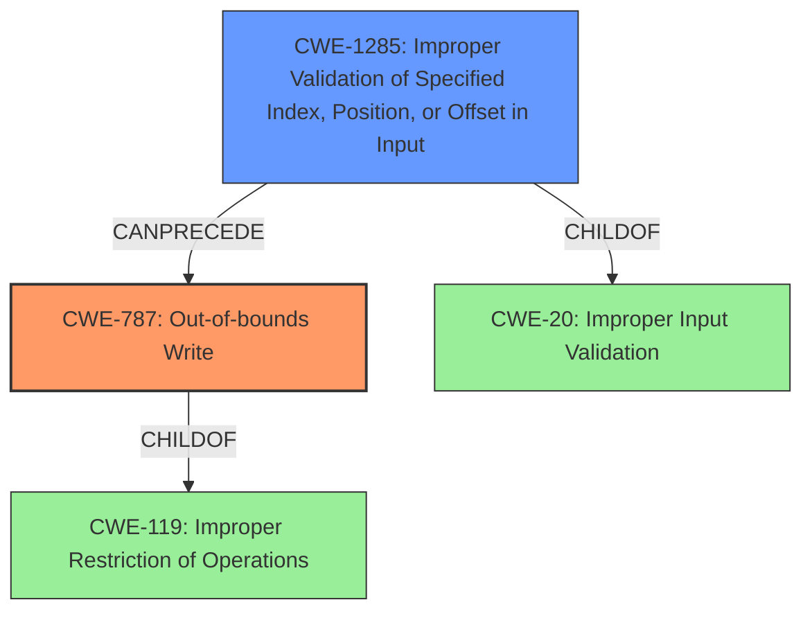

# Analysis for CVE-2021-35132

# Summary
| CWE ID | CWE Name | Confidence | CWE Abstraction Level | CWE Vulnerability Mapping Label | CWE-Vulnerability Mapping Notes |
|---|---|---|---|---|---|
| CWE-787 | Out-of-bounds Write | 1.0 | Base | Allowed | Primary CWE |
| CWE-1285 | Improper Validation of Specified Index, Position, or Offset in Input | 0.7 | Base | Allowed | Secondary Candidate |

## Evidence and Confidence

*   **Confidence Score:** 0.9
*   **Evidence Strength:** HIGH

## Relationship Analysis
The primary CWE is CWE-787, which is a base-level CWE and a child of CWE-119 (Improper Restriction of Operations Within the Bounds of a Memory Buffer). The vulnerability description clearly states an "Out of bound write," directly aligning with CWE-787's definition. A secondary CWE considered is CWE-1285 (Improper Validation of Specified Index, Position, or Offset in Input), as the root cause is identified as an "**improper bound check**" which suggests a failure to properly validate the index or offset used to write to the buffer. This relationship shows that the **improper bound check** (CWE-1285) can lead to an out-of-bounds write (CWE-787).

## Vulnerability Chain
The vulnerability chain starts with the **improper bound check** (CWE-1285), which is the root cause. This leads to the **out-of-bounds write** (CWE-787), which is the weakness. The final impact is memory corruption and potential code execution.

## Summary of Analysis
The initial analysis pointed towards CWE-787 as the primary weakness due to the explicit mention of "**Out of bound write**" in the vulnerability description. The root cause, "**improper bound check**," suggests that the index, position, or offset used to write to the buffer was not properly validated. This makes CWE-1285 a strong candidate for a secondary CWE.

The final decision is based on the provided evidence and the relationships between the CWEs. CWE-787 is the most direct representation of the weakness, while CWE-1285 captures the root cause. Both CWEs are at the Base level of abstraction, which is the preferred level.

The evidence from the vulnerability description includes:
- "**Out of bound write** in DSP service due to **improper bound check** for response buffer size"

This statement clearly indicates the presence of both the weakness (CWE-787) and the root cause (CWE-1285).

Relevant CWE Information:

# Enhanced Context (25 CWEs)
The following CWEs were identified as potentially relevant to this vulnerability:

## CWE-124: Buffer Underwrite ('Buffer Underflow')
**Abstraction Level**: Base

## CWE-131: Incorrect Calculation of Buffer Size
**Abstraction Level**: Base

## CWE-191: Integer Underflow (Wrap or Wraparound)
**Abstraction Level**: Base

## CWE-805: Buffer Access with Incorrect Length Value
**Abstraction Level**: Base

## CWE-127: Buffer Under-read
**Abstraction Level**: Variant

## CWE-126: Buffer Over-read
**Abstraction Level**: Variant

## CWE-823: Use of Out-of-range Pointer Offset
**Abstraction Level**: Base

## CWE-822: Untrusted Pointer Dereference
**Abstraction Level**: Base

## CWE-786: Access of Memory Location Before Start of Buffer
**Abstraction Level**: Base

## CWE-125: Out-of-bounds Read
**Abstraction Level**: Base

## CWE-823: Use of Out-of-range Pointer Offset
**Abstraction Level**: Base

## CWE-822: Untrusted Pointer Dereference
**Abstraction Level**: Base

## CWE-367: Time-of-check Time-of-use (TOCTOU) Race Condition
**Abstraction Level**: Base

## CWE-125: Out-of-bounds Read
**Abstraction Level**: Base

## CWE-1284: Improper Validation of Specified Quantity in Input
**Abstraction Level**: Base

## CWE-123: Write-what-where Condition
**Abstraction Level**: base

## CWE-416: Use After Free
**Abstraction Level**: variant

## CWE-825: Expired Pointer Dereference
**Abstraction Level**: base

## CWE-190: Integer Overflow or Wraparound
**Abstraction Level**: base

## CWE-1284: Improper Validation of Specified Quantity in Input
**Abstraction Level**: base

## CWE-787: Out-of-bounds Write
**Abstraction Level**: base

## CWE-1341: Multiple Releases of Same Resource or Handle
**Abstraction Level**: base

## CWE-415: Double Free
**Abstraction Level**: variant

## CWE-781: Improper Address Validation in IOCTL with METHOD_NEITHER I/O Control Code
**Abstraction Level**: variant

## CWE-1299: Missing Protection Mechanism for Alternate Hardware Interface
**Abstraction Level**: base

### Justification for CWE Selection:

*   **CWE-787: Out-of-bounds Write**
    *   **Explanation:** The vulnerability description explicitly mentions "**Out of bound write**". This directly aligns with the definition of CWE-787, which involves writing data past the end or before the beginning of the intended buffer.
    *   **Security Implications:** This can lead to memory corruption, potentially allowing attackers to overwrite critical data structures, inject malicious code, or cause denial-of-service conditions.
    *   **Relationships:** CWE-787 is a child of CWE-119 (Improper Restriction of Operations Within the Bounds of a Memory Buffer), indicating that the vulnerability involves writing outside the allowed memory region.
    *   **Mapping Guidance:** The usage is "ALLOWED" with a rationale that it is at the Base level of abstraction.
    *   **Confidence:** 1.0
*   **CWE-1285: Improper Validation of Specified Index, Position, or Offset in Input**
    *   **Explanation:** The root cause is identified as "**improper bound check**". This suggests a failure to properly validate the index or offset used to access the buffer, which is precisely what CWE-1285 describes.
    *   **Security Implications:** This allows attackers to potentially control the memory location being written to, exacerbating the impact of the out-of-bounds write.
    *   **Relationships:** CWE-1285 is a child of CWE-20 (Improper Input Validation). It can precede CWE-787 because **improper validation** of a specified index can directly lead to an out-of-bounds write.
    *   **Mapping Guidance:** The usage is "ALLOWED" with a rationale that it is at the Base level of abstraction.
    *   **Confidence:** 0.7

### CWEs Considered but Not Used:

*   **CWE-126: Buffer Over-read:** While related to buffer access, the vulnerability focuses on writing (out-of-bounds write) rather than reading.
*   **CWE-823: Use of Out-of-range Pointer Offset:** This is similar to CWE-1285, but the description emphasizes pointer arithmetic. CWE-1285 is a better fit because it covers general index/position/offset validation.
*   **CWE-367: Time-of-check Time-of-use (TOCTOU) Race Condition:** This is not applicable as there is no indication of a race condition in the vulnerability description.
*   **CWE-822: Untrusted Pointer Dereference:** This is not applicable as there is no indication of untrusted pointer dereference in the vulnerability description.
*   **CWE-1284: Improper Validation of Specified Quantity in Input:** Quantity refers to size or length while the rootcause is related to the bounds of the buffer, making CWE-1285 a better fit.
*   **CWE-415: Double Free:** There's no mention of memory being freed twice.
*   **CWE-1314: Missing Write Protection for Parametric Data Values