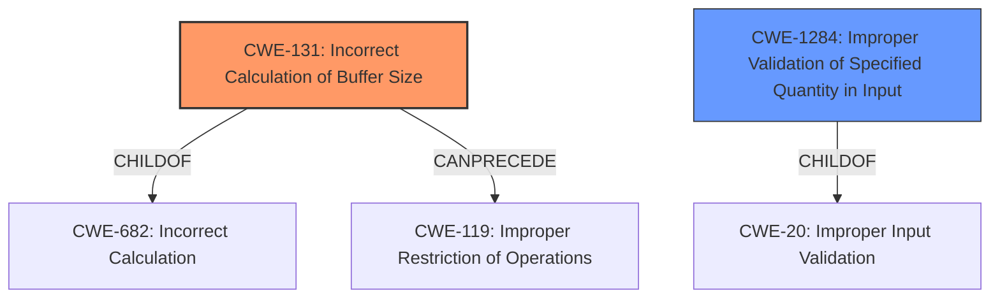

# Analysis for CVE-2021-35134

# Summary
| CWE ID | CWE Name | Confidence | CWE Abstraction Level | CWE Vulnerability Mapping Label | CWE-Vulnerability Mapping Notes |
|---|---|---|---|---|---|
| CWE-131 | Incorrect Calculation of Buffer Size | 0.9 | Base | Primary | Allowed |
| CWE-1284 | Improper Validation of Specified Quantity in Input | 0.7 | Base | Secondary | Allowed |

## Evidence and Confidence

*   **Confidence Score:** 0.8
*   **Evidence Strength:** HIGH

## Relationship Analysis
The primary CWE is CWE-131, which is a base-level CWE. It can be a child of CWE-682 (Incorrect Calculation) and can precede CWE-119 (Improper Restriction of Operations Within the Bounds of a Memory Buffer). CWE-1284 is also base level and can be a child of CWE-20 (Improper Input Validation).

## Vulnerability Chain
The vulnerability chain starts with **insufficient validation of ELF headers**, leading to an **incorrect calculation of buffer size**, ultimately causing memory corruption.

## Summary of Analysis
The vulnerability description indicates that the root cause is **insufficient validation of ELF headers**, which leads to an **incorrect calculation of buffer size**, resulting in memory corruption in Snapdragon products.

The primary CWE selected is CWE-131 (Incorrect Calculation of Buffer Size) because the vulnerability description explicitly mentions "**incorrect calculation of buffer size**". The description of CWE-131 aligns perfectly with this: "The product does not correctly calculate the size to be used when allocating a buffer, which could lead to a buffer overflow." The confidence level is high (0.9) because of the direct mention in the description.

CWE-1284 (Improper Validation of Specified Quantity in Input) is considered a secondary CWE because the root cause is "**insufficient validation of ELF headers**." ELF headers contain size and offset information, so **insufficient validation** can lead to an incorrect size. The confidence level is medium (0.7) because it is not explicitly mentioned.

CWE-20 (Improper Input Validation) was considered, but it is a Class-level CWE and discouraged. CWE-1284 is a more specific Base-level CWE that better captures the **insufficient validation** aspect of this vulnerability.

CWE-787 (Out-of-bounds Write) was considered since memory corruption is mentioned. However, the description clearly states the mechanism is "**incorrect calculation of buffer size**". Therefore, CWE-131 better represents the root cause, and the memory corruption is a consequence.

The selected CWEs are at the optimal level of specificity because they accurately reflect the root cause and the immediate consequence described in the vulnerability.