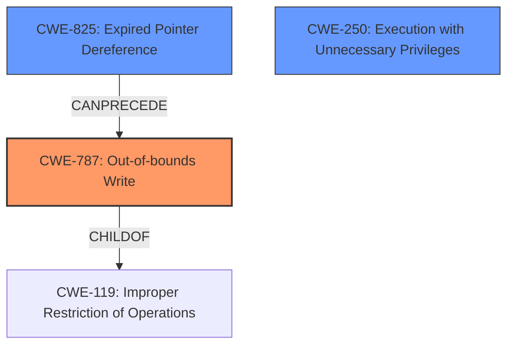

# Raw Analyzer Response for CVE-2021-35211

# Summary
| CWE ID | CWE Name | Confidence | CWE Abstraction Level | CWE Vulnerability Mapping Label | CWE-Vulnerability Mapping Notes |
|---|---|---|---|---|---|
| CWE-787 | Out-of-bounds Write | 0.8 | Base | Allowed | Primary CWE. The **Remote Memory Escape** vulnerability indicates a memory safety issue, specifically writing outside the intended buffer. |
| CWE-825 | Expired Pointer Dereference | 0.6 | Base | Allowed | Secondary CWE. A **Remote Memory Escape** could involve using a pointer to memory that has been freed. |
| CWE-250 | Execution with Unnecessary Privileges | 0.5 | Base | Allowed | Secondary CWE. The attacker's ability to "gain privileged access" after exploiting the RCE suggests the Serv-U process might be running with more privileges than necessary. |

## Evidence and Confidence

*   **Confidence Score:** 0.7
*   **Evidence Strength:** MEDIUM

## Relationship Analysis
The primary CWE is CWE-787, representing the **out-of-bounds write** condition. CWE-825 is a possible secondary weakness if the memory being written to was previously freed. The relationship between CWE-787 and CWE-825 is that CWE-825 (Expired Pointer Dereference) can precede CWE-787 (Out-of-bounds Write), indicating a potential chain. CWE-787 is a child of CWE-119 (Improper Restriction of Operations Within the Bounds of a Memory Buffer). CWE-250 is related to the impact of the vulnerability which is gaining privileged access.

## Vulnerability Chain
The vulnerability chain starts with a **Remote Memory Escape** (**out-of-bounds write** or **expired pointer dereference** due to improper handling of the SSH protocol) leading to remote code execution (RCE), and culminating in privileged access.

## Summary of Analysis
The analysis is based on the vulnerability description and the provided "CVE Reference Links Content Summary". The primary weakness is the **Remote Memory Escape**, which is best captured by CWE-787 (Out-of-bounds Write). The summary mentions a ROP attack and exception handling interception, further suggesting memory corruption. CWE-825 (Expired Pointer Dereference) is considered a possible secondary weakness because memory could have been freed before it was written to out of bounds. The attacker's goal is to "gain privileged access," and if the Serv-U process was running with unnecessary privileges, it amplifies the impact. This is represented by CWE-250.

The final selection of CWEs reflects both the root cause (**Remote Memory Escape** leading to memory corruption) and the resulting impact (privileged access). CWE-787 is the most specific and appropriate CWE for the memory corruption root cause. The other CWEs are secondary because they are either less directly related to the root cause or describe potential contributing factors.

CWEs Considered but Not Used:

*   CWE-22: Improper Limitation of a Pathname to a Restricted Directory ('Path Traversal'): This CWE is related to path traversal vulnerabilities and doesn't directly describe the **Remote Memory Escape** issue.
*   CWE-1394: Use of Default Cryptographic Key: While the vulnerability is exploited over SSH, there is no mention of default cryptographic keys being involved.
*   CWE-798: Use of Hard-coded Credentials: No mention is made of hardcoded credentials.
*   CWE-138: Improper Neutralization of Special Elements: Too general and doesn't specifically address the memory corruption aspect.
*   CWE-74: Improper Neutralization of Special Elements in Output Used by a Downstream Component ('Injection'): This is also too general. The vulnerability is related to memory corruption rather than injection.
*   CWE-732: Incorrect Permission Assignment for Critical Resource: Though the impact is privileged access, the root cause isn't necessarily related to incorrect permission assignment but rather due to memory corruption.
*   CWE-502: Deserialization of Untrusted Data: No mention is made of deserialization.
*   CWE-78: Improper Neutralization of Special Elements used in an OS Command ('OS Command Injection'): OS command injection is not mentioned in the description.
*   CWE-476: NULL Pointer Dereference: No specific mention of NULL pointer dereference.
*   CWE-843: Access of Resource Using Incompatible Type ('Type Confusion'): Type confusion is not mentioned.
*   CWE-184: Incomplete List of Disallowed Inputs: Does not fit the root cause.
*   CWE-653: Improper Isolation or Compartmentalization: Does not fit the root cause.
*   CWE-41: Improper Resolution of Path Equivalence: Does not fit the root cause.
*   CWE-1289: Improper Validation of Unsafe Equivalence in Input: Does not fit the root cause.
*   CWE-99: Improper Control of Resource Identifiers ('Resource Injection'): Does not fit the root cause.
*   CWE-807: Reliance on Untrusted Inputs in a Security Decision: Does not fit the root cause.
*   CWE-73: External Control of File Name or Path: Does not fit the root cause.
*   CWE-212: Improper Removal of Sensitive Information Before Storage or Transfer: Does not fit the root cause.
*   CWE-427: Uncontrolled Search Path Element: Does not fit the root cause.
*   CWE-59: Improper Link Resolution Before File Access ('Link Following'): Does not fit the root cause.
*   CWE-23: Relative Path Traversal: Does not fit the root cause.
*   CWE-367: Time-of-check Time-of-use (TOCTOU) Race Condition: Does not fit the root cause.
*   CWE-183: Permissive List of Allowed Inputs: Does not fit the root cause.
*   CWE-257: Storing Passwords in a Recoverable Format: Does not fit the root cause.