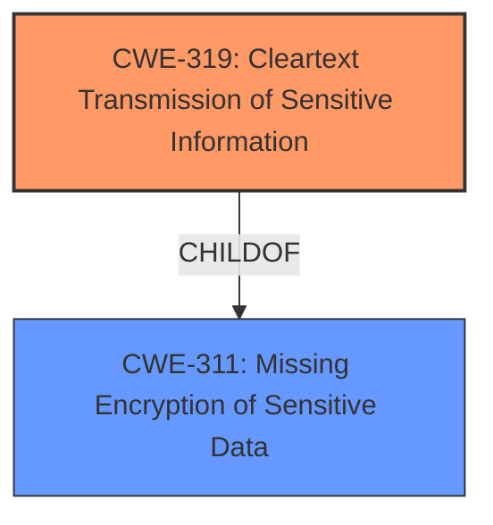

# Analysis for CVE-2021-35246

# Summary
| CWE ID | CWE Name | Confidence | CWE Abstraction Level | CWE Vulnerability Mapping Label | CWE-Vulnerability Mapping Notes |
|---|---|---|---|---|---|
| CWE-319 | Cleartext Transmission of Sensitive Information | 1.0 | Base | Allowed | Primary CWE |

## Evidence and Confidence

*   **Confidence Score:** 1.0
*   **Evidence Strength:** HIGH

## Relationship Analysis
The selected CWE, CWE-319 (**CWE-319: Cleartext Transmission of Sensitive Information**), is a base-level CWE. It is a child of CWE-311 (**CWE-311: Missing Encryption of Sensitive Data**). No chain relationships are relevant in this case. The base level of abstraction is appropriate because the application **fails to prevent users from connecting over unencrypted connections**.

## Vulnerability Chain
The vulnerability chain starts with the **failure to prevent users from connecting over unencrypted connections**, leading to the transmission of sensitive information in cleartext. This allows an attacker to intercept and modify network traffic, bypassing SSL/TLS encryption, and potentially using the application as a platform for attacks.

## Summary of Analysis
The initial analysis correctly identifies the root cause as the **failure to prevent users from connecting over unencrypted connections**. The evidence for this is directly stated in the "Vulnerability Description Key Phrases" as "**rootcause:** **failure to prevent users from connecting over unencrypted connections**" and in the "CVE Reference Links Content Summary" as "**Root cause of vulnerability:** The application fails to prevent users from connecting over unencrypted connections."

The Retriever Results list CWE-319 (**CWE-319: Cleartext Transmission of Sensitive Information**) as the top candidate, which aligns with the vulnerability description. The application's **failure to prevent users from connecting over unencrypted connections** directly leads to the transmission of sensitive information in cleartext. The MITRE mapping guidance for CWE-319 states that it is at the Base level of abstraction, which is a preferred level of abstraction for mapping to the root causes of vulnerabilities, and its Usage is Allowed.

Based on the evidence and the CWE specifications, CWE-319 is the most appropriate and specific classification for this vulnerability.

Relevant CWE Information:
CWE-319 (**CWE-319: Cleartext Transmission of Sensitive Information**)

Other CWEs Considered:

*   CWE-522 (**CWE-522: Insufficiently Protected Credentials**): While related to security, this is more about how credentials are stored/transmitted, not the lack of encryption.
*   CWE-614 (**CWE-614: Sensitive Cookie in HTTPS Session Without 'Secure' Attribute**): This is related to cookies, which is not the primary issue in the described vulnerability.
*   CWE-295 (**CWE-295: Improper Certificate Validation**): This is about certificate validation, which is not the core issue here.
*   CWE-327 (**CWE-327: Use of a Broken or Risky Cryptographic Algorithm**): This is about the algorithm itself, not the absence of encryption.
* CWE-649 (**CWE-649: Reliance on Obfuscation or Encryption of Security-Relevant Inputs without Integrity Checking**): The application is not performing checking of integrity.
*   CWE-208 (**CWE-208: Observable Timing Discrepancy**): Timing discrepancies are not relevant to the described vulnerability.
*   CWE-757 (**CWE-757: Selection of Less-Secure Algorithm During Negotiation ('Algorithm Downgrade')**): This is about downgrading algorithms, not the absence of encryption.
*   CWE-923 (**CWE-923: Improper Restriction of Communication Channel to Intended Endpoints**): This is about restricting communication channels, not the absence of encryption.
*   CWE-1204 (**CWE-1204: Generation of Weak Initialization Vector (IV)**): Initialization vectors are not relevant to the described vulnerability.