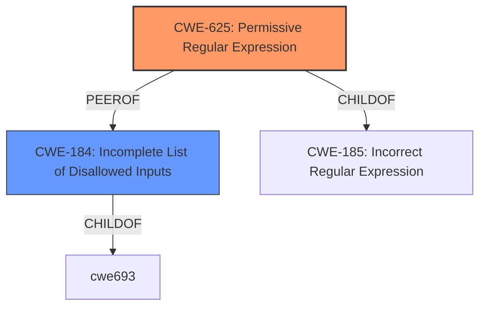

# Analysis for CVE-2021-35368

# Summary
| CWE ID | CWE Name | Confidence | CWE Abstraction Level | CWE Vulnerability Mapping Label | CWE-Vulnerability Mapping Notes |
|---|---|---|---|---|---|
| CWE-625 | Permissive Regular Expression | 0.8 | Base | Primary | Allowed |
| CWE-184 | Incomplete List of Disallowed Inputs | 0.6 | Base | Secondary | Allowed |

## Evidence and Confidence

*   **Confidence Score:** 0.7
*   **Evidence Strength:** MEDIUM

## Relationship Analysis
The primary CWE selected is CWE-625, which describes the use of a regular expression that does not sufficiently restrict the set of allowed values. This is related to CWE-184 because the **incomplete** list can lead to a **permissive** regular expression. Both are base-level CWEs, which are preferred.

## Vulnerability Chain
The vulnerability chain starts with a **missing** phase 1 skip and overly **permissive** rules in the Drupal rule exclusion package, which are forms of **incomplete** configuration. This leads to the WAF not inspecting the request body when it should, due to the regular expression matching the crafted URI. The backend application then processes the request without the WAF's inspection, allowing malicious payloads to pass through.

## Summary of Analysis
Initially, the vulnerability description points to a request body bypass due to a trailing pathname. However, the CVE Reference Links Content Summary provides more information about the root cause. The vulnerability stems from a combination of factors, including a **missing** phase 1 skip, overly **permissive** rules in the Drupal rule exclusion package, inconsistent handling of URI path and path info, and a lack of comprehensive code review and testing.

The most relevant CWE appears to be CWE-625 (Permissive Regular Expression) because the overly **permissive** rules use a regular expression that is not restrictive enough, allowing attackers to bypass the WAF. Supporting evidence comes from the CVE Reference Links Content Summary, which states that the issue is caused by the Drupal RE rules disabling request body scanning based on a regular expression matching against the URI.

CWE-184 (Incomplete List of Disallowed Inputs) is also considered as a secondary CWE because the **missing** phase 1 skip and overly **permissive** rules can be seen as an incomplete list of disallowed inputs or an incomplete configuration that allows the bypass.

CWE-22 (Improper Limitation of a Pathname to a Restricted Directory) was considered because the vulnerability involves a trailing pathname, but it is not the primary issue. The root cause is the **permissive** regular expression and the **incomplete** configuration that allows the bypass.

CWE-74 (Improper Neutralization of Special Elements in Output Used by a Downstream Component) is a class-level CWE and is discouraged when more specific weaknesses are available.

CWE-863 (Incorrect Authorization) is too high level, as the core issue is related to regular expression matching not authorization.

The selected CWEs are at the optimal level of specificity because they directly address the **root cause** of the vulnerability, which is the **permissive** regular expression and the **incomplete** configuration.

Relevant CWE Information:

# Enhanced Context (25 CWEs)

## CWE-625: Permissive Regular Expression
**Abstraction Level**: Base
**Similarity Score**: 0.089
**Source**: sparse

**Description**:
The product uses a regular expression that does not sufficiently restrict the set of allowed values.

**Mapping Guidance**:
- Usage: Allowed
- Rationale: This CWE entry is at the Base level of abstraction, which is a preferred level of abstraction for mapping to the root causes of vulnerabilities.

## CWE-184: Incomplete List of Disallowed Inputs
**Abstraction Level**: Base
**Similarity Score**: 0.002
**Source**: graph

**Description**:
The product implements a protection mechanism that relies on a list of inputs (or properties of inputs) that are not allowed by policy or otherwise require other action to neutralize before additional processing takes place, but the list is incomplete.

**Mapping Guidance**:
- Usage: Allowed
- Rationale: This CWE entry is at the Base level of abstraction, which is a preferred level of abstraction for mapping to the root causes of vulnerabilities.