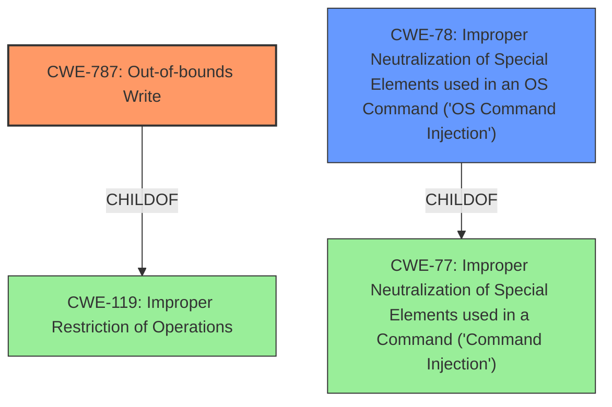

# Raw Analyzer Response for CVE-2021-35394

# Summary
| CWE ID    | CWE Name                                                                    | Confidence | CWE Abstraction Level | CWE Vulnerability Mapping Label | CWE-Vulnerability Mapping Notes |
| :-------- | :-------------------------------------------------------------------------- | :--------- | :-------------------- | :------------------------------ | :-------------------------------- |
| CWE-787   | Out-of-bounds Write                                                          | 0.9        | Base                  | Primary                         | Allowed                           |
| CWE-78    | Improper Neutralization of Special Elements used in an OS Command ('OS Command Injection') | 0.9        | Base                  | Secondary                         | Allowed                           |

## Evidence and Confidence

*   **Confidence Score:** 0.9
*   **Evidence Strength:** HIGH

## Relationship Analysis
The primary weakness is CWE-787 **Out-of-bounds Write**, which is a child of CWE-119 **Improper Restriction of Operations within the Bounds of a Memory Buffer**. The secondary weakness is CWE-78 **Improper Neutralization of Special Elements used in an OS Command ('OS Command Injection')**, which is a child of CWE-77 **Improper Neutralization of Special Elements used in a Command ('Command Injection')**. The vulnerability description clearly mentions both "multiple memory corruption vulnerabilities" (leading to CWE-787) and "an arbitrary command injection vulnerability" (leading to CWE-78).

## Vulnerability Chain
The vulnerability chain involves the following:
1.  **Root Cause:** **Multiple memory corruption vulnerabilities** (CWE-787) due to insufficient validation of commands.
2.  **Root Cause:** **Arbitrary command injection vulnerability** (CWE-78) due to insufficient validation of user input.
3.  **Impact:** Denial of Service (DoS) and Arbitrary Command Execution.

## Summary of Analysis
The analysis indicates the presence of two distinct weaknesses: **multiple memory corruption vulnerabilities** and an **arbitrary command injection vulnerability**. Both stem from the **insufficient validation** of input within the Realtek Jungle SDK's MP Daemon.

The **Vulnerability Description** states: "Realtek Jungle SDK version v2.x up to v3.4.14B provides a diagnostic tool called MP Daemon that is usually compiled as UDPServer binary. The binary is affected by **multiple memory corruption vulnerabilities and an arbitrary command injection vulnerability** that can be exploited by remote unauthenticated attackers."

The **CVE Reference Links Content Summary** reinforces this: "The 'UDPServer' MP tool within the Realtek AP-Router SDK suffers from multiple buffer overflow vulnerabilities and an arbitrary command injection vulnerability. This is due to **insufficient validation of commands** received from clients."

Based on this evidence, I have chosen CWE-787 **Out-of-bounds Write** to represent the memory corruption vulnerabilities and CWE-78 **Improper Neutralization of Special Elements used in an OS Command ('OS Command Injection')** to represent the command injection vulnerability. Both CWEs are at the Base level of abstraction, providing sufficient specificity.

Other CWEs were considered but not selected because they were either too high-level (e.g., CWE-20 **Improper Input Validation**) or more specific variants were a better fit (e.g., CWE-121 **Stack-based Buffer Overflow** and CWE-122 **Heap-based Buffer Overflow** were less preferable to CWE-787 **Out-of-bounds Write**). Although the specific type of out-of-bounds write (stack vs heap) isn't explicitly specified, CWE-787 is broad enough to encompass both and is the root cause, while stack/heap is more about the location.

Relevant CWE Information:

# Enhanced Context (25 CWEs)
The following CWEs were identified as potentially relevant to this vulnerability:

## CWE-787: Out-of-bounds Write
**Abstraction:** Base
**Status:** Draft

### Description
The product writes data past the end, or before the beginning, of the intended buffer.

### Extended Description
Not provided

### Alternative Terms
Memory Corruption: Often used to describe the consequences of writing to memory outside the bounds of a buffer, or to memory that is otherwise invalid.

### Relationships
ChildOf -> CWE-119
ChildOf -> CWE-119
ChildOf -> CWE-119
ChildOf -> CWE-119

### Mapping Guidance
**Usage:** Allowed
**Rationale:** This CWE entry is at the Base level of abstraction, which is a preferred level of abstraction for mapping to the root causes of vulnerabilities.
**Comments:** Carefully read both the name and description to ensure that this mapping is an appropriate fit. Do not try to 'force' a mapping to a lower-level Base/Variant simply to comply with this preferred level of abstraction.
**Reasons:**
- Acceptable-Use

### Observed Examples
- **CVE-2023-1017:** The reference implementation code for a Trusted Platform Module does not implement length checks on data, allowing for an attacker to write 2 bytes past the end of a buffer.
- **CVE-2021-21220:** Chain: insufficient input validation (CWE-20) in browser allows heap corruption (CWE-787), as exploited in the wild per CISA KEV.
- **CVE-2021-28664:** GPU kernel driver allows memory corruption because a user can obtain read/write access to read-only pages, as exploited in the wild per CISA KEV.

## CWE-78: Improper Neutralization of Special Elements used in an OS Command ('OS Command Injection')
**Abstraction:** Base
**Status:** Stable

### Description
The product constructs all or part of an OS command using externally-influenced input from an upstream component, but it does not neutralize or incorrectly neutralizes special elements that could modify the intended OS command when it is sent to a downstream component.

### Extended Description
This weakness can lead to a vulnerability in environments in which the attacker does not have direct access to the operating system, such as in web applications. Alternately, if the weakness occurs in a privileged program, it could allow the attacker to specify commands that normally would not be accessible, or to call alternate commands with privileges that the attacker does not have. The problem is exacerbated if the compromised process does not follow the principle of least privilege, because the attacker-controlled commands may run with special system privileges that increases the amount of damage.

There are at least two subtypes of OS command injection:

- The application intends to execute a single, fixed program that is under its own control. It intends to use externally-supplied inputs as arguments to that program. For example, the program might use system("nslookup [HOSTNAME]") to run nslookup and allow the user to supply a HOSTNAME, which is used as an argument. Attackers cannot prevent nslookup from executing. However, if the program does not remove command separators from the HOSTNAME argument, attackers could place the separators into the arguments, which allows them to execute their own program after nslookup has finished executing.
- The application accepts an input that it uses to fully select which program to run, as well as which commands to use. The application simply redirects this entire command to the operating system. For example, the program might use "exec([COMMAND])" to execute the [COMMAND] that was supplied by the user. If the COMMAND is under attacker control, then the attacker can execute arbitrary commands or programs. If the command is being executed using functions like exec() and CreateProcess(), the attacker might not be able to combine multiple commands together in the same line.

From a weakness standpoint, these variants represent distinct programmer errors. In the first variant, the programmer clearly intends that input from untrusted parties will be part of the arguments in the command to be executed. In the second variant, the programmer does not intend for the command to be accessible to any untrusted party, but the programmer probably has not accounted for alternate ways in which malicious attackers can provide input.

### Alternative Terms
Shell injection
Shell metacharacters
OS Command Injection

### Relationships
ChildOf -> CWE-77
ChildOf -> CWE-74
ChildOf -> CWE-77
ChildOf -> CWE-77
CanAlsoBe -> CWE-88

### Mapping Guidance
**Usage:** Allowed
**Rationale:** This CWE entry is at the Base level of abstraction, which is a preferred level of abstraction for mapping to the root causes of vulnerabilities.
**Comments:** Carefully read both the name and description to ensure that this