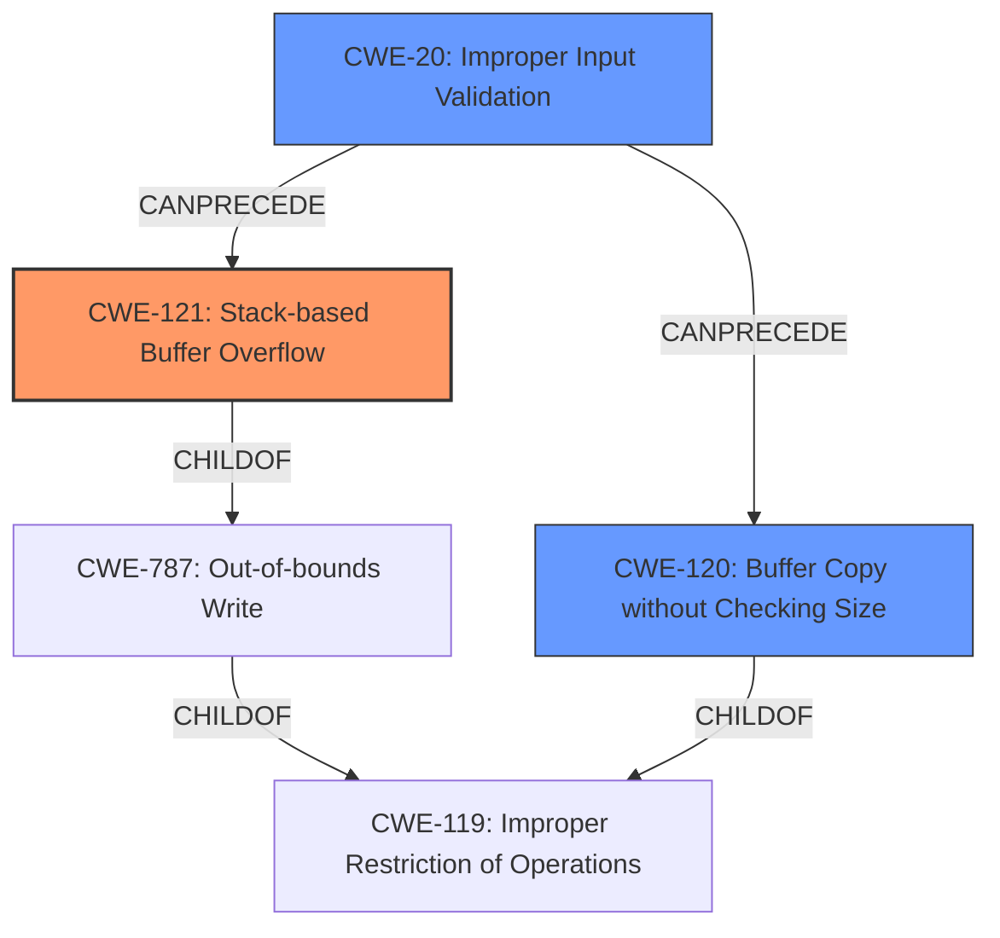

# Analysis for CVE-2021-35395

# Summary
| CWE ID | CWE Name | Confidence | CWE Abstraction Level | CWE Vulnerability Mapping Label | CWE-Vulnerability Mapping Notes |
|---|---|---|---|---|---|
| CWE-121 | Stack-based Buffer Overflow | 1.0 | Variant | Allowed | Primary CWE |
| CWE-120 | Buffer Copy without Checking Size of Input ('Classic Buffer Overflow') | 0.8 | Base | Allowed-with-Review | Secondary Candidate |
| CWE-20 | Improper Input Validation | 0.6 | Class | Discouraged | Secondary Candidate |

## Evidence and Confidence

*   **Confidence Score:** 0.9
*   **Evidence Strength:** HIGH

## Relationship Analysis
The primary CWE is CWE-121 (Stack-based Buffer Overflow), which is a variant of CWE-787 (Out-of-bounds Write) and CWE-119 (Improper Restriction of Operations within the Bounds of a Memory Buffer). CWE-120 (Buffer Copy without Checking Size of Input) is a related base CWE and a child of CWE-119 as well. CWE-20 (Improper Input Validation) is a class-level CWE that can precede buffer overflows. The abstraction levels influenced the selection, with a preference for the more specific Variant (CWE-121) and Base (CWE-120) levels over the more general Class level (CWE-20).

## Vulnerability Chain
The vulnerability chain starts with **improper input validation** or the **lack of input validation**, leading to an **unsafe copy of user-supplied parameters**, which results in a **stack buffer overflow**, ultimately enabling **arbitrary code execution**.

## Summary of Analysis
The initial assessment strongly points towards a stack-based buffer overflow due to the "**stack buffer overflow** in formRebootCheck due to **unsafe copy of** submit-url parameter" and similar statements in the vulnerability description. The CVE Reference Links Content Summary confirms the **root_cause** as "**unsafe copies** of some overly long parameters submitted in the form, specifically when handling parameters like 'submit-url', 'ifname', 'hostname', and 'peerPin'." and mentions "**insufficient validation** of the received buffer and **unsafe calls** to sprintf/strcpy." This confirms both the buffer overflow and the lack of input validation.

The graph relationships highlight the connection between improper input validation (CWE-20) and buffer overflows (CWE-121, CWE-120). The choice of CWE-121 is made because the vulnerability description specifically mentions "**stack buffer overflow**". CWE-120 is considered because it describes the **unsafe copy** aspect of the vulnerability, where input is copied to a buffer without checking its size. However, because the description is explicit about the overflow occurring on the stack, CWE-121 is the more specific and appropriate choice.

The selected CWEs are at the optimal level of specificity because CWE-121 is a variant that accurately describes the location of the buffer overflow (stack). While CWE-119 (Improper Restriction of Operations within the Bounds of a Memory Buffer) is a parent class, it is too general. The evidence supports a more specific classification. CWE-20 is included as a secondary candidate because of the "**insufficient validation**" aspect, but it is a class-level CWE and less specific than CWE-121 and CWE-120.

Relevant CWE Information:

# Enhanced Context (25 CWEs)

## CWE-191: Integer Underflow (Wrap or Wraparound)
**Abstraction Level**: Base
**Similarity Score**: 0.75

*Rationale for not selecting*: Not relevant; no integer underflow is mentioned.

## CWE-124: Buffer Underwrite ('Buffer Underflow')
**Abstraction Level**: Base
**Similarity Score**: 0.74

*Rationale for not selecting*: Not relevant; the vulnerability is a buffer overflow, not an underflow.

## CWE-131: Incorrect Calculation of Buffer Size
**Abstraction Level**: Base
**Similarity Score**: 0.74

*Rationale for not selecting*: While a buffer size calculation error *could* be present, the description focuses on the lack of size checking during the copy operation, not a calculation error.

## CWE-805: Buffer Access with Incorrect Length Value
**Abstraction Level**: Base
**Similarity Score**: 0.74

*Rationale for not selecting*: The core issue is copying without checking size, rather than using an incorrect length value during access.

## CWE-680: Integer Overflow to Buffer Overflow
**Abstraction Level**: Compound
**Similarity Score**: 0.74

*Rationale for not selecting*: No integer overflow is mentioned in the provided evidence.

## CWE-126: Buffer Over-read
**Abstraction Level**: Variant
**Similarity Score**: 0.73

*Rationale for not selecting*: The vulnerability is a buffer overflow (write), not an over-read.

## CWE-197: Numeric Truncation Error
**Abstraction Level**: Base
**Similarity Score**: 0.73

*Rationale for not selecting*: Not relevant; no numeric truncation is mentioned.

## CWE-193: Off-by-one Error
**Abstraction Level**: Base
**Similarity Score**: 0.72

*Rationale for not selecting*: While an off-by-one error *could* contribute, the main issue is the lack of size checking.

## CWE-190: Integer Overflow or Wraparound
**Abstraction Level**: Base
**Similarity Score**: 0.72

*Rationale for not selecting*: Not relevant; no integer overflow is mentioned.

## CWE-681: Incorrect Conversion between Numeric Types
**Abstraction Level**: Base
**Similarity Score**: 0.72

*Rationale for not selecting*: Not relevant; no incorrect conversion between numeric types is mentioned.

## CWE-41: Improper Resolution of Path Equivalence
**Abstraction Level**: base
**Similarity Score**: 5.03

*Rationale for not selecting*: Not relevant; this relates to path traversal, which is not the focus of the vulnerability.

## CWE-22: Improper Limitation of a Pathname to a Restricted Directory ('Path Traversal')
**Abstraction Level**: base
**Similarity Score**: 4.33

*Rationale for not selecting*: Not relevant; this relates to path traversal, which is not the focus of the vulnerability.

## CWE-770: Allocation of Resources Without Limits or Throttling
**Abstraction Level**: base
**Similarity Score**: 4.33

*Rationale for not selecting*: Not relevant; there's no indication of resource allocation issues.

## CWE-73: External Control of File Name or Path
**Abstraction Level**: base
**Similarity Score**: 4.33

*Rationale for not selecting*: Not relevant; this relates to file path manipulation, not the focus.

## CWE-78: Improper Neutralization of Special Elements used in an OS Command ('OS Command Injection')
**Abstraction Level**: base
**Similarity Score**: 4.31

*Rationale for not selecting*: The description does mention "arbitrary command execution" and "arbitrary command injection" but specifically via other parameters and forms. There is a separate vulnerability related to this CWE.

## CWE-195: Signed to Unsigned Conversion Error
**Abstraction Level**: variant
**Similarity Score**: 3.88

*Rationale for not selecting*: Not relevant; no signed to unsigned conversion error is present.

## CWE-170: Improper Null Termination
**Abstraction Level**: Base
**Similarity Score**: 3.30

*Rationale for not selecting*: While this *could* be a contributing factor, the core issue is the lack of size checking during the copy operation.

## CWE-121: Stack-based Buffer Overflow
**Technical Explanation:** The vulnerability description explicitly states that a "**stack buffer overflow**" occurs due to "**unsafe copy of**" parameters. This aligns perfectly with CWE-121, which describes a buffer overflow occurring on the stack.
**Security Implications:** Stack-based buffer overflows can allow attackers to overwrite return addresses, function pointers, or other critical data on the stack, leading to