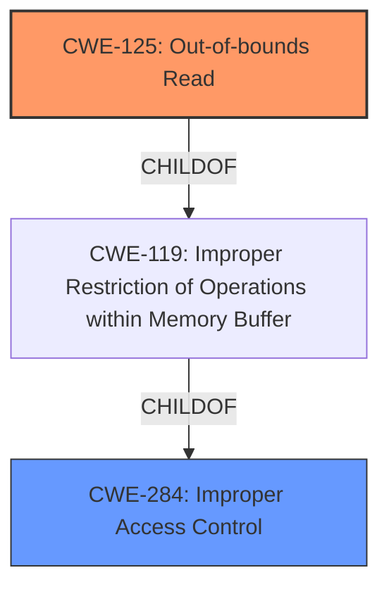

# Analysis for CVE-2021-35452

# Summary
| CWE ID | CWE Name | Confidence | CWE Abstraction Level | CWE Vulnerability Mapping Label | CWE-Vulnerability Mapping Notes |
|---|---|---|---|---|---|
| CWE-125 | Out-of-bounds Read | 0.9 | Base | Allowed | Primary CWE |
| CWE-284 | Improper Access Control | 0.6 | Pillar | Discouraged | Secondary Candidate |

## Evidence and Confidence

*   **Confidence Score:** 0.8
*   **Evidence Strength:** HIGH

## Relationship Analysis
The primary relationship influencing the CWE selection is the ChildOf relationship between CWE-125 **Out-of-bounds Read** and CWE-119 **Improper Restriction of Operations within Memory Buffer**. While the vulnerability description mentions **Incorrect Access Control**, the more specific issue is reading memory outside the allocated buffer. CWE-284 is a high-level Pillar, making it less appropriate than the Base-level CWE-125.

## Vulnerability Chain
The vulnerability chain starts with the **incorrect access control**, leading to an attempt to read memory out of bounds, ultimately resulting in a segmentation fault. The chain can be summarized as: **Incorrect Access Control** -> Out-of-bounds Read -> Segmentation Fault (DoS).

## Summary of Analysis
The initial analysis focused on identifying the root cause of the vulnerability. The description mentions "**Incorrect Access Control**" but the CVE details point to an out-of-bounds read due to a missing or improper bounds check.

The most relevant evidence comes from the "CVE Reference Links Content Summary":
*   "The vulnerability is located in the `slice_segment_header::read` function within the `slice.cc` file. It involves an incorrect memory access while reading slice segment header data. Specifically, a read from memory location `rsi+0x7fff8000` is performed without proper bounds checking"
*   "**Incorrect Access Control:** The primary issue is an incorrect access control that leads to an out-of-bounds read. The code attempts to read a byte from a memory address that may not belong to the allocated memory, leading to a segmentation fault."

Based on this evidence, CWE-125 **Out-of-bounds Read** is the most accurate representation of the vulnerability. While **incorrect access control** is a contributing factor, the immediate cause is the out-of-bounds memory access. CWE-284 **Improper Access Control** is too general.

The selection of CWE-125 is at the optimal level of specificity because it directly describes the **weakness** where the code reads data past the boundary of a buffer.

Relevant CWE Information:

# Enhanced Context (25 CWEs)
The following CWEs were identified as potentially relevant to this vulnerability:

## CWE-404: Improper Resource Shutdown or Release
**Abstraction Level**: Class
**Similarity Score**: 0.76

## CWE-668: Exposure of Resource to Wrong Sphere
**Abstraction Level**: Class
**Similarity Score**: 0.76

## CWE-613: Insufficient Session Expiration
**Abstraction Level**: Base
**Similarity Score**: 0.76

## CWE-274: Improper Handling of Insufficient Privileges
**Abstraction Level**: Base
**Similarity Score**: 0.75

## CWE-799: Improper Control of Interaction Frequency
**Abstraction Level**: Class
**Similarity Score**: 0.75

## CWE-226: Sensitive Information in Resource Not Removed Before Reuse
**Abstraction Level**: Base
**Similarity Score**: 0.75

## CWE-653: Improper Isolation or Compartmentalization
**Abstraction Level**: Class
**Similarity Score**: 0.75

## CWE-807: Reliance on Untrusted Inputs in a Security Decision
**Abstraction Level**: Base
**Similarity Score**: 0.75

## CWE-1289: Improper Validation of Unsafe Equivalence in Input
**Abstraction Level**: Base
**Similarity Score**: 0.75

## CWE-41: Improper Resolution of Path Equivalence
**Abstraction Level**: Base
**Similarity Score**: 0.75

## CWE-125: Out-of-bounds Read
**Abstraction Level**: Base
**Similarity Score**: 5774.61

**Description**:
The product reads data past the end, or before the beginning, of the intended buffer.

**Mapping Guidance**:
- Usage: Allowed
- Rationale: This CWE entry is at the Base level of abstraction, which is a preferred level of abstraction for mapping to the root causes of vulnerabilities.

## CWE-863: Incorrect Authorization
**Abstraction Level**: Class
**Similarity Score**: 5606.97

## CWE-1284: Improper Validation of Specified Quantity in Input
**Abstraction Level**: Base
**Similarity Score**: 5593.65

## CWE-668: Exposure of Resource to Wrong Sphere
**Abstraction Level**: Class
**Similarity Score**: 5575.18

## CWE-942: Permissive Cross-domain Policy with Untrusted Domains
**Abstraction Level**: Variant
**Similarity Score**: 5572.74

## CWE-170: Improper Null Termination
**Abstraction Level**: base
**Similarity Score**: 4.33

## CWE-190: Integer Overflow or Wraparound
**Abstraction Level**: base
**Similarity Score**: 4.33

## CWE-1284: Improper Validation of Specified Quantity in Input
**Abstraction Level**: base
**Similarity Score**: 4.33

## CWE-787: Out-of-bounds Write
**Abstraction Level**: base
**Similarity Score**: 3.89

## CWE-126: Buffer Over-read
**Abstraction Level**: variant
**Similarity Score**: 3.88

## CWE-195: Signed to Unsigned Conversion Error
**Abstraction Level**: variant
**Similarity Score**: 3.88

## CWE-942: Permissive Cross-domain Policy with Untrusted Domains
**Abstraction Level**: variant
**Similarity Score**: 3.88

## CWE-79: Improper Neutralization of Input During Web Page Generation ('Cross-site Scripting')
**Abstraction Level**: base
**Similarity Score**: 3.49

## CWE-184: Incomplete List of Disallowed Inputs
**Abstraction Level**: base
**Similarity Score**: 3.36

## CWE-125: Out-of-bounds Read
**Abstraction Level**: base
**Similarity Score**: 3.30

CWE-125 **Out-of-bounds Read** is selected because it directly describes the **weakness** identified in the vulnerability description and the CVE reference. The code attempts to read memory outside the bounds of the allocated buffer, leading to a segmentation fault. Other CWEs were considered but deemed less specific or accurate.

CWE-284 **Improper Access Control** was considered because the initial description mentions **incorrect access control**. However, this is a broader category, and the more specific issue is the out-of-bounds read. The MITRE mapping guidance discourages using CWE-284 due to its high-level nature.