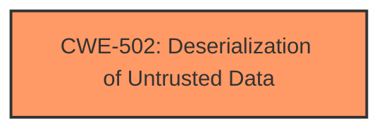

# Analysis Report for CVE-2021-35464

# Vulnerability Analysis Report: CVE-2021-35464

## Description


## Analysis (with Relationship Data)

# Summary
| CWE ID | CWE Name | Confidence | CWE Abstraction Level | CWE Vulnerability Mapping Label | CWE-Vulnerability Mapping Notes |
|---|---|---|---|---|---|
| CWE-502 | Deserialization of Untrusted Data | 1.0 | Base | Allowed | Primary CWE |

## Evidence and Confidence

*   **Confidence Score:** 1.0
*   **Evidence Strength:** HIGH

## Relationship Analysis
The primary relationship that impacted my decision was the direct match of the vulnerability description to CWE-502, which is a Base level CWE. There are no specific child or parent relationships that are relevant in this case. No chain relationships are present because this is the root cause vulnerability.



## Vulnerability Chain
The vulnerability chain is very simple:
1.  **Root Cause:** CWE-502 - Deserialization of Untrusted Data
2.  **Impact:** Remote Code Execution

## Summary of Analysis
The initial analysis strongly pointed towards CWE-502 due to the explicit mention of **Java deserialization** in the vulnerability description. The retriever results also listed CWE-502 as the top candidate.

The vulnerability description states: "ForgeRock AM server before 7.0 has a **Java deserialization** vulnerability in the jato.pageSession parameter on multiple pages. The exploitation does not require authentication, and remote code execution can be triggered by sending a single crafted /ccversion/* request to the server. The vulnerability exists due to the usage of Sun ONE Application Framework (JATO) found in versions of Java 8 or earlier"

Based on the provided evidence and the high confidence in the initial assessment, CWE-502 is the optimal choice. All other CWEs were considered but deemed less relevant as they describe related but distinct weaknesses. CWE-502 directly addresses the core issue of deserializing untrusted data, making it the most specific and accurate classification for this vulnerability.

Relevant CWE Information:

# Enhanced Context (25 CWEs)

## CWE-502: Deserialization of Untrusted Data
**Abstraction:** Base
**Status:** Draft

### Description
The product deserializes untrusted data without sufficiently ensuring that the resulting data will be valid.

### Extended Description
Not provided

### Alternative Terms
Marshaling, Unmarshaling: Marshaling and unmarshaling are effectively synonyms for serialization and deserialization, respectively.
Pickling, Unpickling: In Python, the "pickle" functionality is used to perform serialization and deserialization.
PHP Object Injection: Some PHP application researchers use this term when attacking unsafe use of the unserialize() function; but it is also used for CWE-915.

### Relationships
ChildOf -> CWE-913
ChildOf -> CWE-913
PeerOf -> CWE-915

### Mapping Guidance
**Usage:** Allowed
**Rationale:** This CWE entry is at the Base level of abstraction, which is a preferred level of abstraction for mapping to the root causes of vulnerabilities.
**Comments:** Carefully read both the name and description to ensure that this mapping is an appropriate fit. Do not try to 'force' a mapping to a lower-level Base/Variant simply to comply with this preferred level of abstraction.
**Reasons:**
- Acceptable-Use
### Additional Notes
**[Maintenance]** The relationships between CWE-502 and CWE-915 need further exploration. CWE-915 is more narrowly scoped to object modification, and is not necessarily used for deserialization.

### Observed Examples
- **CVE-2019-12799:** chain: bypass of untrusted deserialization issue (CWE-502) by using an assumed-trusted class (CWE-183)
- **CVE-2015-8103:** Deserialization issue in commonly-used Java library allows remote execution.
- **CVE-2015-4852:** Deserialization issue in commonly-used Java library allows remote execution.


## CWE Relationship Analysis

Current CWEs represent these abstraction levels: .


### Vulnerability Chain Analysis

**Chain starting from CWE-502:**
- 502 (Deserialization of Untrusted Data) - ROOT


**Chain starting from CWE-183:**
- 183 (Permissive List of Allowed Inputs) - ROOT


### CWE Relationship Diagram

```mermaid
graph TD
    classDef primary fill:#f96,stroke:#333,stroke-width:2px
    classDef secondary fill:#69f,stroke:#333
    classDef tertiary fill:#9e9,stroke:#333
```


*Report generated on 2025-04-02 12:08:12*
