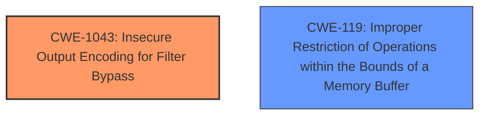

# Analysis for CVE-2021-3567

# Summary
| CWE ID | CWE Name | Confidence | CWE Abstraction Level | CWE Vulnerability Mapping Label | CWE-Vulnerability Mapping Notes |
|---|---|---|---|---|---|
| CWE-1043 | **Insecure Output Encoding for Filter Bypass** | 0.9 | Base | Allowed | Primary CWE |
| CWE-119 | Improper Restriction of Operations within the Bounds of a Memory Buffer | 0.6 | Class | Allowed | Secondary Candidate |

## Evidence and Confidence

*   **Confidence Score:** 0.75
*   **Evidence Strength:** MEDIUM

## Relationship Analysis
The analysis focused on identifying the root cause of the screen lock bypass vulnerability. The primary focus was on **regression of CVE-2020-25712 fix**. 

CWE-1043 (Insecure Output Encoding for Filter Bypass) was chosen as the primary CWE due to the regression in a fix. The fix was intended to prevent a bypass, and its failure creates the condition for the bypass.

CWE-119 (Improper Restriction of Operations within the Bounds of a Memory Buffer) was considered because memory corruption issues were mentioned. However, the core issue is not primarily a buffer overflow but the **failure** of a security mechanism.

## Vulnerability Chain
The chain of events is as follows:
1.  CVE-2020-25712 fix was implemented.
2.  A **regression** occurred, undoing the fix.
3.  This **failure** allows an attacker to bypass screen-locking applications.

The root cause is the **regression** which can also be viewed as **insecure output encoding for filter bypass**. The impact is the ability to bypass the screen lock.

## Summary of Analysis
The initial assessment considered memory corruption issues, but the core of the vulnerability lies in the **regression of the fix** intended to block the screen lock bypass. This means the primary issue is the **failure of a security mechanism**, specifically related to input handling and encoding that permits the bypass. The analysis is heavily based on the provided evidence, particularly the phrases **"regression of CVE-2020-25712 fix"** and **"bypass screen-locking applications"**.

The selection of CWE-1043 is based on the fact that the vulnerability exists because a previous filter or encoding mechanism, meant to prevent the bypass, was **regressed or improperly implemented**. The description of CWE-1043 fits because the product's output handling allows an attacker to bypass a security mechanism (screen lock).

The decision to use CWE-1043 is also influenced by the abstraction level. While some memory-related CWEs were considered, the root cause isn't directly a memory corruption issue, but the **failure** of a security control. CWE-1043 captures this at a base level.

Relevant CWE Information:

# Enhanced Context (25 CWEs)
The following CWEs were identified as potentially relevant to this vulnerability:

## CWE-807: Reliance on Untrusted Inputs in a Security Decision
**Abstraction Level**: Base
**Similarity Score**: 0.77
**Source**: dense

**Description**:
The product uses a protection mechanism that relies on the existence or values of an input, but the input can be modified by an untrusted actor in a way that bypasses the protection mechanism.

**Mapping Guidance**:
- Usage: Allowed
- Rationale: This CWE entry is at the Base level of abstraction, which is a preferred level of abstraction for mapping to the root causes of vulnerabilities.

## CWE-1043: Insecure Output Encoding for Filter Bypass
**Abstraction Level**: Base

### Description
The product generates output, but it does not encode output such that a filter intended to prevent bypasses is itself bypassed, which allows for otherwise-prohibited inputs to be used.

### Extended Description
This weakness occurs when the product generates output, but it does not encode the output such that a filter intended to prevent bypasses is itself bypassed.

### Relationships
ChildOf -> CWE-693
PeerOf -> CWE-117
PeerOf -> CWE-119
PeerOf -> CWE-120
PeerOf -> CWE-123
PeerOf -> CWE-134
PeerOf -> CWE-184
PeerOf -> CWE-200
PeerOf -> CWE-201
PeerOf -> CWE-209
PeerOf -> CWE-212
PeerOf -> CWE-226
PeerOf -> CWE-236
PeerOf -> CWE-242
PeerOf -> CWE-269
PeerOf -> CWE-312
PeerOf -> CWE-315
PeerOf -> CWE-319
PeerOf -> CWE-326
PeerOf -> CWE-327
PeerOf -> CWE-352
PeerOf -> CWE-362
PeerOf -> CWE-367
PeerOf -> CWE-377
PeerOf -> CWE-426
PeerOf -> CWE-427
PeerOf -> CWE-444
PeerOf -> CWE-476
PeerOf -> CWE-494
PeerOf -> CWE-501
PeerOf -> CWE-502
PeerOf -> CWE-520
PeerOf -> CWE-532
PeerOf -> CWE-538
PeerOf -> CWE-539
PeerOf -> CWE-547
PeerOf -> CWE-561
PeerOf -> CWE-564
PeerOf -> CWE-565
PeerOf -> CWE-591
PeerOf -> CWE-598
PeerOf -> CWE-601
PeerOf -> CWE-606
PeerOf -> CWE-611
PeerOf -> CWE-614
PeerOf -> CWE-642
PeerOf -> CWE-643
PeerOf -> CWE-664
PeerOf -> CWE-665
PeerOf -> CWE-676
PeerOf -> CWE-691
PeerOf -> CWE-703
PeerOf -> CWE-707
PeerOf -> CWE-730
PeerOf -> CWE-732
PeerOf -> CWE-749
PeerOf -> CWE-754
PeerOf -> CWE-755
PeerOf -> CWE-756
PeerOf -> CWE-759
PeerOf -> CWE-764
PeerOf -> CWE-770
PeerOf -> CWE-771
PeerOf -> CWE-772
PeerOf -> CWE-775
PeerOf -> CWE-776
PeerOf -> CWE-777
PeerOf -> CWE-778
PeerOf -> CWE-780
PeerOf -> CWE-789
PeerOf -> CWE-790
PeerOf -> CWE-791
PeerOf -> CWE-794
PeerOf -> CWE-798
PeerOf -> CWE-805
PeerOf -> CWE-806
PeerOf -> CWE-807
PeerOf -> CWE-824
PeerOf -> CWE-825
PeerOf -> CWE-829
PeerOf -> CWE-834
PeerOf -> CWE-840
PeerOf -> CWE-841
PeerOf -> CWE-843
PeerOf -> CWE-862
PeerOf -> CWE-863
PeerOf -> CWE-864
PeerOf -> CWE-865
PeerOf -> CWE-870
PeerOf -> CWE-89
PeerOf -> CWE-90
PeerOf -> CWE-912
PeerOf -> CWE-913
PeerOf -> CWE-916
PeerOf -> CWE-918
PeerOf -> CWE-920
PeerOf -> CWE-921
PeerOf -> CWE-922
PeerOf -> CWE-923
PeerOf -> CWE-93
PeerOf -> CWE-94
PeerOf -> CWE-95
PeerOf -> CWE-97
PeerOf -> CWE-98
PeerOf -> CWE-99

### Mapping Guidance
Not provided.

## CWE-119: Improper Restriction of Operations within the Bounds of a Memory Buffer
**Abstraction Level**: Class
**Description**
The software performs an operation that can write to a memory location outside of the intended boundary.

### Explanation:
This is a broad category, but it aligns with the description that a certain action leads to a crash.

While other CWEs were considered, such as those related to authentication and memory management, the provided details strongly suggest that the core vulnerability is due to a **regression** in a previous fix which lead to **insecure output encoding** that allows