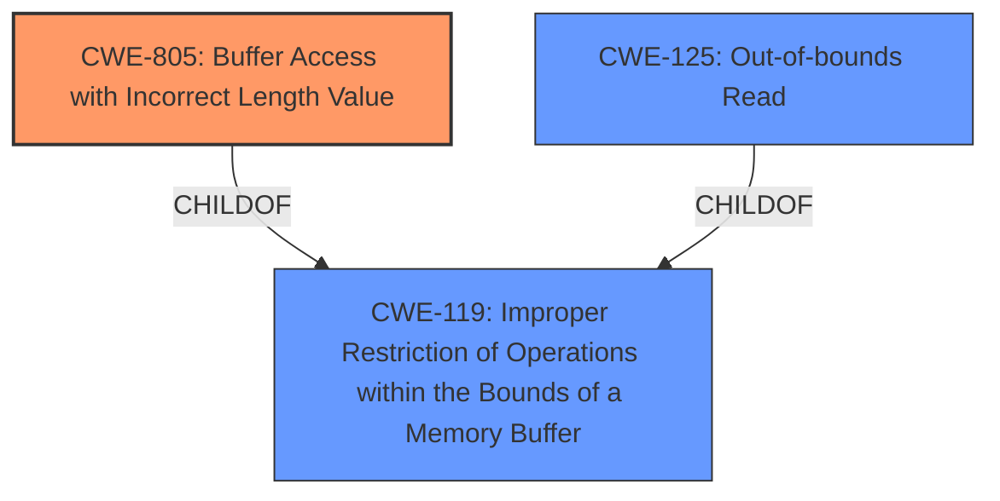

# Raw Analyzer Response for CVE-2021-3581

# Summary

| CWE ID  | CWE Name                                           | Confidence | CWE Abstraction Level | CWE Vulnerability Mapping Label | CWE-Vulnerability Mapping Notes |
| :-------- | :------------------------------------------------- | :--------- | :---------------------- | :------------------------------ | :------------------------------ |
| CWE-805 | Buffer Access with Incorrect Length Value         | 1          | Base                    | Primary CWE                     | Allowed                       |
| CWE-119 | Improper Restriction of Operations within the Bounds of a Memory Buffer | 0.70 | Class                   | Secondary CWE                     |   |
| CWE-125 | Out-of-bounds Read         | 0.60          | Base                    | Secondary CWE                     | Allowed                       |

## Evidence and Confidence

*   **Confidence Score:** 0.90
*   **Evidence Strength:** HIGH

## Relationship Analysis

The primary weakness is **CWE-805 (Buffer Access with Incorrect Length Value)**, which is a direct match to the vulnerability description. This is a base-level CWE, providing a good level of specificity. **CWE-805** is a child of **CWE-119 (Improper Restriction of Operations within the Bounds of a Memory Buffer)**. The vulnerability description key phrases and CVE Reference Links Content Summary mention buffer overflow due to **lack of proper length checks on the incoming HCI data** which maps well with **CWE-805**. The secondary weakness, **CWE-125 (Out-of-bounds Read)**, could be a consequence of incorrect length value leading to reading beyond buffer boundaries.

## Vulnerability Chain

The vulnerability chain starts with the **improper validation of the length** of incoming HCI data, leading to **buffer access with an incorrect length value**, which results in a **buffer overflow** and **memory corruption**, potentially allowing for **arbitrary code execution.**

## Summary of Analysis

The initial assessment aligns well with the provided evidence and the retriever results. The **Vulnerability Description** clearly states "**Buffer Access with Incorrect Length Value** in zephyr." The **CVE Reference Links Content Summary** confirms that the **root cause of vulnerability** is that the Zephyr Bluetooth protocol stack **does not properly validate the length of incoming HCI data** when setting `SCAN_RSP` through the HCI command which confirms the incorrect length issue. The reference also states that "**A buffer overflow vulnerability exists due to the lack of proper length checks on the incoming HCI data**" and that "**An attacker can cause memory overflow leading to memory overwrite, potentially resulting in arbitrary code execution**".

The graph relationships support the selection of **CWE-805** as the primary CWE, given its direct connection to the **improper buffer access** due to incorrect length. Other considered CWEs like **CWE-130 (Improper Handling of Length Parameter Inconsistency)** and **CWE-1284 (Improper Validation of Specified Quantity in Input)** were less specific to the buffer access itself, focusing more on the parameter handling and validation aspects, respectively. Therefore, **CWE-805** is the most specific and appropriate CWE for this vulnerability.

Relevant CWE Information:

# Enhanced Context (25 CWEs)
The following CWEs were identified as potentially relevant to this vulnerability:

## CWE-805: Buffer Access with Incorrect Length Value
**Abstraction Level**: Base
**Similarity Score**: 0.80
**Source**: dense

**Description**:
The product uses a sequential operation to read or write a buffer, but it uses an incorrect length value that causes it to access memory that is outside of the bounds of the buffer.

**Mapping Guidance**:
- Usage: Allowed
- Rationale: This CWE entry is at the Base level of abstraction, which is a preferred level of abstraction for mapping to the root causes of vulnerabilities.

## CWE-119: Improper Restriction of Operations within the Bounds of a Memory Buffer
**Abstraction Level**: Class
**Similarity Score**: N/A
**Source**: N/A

**Description**:
The software performs an operation that can read or write to a memory buffer, but it does not properly restrict the operation to prevent reading or writing to memory locations outside of the intended boundary of the buffer.

## CWE-125: Out-of-bounds Read
**Abstraction Level**: Base
**Similarity Score**: N/A
**Source**: N/A

**Description**:
The product reads data past the end, or before the beginning, of the intended buffer.