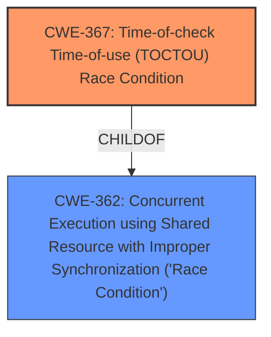

# Analysis for CVE-2021-35937

# Summary
| CWE ID | CWE Name | Confidence | CWE Abstraction Level | CWE Vulnerability Mapping Label | CWE-Vulnerability Mapping Notes |
|---|---|---|---|---|---|
| CWE-367 | Time-of-check Time-of-use (TOCTOU) Race Condition | 0.9 | Base | Allowed | Primary CWE.  The vulnerability stems from a TOCTOU **race condition** in RPM's symlink handling. |
| CWE-362 | Concurrent Execution using Shared Resource with Improper Synchronization ('Race Condition') | 0.7 | Class | Allowed-with-Review | Secondary Candidate.  The vulnerability involves concurrent execution and **improper synchronization**, but CWE-367 is more specific. |

## Evidence and Confidence

*   **Confidence Score:** 0.9
*   **Evidence Strength:** HIGH

## Relationship Analysis
The primary relationship impacting the decision is that CWE-367 (Time-of-check Time-of-use Race Condition) is a ChildOf CWE-362 (Concurrent Execution using Shared Resource with Improper Synchronization). Since the vulnerability description specifically mentions a TOCTOU **race condition**, CWE-367 is the more specific and appropriate choice.

## Vulnerability Chain
The vulnerability chain starts with a TOCTOU **race condition** (CWE-367) in RPM's handling of symlinks. This allows an attacker to bypass intended security checks, potentially leading to privilege escalation and unauthorized access/modification of files.

## Summary of Analysis
The initial analysis identified a **race condition** vulnerability in RPM. The key evidence for this is the "Vulnerability Description Key Phrases" section which states the **rootcause** as "**race condition**". The "CVE Reference Links Content Summary" confirms this, stating the "**Root cause**" as a "Time-of-Check to Time-of-Use (TOCTOU) **race condition** in how RPM handles symlinks".

The Retriever Results listed CWE-362 and CWE-367 as top candidates. While CWE-362 is a broader classification for concurrent execution with improper synchronization, CWE-367 is a more specific type of **race condition** that occurs between a check and the subsequent use of a resource. Given the explicit mention of TOCTOU in the CVE description, CWE-367 is the more accurate and specific choice.

The relationship analysis confirms that CWE-367 is a child of CWE-362, making it a more granular and appropriate mapping for this vulnerability.

The final decision is based on the evidence from the vulnerability description, the "CVE Reference Links Content Summary" section, and the hierarchical relationship between CWE-362 and CWE-367. CWE-367 provides the optimal level of specificity for describing this TOCTOU **race condition** vulnerability.

Relevant CWE Information:

# Enhanced Context (25 CWEs)

## CWE-667: Improper Locking
This CWE was considered but not selected because the vulnerability is not explicitly about locking mechanisms, but rather a timing issue in symlink handling.

## CWE-404: Improper Resource Shutdown or Release
This CWE was considered but not selected because the vulnerability does not involve the improper release of resources.

## CWE-662: Improper Synchronization
This CWE was considered but not selected because while the vulnerability involves improper synchronization, CWE-367 is a more specific type of synchronization issue (TOCTOU **race condition**).

## CWE-362: Concurrent Execution using Shared Resource with Improper Synchronization ('Race Condition')
This CWE was considered as a primary candidate but ultimately rejected in favor of its child, CWE-367, which is more specific to the TOCTOU **race condition** described in the vulnerability.

## CWE-367: Time-of-check Time-of-use (TOCTOU) Race Condition
This CWE was selected as the primary CWE because the vulnerability stems from a TOCTOU **race condition** in RPM's symlink handling.

## CWE-754: Improper Check for Unusual or Exceptional Conditions
This CWE was considered but not selected because the vulnerability is not primarily about missing checks for unusual conditions, but rather about a timing issue that invalidates the results of a check.

## CWE-366: Race Condition within a Thread
This CWE was considered but not selected because the provided information doesn't limit the **race condition** to within a single thread.

## CWE-833: Deadlock
This CWE was considered but not selected because the vulnerability does not involve a deadlock situation.

## CWE-703: Improper Check or Handling of Exceptional Conditions
This CWE was considered but not selected because it's too high-level and doesn't accurately describe the specific TOCTOU **race condition**.

## CWE-664: Improper Control of a Resource Through its Lifetime
This CWE was considered but not selected because it's too high-level and doesn't accurately describe the specific TOCTOU **race condition**.

## CWE-119: Improper Restriction of Operations within the Bounds of a Memory Buffer
This CWE was considered but not selected because the vulnerability is not directly related to memory buffer operations.
## CWE-911: Improper Update of Reference Count
This CWE was considered but not selected because the vulnerability is not related to reference counting.
## CWE-250: Execution with Unnecessary Privileges
This CWE was considered but not selected because even though the exploitation can lead to root privileges, the rootcause is a **race condition** not execution with unnecessary privileges.
## CWE-476: NULL Pointer Dereference
This CWE was considered but not selected because the vulnerability does not involve NULL pointer dereferences.
## CWE-787: Out-of-bounds Write
This CWE was considered but not selected because the vulnerability is not directly related to out-of-bounds writes.
## CWE-732: Incorrect Permission Assignment for Critical Resource
This CWE was considered but not selected because the vulnerability is not directly related to incorrect permission assignments.