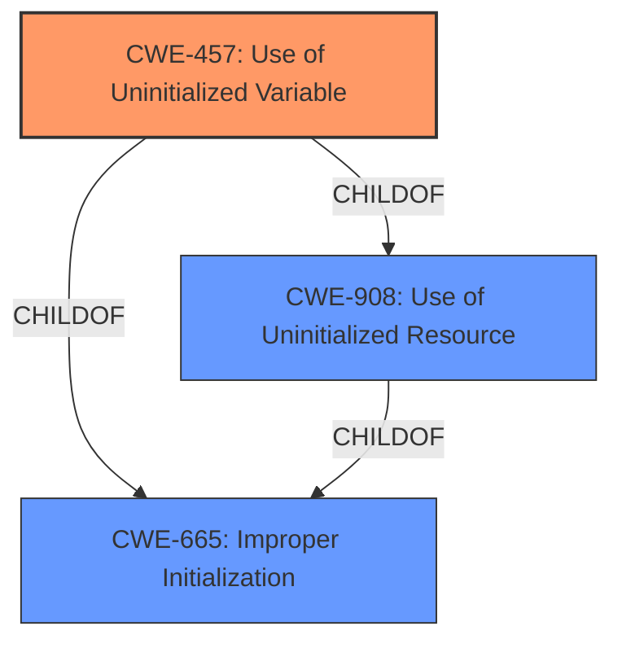

# Raw Analyzer Response for CVE-2021-36007

# Summary
| CWE ID | CWE Name | Confidence | CWE Abstraction Level | CWE Vulnerability Mapping Label | CWE-Vulnerability Mapping Notes |
|---|---|---|---|---|---|
| CWE-457 | Use of Uninitialized Variable | 0.9 | Variant | Allowed | Primary CWE |
| CWE-908 | Use of Uninitialized Resource | 0.7 | Base | Allowed | Secondary Candidate |
| CWE-665 | Improper Initialization | 0.5 | Class | Discouraged | Secondary Candidate |

## Evidence and Confidence

*   **Confidence Score:** 0.9
*   **Evidence Strength:** HIGH

## Relationship Analysis
The primary CWE is CWE-457, which is a Variant of CWE-908 and CWE-665. This indicates a hierarchical relationship where CWE-457 is more specific than its parents. CWE-908 represents the general case of using an uninitialized resource, while CWE-457 focuses specifically on the use of an uninitialized variable. CWE-665 represents the class of improper initialization. The selection of CWE-457 is based on the vulnerability description explicitly mentioning an "**uninitialized variable**".

## Vulnerability Chain
The vulnerability chain starts with the **uninitialized variable** (CWE-457). The use of this variable leads to the disclosure of arbitrary memory information. This represents a direct cause-and-effect relationship.

## Summary of Analysis
The primary classification is CWE-457 (Use of Uninitialized Variable) because the vulnerability description explicitly states that the vulnerability is due to an "**uninitialized variable**". The description states: "Adobe Prelude version 10.0 (and earlier) are affected by an **uninitialized variable** vulnerability when parsing a specially crafted file." This aligns perfectly with the definition of CWE-457, which states: "The code uses a variable that has not been initialized, leading to unpredictable or unintended results." The impact, which is the disclosure of arbitrary memory information, is a direct consequence of using this uninitialized variable.

CWE-908 (Use of Uninitialized Resource) was considered as a parent CWE, but CWE-457 is more specific and accurately captures the weakness related to variables. CWE-665 (Improper Initialization) was considered, but it is too broad. The evidence points to the use of a variable that was not initialized at all rather than an incorrect initialization, making CWE-457 the better choice.

The retriever results also support this decision, with CWE-457 being a top-ranked candidate. The high confidence in this mapping is due to the explicit mention of the root cause within the vulnerability description. The selected CWE is at the optimal level of specificity, as it directly addresses the type of uninitialized resource (a variable) that causes the vulnerability.