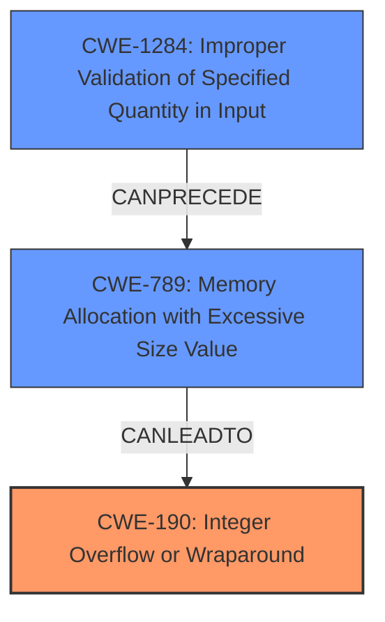

# Enhanced Analysis for CVE-2021-3607

# Summary
| CWE ID  | CWE Name                                                     | Confidence | CWE Abstraction Level | CWE Vulnerability Mapping Label | CWE-Vulnerability Mapping Notes |
| :------- | :----------------------------------------------------------- | :--------- | :---------------------- | :------------------------------ | :------------------------------ |
| CWE-190  | Integer Overflow or Wraparound                               | 0.95       | Base                    | Primary                         | Allowed                         |
| CWE-1284 | Improper Validation of Specified Quantity in Input          | 0.90       | Base                    | Secondary                       | Allowed                         |
| CWE-789  | Memory Allocation with Excessive Size Value                 | 0.85       | Variant                 | Secondary                       | Allowed                         |

## Evidence and Confidence

*   **Confidence Score:** 0.90
*   **Evidence Strength:** HIGH

## Relationship Analysis
The primary relationship that impacted the decision was the chain relationship between **CWE-1284 (Improper Validation of Specified Quantity in Input)**, which **CANPRECEDE** **CWE-789 (Memory Allocation with Excessive Size Value)**, and the vulnerability's explicit mention of an **integer overflow** condition, which indicates **CWE-190 (Integer Overflow or Wraparound)**. The **improper input validation** leads to the potential for an **integer overflow**, which then causes excessive memory allocation. The abstraction levels were carefully considered, selecting Base and Variant levels where possible for specificity.



## Vulnerability Chain
The vulnerability chain starts with **CWE-1284 (Improper Validation of Specified Quantity in Input)**, where the QEMU implementation fails to validate the `num_pages` value. This leads to the possibility of an **integer overflow (CWE-190)** when the guest provides a malicious value, potentially resulting in an excessive memory allocation **CWE-789 (Memory Allocation with Excessive Size Value)**. This excessive memory allocation then leads to a denial of service, which is the impact of the vulnerability.

## Summary of Analysis
The initial analysis pointed to **CWE-190 (Integer Overflow or Wraparound)** as a primary weakness due to the vulnerability description explicitly mentioning an **integer overflow**. However, considering the root cause, which is **improper input validation**, **CWE-1284 (Improper Validation of Specified Quantity in Input)** was also selected. Furthermore, the excessive memory allocation resulting from this **integer overflow** was classified as **CWE-789 (Memory Allocation with Excessive Size Value)**.

The evidence from the vulnerability description is strong: "An **integer overflow** was found... due to **improper input validation**." The CVE Reference Links Content Summary further confirms this analysis, stating, "The vulnerability stems from a lack of input validation... Specifically, the code does not verify if the `num_pages` value provided by the guest is greater than zero before using it in a memory allocation operation." Also, "If the guest provides `0` for `num_pages`, decrementing it results in a large, positive value, potentially leading to an allocation of a very large buffer."

The graph relationships influenced the selection by highlighting the chain of events: **improper input validation** leads to **excessive memory allocation**, which could also lead to an **integer overflow**.

The selected CWEs are at the optimal level of specificity because they accurately represent the root cause (**improper input validation**), the resulting vulnerability (**integer overflow**), and the impact (**excessive memory allocation**).

Relevant CWE Information:

# Enhanced Context (25 CWEs)

## CWE-667: Improper Locking
**Abstraction Level**: Class
**Similarity Score**: 0.79
**Source**: dense

**Description**:
The product does not properly acquire or release a lock on a resource, leading to unexpected resource state changes and behaviors.

**Mapping Guidance**:
- Usage: Allowed-with-Review
- Rationale: This CWE entry is a Class and might have Base-level children that would be more appropriate

*Not Selected*: This CWE does not relate to the vulnerability description

## CWE-404: Improper Resource Shutdown or Release
**Abstraction Level**: Class
**Similarity Score**: 0.76
**Source**: dense

**Description**:
The product does not release or incorrectly releases a resource before it is made available for re-use.

**Mapping Guidance**:
- Usage: Allowed-with-Review
- Rationale: This CWE entry is a Class and might have Base-level children that would be more appropriate

*Not Selected*: This CWE does not relate to the vulnerability description

## CWE-833: Deadlock
**Abstraction Level**: Base
**Similarity Score**: 0.75
**Source**: dense

**Description**:
The product contains multiple threads or executable segments that are waiting for each other to release a necessary lock, resulting in deadlock.

**Mapping Guidance**:
- Usage: Allowed
- Rationale: This CWE entry is at the Base level of abstraction, which is a preferred level of abstraction for mapping to the root causes of vulnerabilities.

*Not Selected*: This CWE does not relate to the vulnerability description

## CWE-191: Integer Underflow (Wrap or Wraparound)
**Abstraction Level**: Base
**Similarity Score**: 0.75
**Source**: dense

**Description**:
The product subtracts one value from another, such that the result is less than the minimum allowable integer value, which produces a value that is not equal to the correct result.

**Mapping Guidance**:
- Usage: Allowed
- Rationale: This CWE entry is at the Base level of abstraction, which is a preferred level of abstraction for mapping to the root causes of vulnerabilities.

*Not Selected*: While the CVE Reference Links Content Summary mentions an **integer underflow**, the primary issue described in the vulnerability is an **integer overflow**, making **CWE-190 (Integer Overflow or Wraparound)** a more appropriate primary classification.

## CWE-131: Incorrect Calculation of Buffer Size
**Abstraction Level**: Base
**Similarity Score**: 0.75
**Source**: dense

**Description**:
The product does not correctly calculate the size to be used when allocating a buffer, which could lead to a buffer overflow.

**Mapping Guidance**:
- Usage: Allowed
- Rationale: This CWE entry is at the Base level of abstraction, which is a preferred level of abstraction for mapping to the root causes of vulnerabilities.

*Not Selected*: This CWE is too specific and doesn't accurately capture the root cause.

## CWE-119: Improper Restriction of Operations within the Bounds of a Memory Buffer
**Abstraction Level**: Class
**Similarity Score**: 0.75
**Source**: dense

**Description**:
The product performs operations on a memory buffer, but it reads from or writes to a memory location outside the buffer's intended boundary. This may result in read or write operations on unexpected memory locations that could be linked to other variables, data structures, or internal program data.

**Mapping Guidance**:
- Usage: Discouraged
- Rationale: CWE-119 is commonly misused in low-information vulnerability reports when lower-level CWEs could be used instead, or when more details about the vulnerability are available.

*Not Selected*: This is a high-level CWE, and more specific CWEs like **CWE-125 (Out-of-bounds Read)** or **CWE-787 (Out-of-bounds Write)** could be more appropriate if such conditions occur. However, the primary issue described in the vulnerability is an integer overflow leading to excessive memory allocation, not an out-of-bounds read or write.

## CWE-789: Memory Allocation with Excessive Size Value
**Abstraction Level**: Variant
**Similarity Score**: 0.74
**Source**: dense

**Description**:
The product allocates memory based on an untrusted, large size value, but it does not ensure that the size is within expected limits, allowing arbitrary amounts of memory to be allocated.

**Mapping Guidance**:
- Usage: Allowed
- Rationale: This CWE entry is at the Variant level of abstraction, which is a preferred level of abstraction for mapping to the root causes of vulnerabilities.

*Selected*: This CWE aligns with the vulnerability where **improper input validation** leads to excessive memory allocation, resulting in a denial of service.

## CWE-754: Improper Check for Unusual or Exceptional Conditions
**Abstraction Level**: Class
**Similarity Score**: 0.74
**Source**: dense

**Description**:
The product does not check or incorrectly checks for unusual or exceptional conditions that are not expected to occur frequently during day to day operation of the product.

**


## CWE Relationship Analysis

Current CWEs represent these abstraction levels: .


### Vulnerability Chain Analysis

**Chain starting from CWE-190:**
- 190 (Integer Overflow or Wraparound) - ROOT


**Chain starting from CWE-131:**
- 131 (Incorrect Calculation of Buffer Size) - ROOT


### CWE Relationship Diagram

```mermaid
graph TD
    classDef primary fill:#f96,stroke:#333,stroke-width:2px
    classDef secondary fill:#69f,stroke:#333
    classDef tertiary fill:#9e9,stroke:#333
```