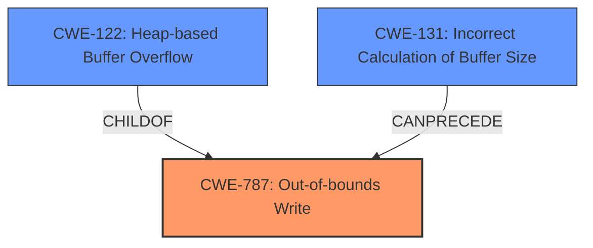

# Raw Analyzer Response for CVE-2021-3610

# Summary
| CWE ID | CWE Name | Confidence | CWE Abstraction Level | CWE Vulnerability Mapping Label | CWE-Vulnerability Mapping Notes |
|---|---|---|---|---|---|
| CWE-787 | Out-of-bounds Write | 1.0 | Base | Allowed | Primary CWE. The vulnerability leads to writing beyond the allocated buffer. |
| CWE-122 | Heap-based Buffer Overflow | 0.9 | Variant | Allowed | The specific type of out-of-bounds write on the heap. |
| CWE-131 | Incorrect Calculation of Buffer Size | 0.7 | Base | Allowed | The root cause involves an incorrect calculation of the buffer size, leading to the overflow. |

## Evidence and Confidence

*   **Confidence Score:** 0.9
*   **Evidence Strength:** HIGH

## Relationship Analysis
The primary weakness is **CWE-787 (Out-of-bounds Write)**, because the vulnerability allows writing data beyond the allocated buffer. **CWE-122 (Heap-based Buffer Overflow)** is a variant of **CWE-787**, specifying that the overflow occurs on the heap. **CWE-131 (Incorrect Calculation of Buffer Size)** is included as it describes the root cause for the heap-based buffer overflow. It describes that the buffer size was incorrectly calculated.

## Vulnerability Chain
The vulnerability chain starts with **CWE-131 (Incorrect Calculation of Buffer Size)**, which leads to **CWE-787 (Out-of-bounds Write)**, specifically a **CWE-122 (Heap-based Buffer Overflow)**. The impact is a crash and segmentation fault.

## Summary of Analysis
The analysis is based on the provided evidence, primarily from the "**Vulnerability Description Key Phrases**" and "**CVE Reference Links Content Summary**" sections. The vulnerability is a **heap-based buffer overflow** due to an **incorrect setting of pixel array size**.

The primary CWE is **CWE-787 (Out-of-bounds Write)**, because the vulnerability allows writing data beyond the allocated buffer. The "**CVE Reference Links Content Summary**" states, "The root cause is an incorrect calculation of the `extent` variable, which is used to determine the size of a memory allocation via `AcquireQuantumMemory`. The calculated `extent` was too small, leading to a heap-based buffer overflow when converting stripped TIFF images." This confirms that the root cause is related to memory allocation size.

**CWE-122 (Heap-based Buffer Overflow)** is a variant of **CWE-787**, specifying that the overflow occurs on the heap. The "**Vulnerability Description**" clearly states it's a heap-based buffer overflow.

**CWE-131 (Incorrect Calculation of Buffer Size)** is included as it describes the root cause for the heap-based buffer overflow.

The selected CWEs are at the optimal level of specificity because they accurately describe the vulnerability's root cause and type. **CWE-787** describes the out-of-bounds write, **CWE-122** specifies that it occurs on the heap, and **CWE-131** specifies that the root cause is the incorrect calculation of the buffer size.

Relevant CWE Information:

# Enhanced Context (25 CWEs)
The following CWEs were identified as potentially relevant to this vulnerability:

## CWE-789: Memory Allocation with Excessive Size Value
**Abstraction Level**: Variant
**Similarity Score**: 0.79
**Source**: dense

**Description**:
The product allocates memory based on an untrusted, large size value, but it does not ensure that the size is within expected limits, allowing arbitrary amounts of memory to be allocated.

**Mapping Guidance**:
- Usage: Allowed
- Rationale: This CWE entry is at the Variant level of abstraction, which is a preferred level of abstraction for mapping to the root causes of vulnerabilities.

**Why Not Used:** This CWE describes allocating *excessive* memory, but the vulnerability description says the allocated memory was too *small*.

## CWE-1325: Improperly Controlled Sequential Memory Allocation
**Abstraction Level**: Base
**Similarity Score**: 0.78
**Source**: dense

**Description**:
The product manages a group of objects or resources and performs a separate memory allocation for each object, but it does not properly limit the total amount of memory that is consumed by all of the combined objects.

**Mapping Guidance**:
- Usage: Allowed
- Rationale: This CWE entry is at the Base level of abstraction, which is a preferred level of abstraction for mapping to the root causes of vulnerabilities.

**Why Not Used:** This CWE is about not limiting the total amount of memory across multiple allocations, but the root cause of the vulnerability involves a single allocation size calculation.

## CWE-131: Incorrect Calculation of Buffer Size
**Abstraction Level**: Base
**Similarity Score**: 0.77
**Source**: dense

**Description**:
The product does not correctly calculate the size to be used when allocating a buffer, which could lead to a buffer overflow.

**Mapping Guidance**:
- Usage: Allowed
- Rationale: This CWE entry is at the Base level of abstraction, which is a preferred level of abstraction for mapping to the root causes of vulnerabilities.

**Why Used:** This CWE accurately reflects the root cause - the incorrect calculation of the buffer size.

## CWE-191: Integer Underflow (Wrap or Wraparound)
**Abstraction Level**: Base
**Similarity Score**: 0.77
**Source**: dense

**Description**:
The product subtracts one value from another, such that the result is less than the minimum allowable integer value, which produces a value that is not equal to the correct result.

**Mapping Guidance**:
- Usage: Allowed
- Rationale: This CWE entry is at the Base level of abstraction, which is a preferred level of abstraction for mapping to the root causes of vulnerabilities.

**Why Not Used:** There's no indication of integer underflow in the vulnerability description.

## CWE-190: Integer Overflow or Wraparound
**Abstraction Level**: Base
**Similarity Score**: 0.77
**Source**: dense

**Description**:
The product performs a calculation that can
         produce an integer overflow or wraparound when the logic
         assumes that the resulting value will always be larger than
         the original value. This occurs when an integer value is
         incremented to a value that is too large to store in the
         associated representation. When this occurs, the value may
         become a very small or negative number.

**Mapping Guidance**:
- Usage: Allowed
- Rationale: This CWE entry is at the Base level of abstraction, which is a preferred level of abstraction for mapping to the root causes of vulnerabilities.

**Why Not Used:** Although integer overflow could have been involved in calculating the incorrect buffer size, the description does not state this directly. The root cause is simply "incorrect calculation".

## CWE-805: Buffer Access with Incorrect Length Value
**Abstraction Level**: Base
**Similarity Score**: 0.76
**Source**: dense

**Description**:
The product uses a sequential operation to read or write a buffer, but it uses an incorrect length value that causes it to access memory that is outside of the bounds of the buffer.

**Mapping Guidance**:
- Usage: Allowed
- Rationale: This CWE entry is at the Base level of abstraction, which is a preferred level of abstraction for mapping to the root causes of vulnerabilities.

**Why Not Used:** This CWE focuses on using an incorrect length value during a read or write operation, but the primary issue is with the initial calculation of the buffer size, leading to the overflow.

## CWE-126: Buffer Over-read
**Abstraction Level**: Variant
**Similarity Score**: 0.76
**Source**: dense

**Description**:
The product reads from a buffer using buffer access mechanisms such as indexes or pointers that reference memory locations after the targeted buffer.

**Mapping Guidance**:
- Usage: Allowed
- Rationale: This CWE entry is at the Variant level of abstraction, which is a preferred level of abstraction for mapping to the root causes of vulnerabilities.

**Why Not Used:** The issue is with writing past the end of a buffer, not reading.

## CWE-193: Off-by-one Error
**Abstraction Level**: Base
**Similarity Score**: 0.75
**Source**: dense

**Description**:
A product calculates or uses an incorrect maximum or minimum value that is 1 more, or 1 less, than the correct value.

**Mapping Guidance**:
-