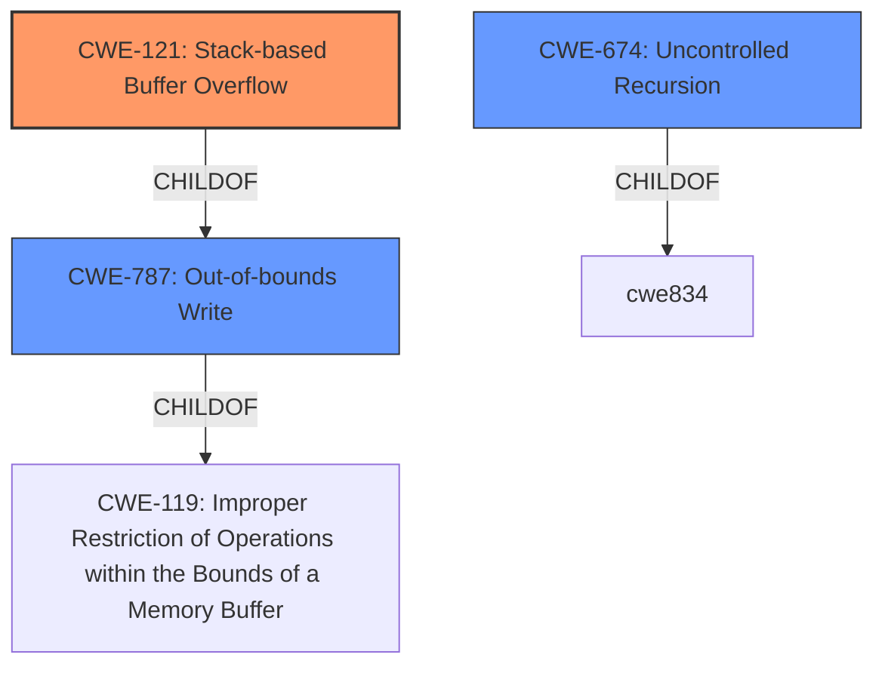

# Raw Analyzer Response for CVE-2021-3611

# Summary
| CWE ID  | CWE Name                                             | Confidence | CWE Abstraction Level | CWE Vulnerability Mapping Label | CWE-Vulnerability Mapping Notes |
|---------|------------------------------------------------------|------------|-----------------------|---------------------------------|-----------------------------------|
| CWE-121 | Stack-based Buffer Overflow                          | 1.0        | Variant               | Allowed                         | Primary CWE                       |
| CWE-674 | Uncontrolled Recursion                             | 0.6        | Class                 | Allowed-with-Review           | Secondary Candidate             |
| CWE-787 | Out-of-bounds Write                                  | 0.5        | Base                 | Allowed                         | Secondary Candidate             |

## Evidence and Confidence

*   **Confidence Score:** 0.9
*   **Evidence Strength:** HIGH

## Relationship Analysis
The primary relationship that influenced the selection was that CWE-121 is a variant of CWE-787 (**Out-of-bounds Write**) which is a child of CWE-119 (**Improper Restriction of Operations within the Bounds of a Memory Buffer**). The description specifies a **stack overflow**, making CWE-121 a more precise fit than its parents. CWE-674 (**Uncontrolled Recursion**) was considered since recursion could lead to a stack overflow, but the root cause is more directly tied to writing outside buffer boundaries.

## Vulnerability Chain
The chain of events leading to the vulnerability is as follows:
1.  DMA to MMIO: DMA engine targets MMIO regions of the HDA controller.
2.  Reentrancy Issues: HDA controller's MMIO handlers are not re-entrant.
3.  Stack Overflow: Re-entering the MMIO handler leads to a **stack overflow** (CWE-121).
4.  Denial of Service: Stack overflow crashes the QEMU process, resulting in DoS.

The root cause can be considered the DMA to MMIO access, with the non-reentrant MMIO handler and the stack overflow as subsequent weaknesses in the chain.

## Summary of Analysis
The initial assessment focused on identifying the root cause of the vulnerability, which is described as a **stack overflow** in the Intel HD Audio device of QEMU. The provided evidence from the "CVE Reference Links Content Summary" section strongly supports this: "The primary vulnerability is the ability of the DMA engine to target MMIO regions of the HDA controller" and "The HDA controller's MMIO handlers were not designed to handle being re-entered through DMA, leading to a **stack overflow**".

CWE-121 (**Stack-based Buffer Overflow**) directly matches this description and is a Variant-level CWE, making it more specific than the Class-level CWE-119 (**Improper Restriction of Operations within the Bounds of a Memory Buffer**). The "Retriever Results" also list CWE-121 as the top result with a score of 1.0.

CWE-674 (**Uncontrolled Recursion**) was considered because recursion can lead to stack exhaustion, but it is not the direct cause in this scenario. The vulnerability is triggered by DMA reentrancy, which leads to overwriting the stack.

CWE-787 (**Out-of-bounds Write**) is a parent of CWE-121 and describes a more general out-of-bounds write condition. While applicable, CWE-121 is preferred due to the specific mention of "stack overflow".

The decision to map to CWE-121 is based on the clear evidence of a **stack overflow** and the guidance to prefer more specific Variant-level CWEs when available. The CWE relationships confirm that CWE-121 is the most precise representation of the vulnerability.