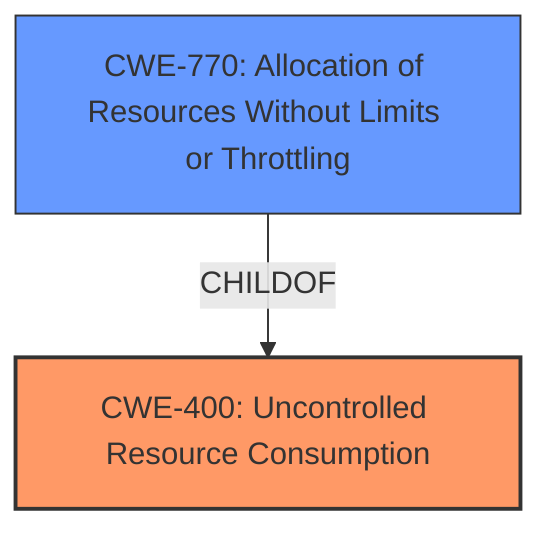

# Analysis Report for CVE-2021-36176

# Vulnerability Analysis Report: CVE-2021-36176

## Description


## Analysis (with Relationship Data)

# Summary
| CWE ID | CWE Name | Confidence | CWE Abstraction Level | CWE Vulnerability Mapping Label | CWE-Vulnerability Mapping Notes |
|---|---|---|---|---|---|
| CWE-400 | Uncontrolled Resource Consumption | 0.8 | Class | Primary | Discouraged |
| CWE-770 | Allocation of Resources Without Limits or Throttling | 0.6 | Base | Secondary | Allowed |

## Evidence and Confidence

*   **Confidence Score:** 0.7
*   **Evidence Strength:** MEDIUM

## Relationship Analysis
The primary CWE selected is CWE-400, which is a Class-level CWE. The retriever results also suggest CWE-770, which is a child of CWE-400 and represents a more specific type of resource consumption issue. Since the vulnerability description mentions "**uncontrolled resource consumption**" due to multiple HTTP requests from a low-privileged user, this indicates a lack of limits or throttling on resource allocation. Therefore, CWE-770 is a more appropriate mapping.



## Vulnerability Chain
The vulnerability chain starts with the **uncontrolled resource consumption** due to a lack of limits or throttling on resource allocation, leading to a denial of service.

## Summary of Analysis
The initial assessment leaned towards CWE-400 due to the "**uncontrolled resource consumption**" mentioned in the vulnerability description. However, after further analysis of the retriever results and the relationships between CWEs, CWE-770 was identified as a more specific and appropriate mapping.

The vulnerability description states "**Multiple uncontrolled resource consumption** vulnerabilities in the web interface of FortiPortal before 6.0.6 may allow a single low-privileged user to induce a denial of service via multiple HTTP requests." This indicates that the system is not properly limiting or throttling the resources allocated to each user or request, leading to resource exhaustion and denial of service.

CWE-770, "Allocation of Resources Without Limits or Throttling," aligns well with this scenario, as it describes the product allocating resources without imposing restrictions on the size or number of resources that can be allocated. This is a more precise characterization of the vulnerability than the more general CWE-400.

The choice of CWE-770 is further supported by its Base abstraction level, which is preferred for root cause analysis. While CWE-400 is a Class-level CWE, CWE-770 provides a more specific and actionable description of the weakness.

Relevant CWE Information:

# Enhanced Context (25 CWEs)
The following CWEs were identified as potentially relevant to this vulnerability:

## CWE-405: Asymmetric Resource Consumption (Amplification)
**Abstraction Level**: Class
**Similarity Score**: 0.77
**Source**: dense

**Description**:
The product does not properly control situations in which an adversary can cause the product to consume or produce excessive resources without requiring the adversary to invest equivalent work or otherwise prove authorization, i.e., the adversary's influence is "asymmetric."

**Mapping Guidance**:
- Usage: Allowed-with-Review
- Rationale: This CWE entry is a Class and might have Base-level children that would be more appropriate

## CWE-770: Allocation of Resources Without Limits or Throttling
**Abstraction Level**: Base
**Similarity Score**: 6313.36
**Source**: sparse

**Description**:
The product allocates a reusable resource or group of resources on behalf of an actor without imposing any restrictions on the size or number of resources that can be allocated, in violation of the intended security policy for that actor.

**Mapping Guidance**:
- Usage: Allowed
- Rationale: This CWE entry is at the Base level of abstraction, which is a preferred level of abstraction for mapping to the root causes of vulnerabilities.


## CWE Relationship Analysis

Current CWEs represent these abstraction levels: .


### Vulnerability Chain Analysis

**Chain starting from CWE-405:**
- 405 (Asymmetric Resource Consumption (Amplification)) - ROOT


**Chain starting from CWE-770:**
- 770 (Allocation of Resources Without Limits or Throttling) - ROOT


### CWE Relationship Diagram

```mermaid
graph TD
    classDef primary fill:#f96,stroke:#333,stroke-width:2px
    classDef secondary fill:#69f,stroke:#333
    classDef tertiary fill:#9e9,stroke:#333
```


*Report generated on 2025-03-31 01:47:24*
