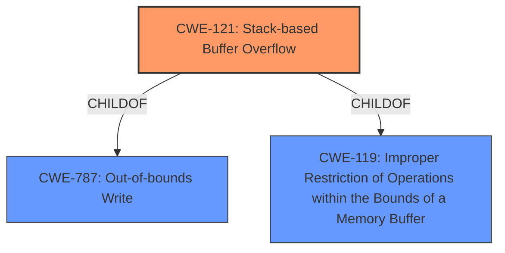

# Enhanced Analysis for CVE-2021-36194

# Summary
| CWE ID | CWE Name | Confidence | CWE Abstraction Level | CWE Vulnerability Mapping Label | CWE-Vulnerability Mapping Notes |
|---|---|---|---|---|---|
| CWE-121 | Stack-based Buffer Overflow | 1.0 | Variant | Primary | Allowed |
| CWE-119 | Improper Restriction of Operations within the Bounds of a Memory Buffer | 0.7 | Class | Secondary | Discouraged |
| CWE-787 | Out-of-bounds Write | 0.7 | Base | Secondary | Allowed |

## Evidence and Confidence

*   **Confidence Score:** 0.9
*   **Evidence Strength:** HIGH

## Relationship Analysis
The primary CWE is CWE-121, which is a child (more specific) of CWE-787 and CWE-119. CWE-787 indicates the out-of-bounds write, and CWE-119 is a more general class describing improper memory buffer restrictions. The relationship highlights that the vulnerability is a specific type of out-of-bounds write that occurs on the stack. Choosing CWE-121 provides the most accurate and specific classification.



## Vulnerability Chain
The chain of events is as follows:
1.  The application has **stack-based buffer overflows**.
2.  An authenticated attacker sends specially crafted requests to trigger the overflow.
3.  The overflow leads to arbitrary code execution.

## Summary of Analysis
The initial assessment correctly identified **stack-based buffer overflows** as the root cause, aligning with CWE-121. The vulnerability description explicitly mentions "stack-based buffer overflows," and the CVE Reference Links Content Summary confirms this. The retriever results also list CWE-121 as a strong candidate.

The selection of CWE-121 is based on the following evidence:

*   The vulnerability description states: "Multiple **stack-based buffer overflows** in the API controllers..."
*   The CVE Reference Links Content Summary states: "**Root cause of vulnerability**: Multiple stack-based buffer overflows exist in the API controllers of FortiWeb. **Weaknesses/vulnerabilities present**: Stack-based buffer overflows [CWE-121]."

CWE-119 and CWE-787 were considered because they are parent classes of CWE-121. However, CWE-121 is the most specific and accurate representation of the vulnerability.
CWE-120 was considered because it is a type of buffer overflow, but it is not specific to stack-based overflows.
CWE-190 was considered because integer overflows can sometimes lead to buffer overflows, but there is no direct evidence of an integer overflow in this case.
CWE-113 was considered, but is specific to HTTP Request/Response splitting.

Therefore, CWE-121 is the optimal choice because it directly reflects the **stack-based buffer overflow** vulnerability described in the provided information.


## CWE Relationship Analysis

Current CWEs represent these abstraction levels: .


### Vulnerability Chain Analysis

**Chain starting from CWE-190:**
- 190 (Integer Overflow or Wraparound) - ROOT


**Chain starting from CWE-121:**
- 121 (Stack-based Buffer Overflow) - ROOT


### CWE Relationship Diagram

```mermaid
graph TD
    classDef primary fill:#f96,stroke:#333,stroke-width:2px
    classDef secondary fill:#69f,stroke:#333
    classDef tertiary fill:#9e9,stroke:#333
```