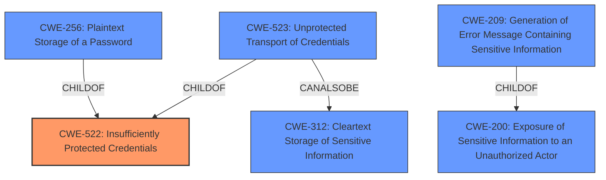

# Analysis Report for CVE-2021-36204

# Vulnerability Analysis Report: CVE-2021-36204

## Description


## Analysis (with Relationship Data)

# Summary
| CWE ID | CWE Name | Confidence | CWE Abstraction Level | CWE Vulnerability Mapping Label | CWE-Vulnerability Mapping Notes |
|---|---|---|---|---|---|
| CWE-522 | Insufficiently Protected Credentials | 1.0 | Class | Allowed-with-Review | This is the Primary CWE due to the **rootcause** of **Insufficiently Protected Credentials** |
| CWE-200 | Exposure of Sensitive Information to an Unauthorized Actor | 0.7 | Class | Discouraged | This is a secondary candidate because the **impact** is credentials exposed in plain text |
| CWE-312 | Cleartext Storage of Sensitive Information | 0.6 | Base | Allowed | This is a secondary candidate because the credentials were exposed in plain text. |

## Evidence and Confidence

*   **Confidence Score:** 0.9
*   **Evidence Strength:** HIGH

## Relationship Analysis
The primary relationship influencing the decision is that CWE-522 is a Class-level CWE. The relationships between CWE-522 and its children, specifically CWE-256 (Plaintext Storage of a Password) and CWE-523 (Unprotected Transport of Credentials), were considered. CWE-200 is a parent of CWE-209 (Generation of Error Message Containing Sensitive Information) and is related to information exposure.



## Vulnerability Chain
The vulnerability chain starts with **Insufficiently Protected Credentials** (CWE-522), leading to the exposure of credentials in plain text through API calls. This exposure represents a loss of confidentiality (CWE-200) because the credentials are now accessible to unauthorized users.

## Summary of Analysis
The initial analysis focused on identifying the root cause of the vulnerability, which is the **Insufficiently Protected Credentials**. The vulnerability description and the CVE Reference Links Content Summary both explicitly state this. The **impact** is the exposure of credentials in plain text.

CWE-522 (Insufficiently Protected Credentials) is selected as the primary CWE because it directly addresses the **root cause** described in the vulnerability. The vulnerability description key phrases also support this selection. However, CWE-522 is a Class-level CWE, which means more specific Base or Variant level CWEs might be more appropriate.

CWE-200 (Exposure of Sensitive Information to an Unauthorized Actor) is considered a secondary CWE because the **impact** of the vulnerability is the exposure of credentials. However, CWE-200 is a Class-level CWE and is often misused to represent the impact rather than the root cause.

CWE-312 (Cleartext Storage of Sensitive Information) is also considered as a secondary CWE because the credentials are exposed in plain text. While the initial issue might be the protection mechanism, the fact that the credentials exist in a form that can be exposed as plain text is relevant.

The final decision is to map to CWE-522 as the primary CWE, acknowledging that it is a Class-level CWE, but it directly addresses the stated **root cause**. CWE-200 and CWE-312 are added as secondary CWEs to reflect the **impact** of the vulnerability. The evidence is primarily based on the vulnerability description and the CVE Reference Links Content Summary, which explicitly mention the **Insufficiently Protected Credentials**.

Relevant CWE Information:
# Enhanced Context (25 CWEs)
The following CWEs were identified as potentially relevant to this vulnerability:

## CWE-538: Insertion of Sensitive Information into Externally-Accessible File or Directory
**Abstraction Level**: Base
**Similarity Score**: 0.78
**Source**: dense

**Description**:
The product places sensitive information into files or directories that are accessible to actors who are allowed to have access to the files, but not to the sensitive information.

**Mapping Guidance**:
- Usage: Allowed
- Rationale: This CWE entry is at the Base level of abstraction, which is a preferred level of abstraction for mapping to the root causes of vulnerabilities.

## CWE-213: Exposure of Sensitive Information Due to Incompatible Policies
**Abstraction Level**: Base
**Similarity Score**: 0.76
**Source**: dense

**Description**:
The product's intended functionality exposes information to certain actors in accordance with the developer's security policy, but this information is regarded as sensitive according to the intended security policies of other stakeholders such as the product's administrator, users, or others whose information is being processed.

**Mapping Guidance**:
- Usage: Allowed
- Rationale: This CWE entry is at the Base level of abstraction, which is a preferred level of abstraction for mapping to the root causes of vulnerabilities.

## CWE-211: Externally-Generated Error Message Containing Sensitive Information
**Abstraction Level**: Base
**Similarity Score**: 0.76
**Source**: dense

**Description**:
The product performs an operation that triggers an external diagnostic or error message that is not directly generated or controlled by the product, such as an error generated by the programming language interpreter that a software application uses. The error can contain sensitive system information.

**Mapping Guidance**:
- Usage: Allowed
- Rationale: This CWE entry is at the Base level of abstraction, which is a preferred level of abstraction for mapping to the root causes of vulnerabilities.

## CWE-497: Exposure of Sensitive System Information to an Unauthorized Control Sphere
**Abstraction Level**: Base
**Similarity Score**: 0.75
**Source**: dense

**Description**:
The product does not properly prevent sensitive system-level information from being accessed by unauthorized actors who do not have the same level of access to the underlying system as the product does.

**Mapping Guidance**:
- Usage: Allowed
- Rationale: This CWE entry is at the Base level of abstraction, which is a preferred level of abstraction for mapping to the root causes of vulnerabilities.

## CWE-226: Sensitive Information in Resource Not Removed Before Reuse
**Abstraction Level**: Base
**Similarity Score**: 0.75
**Source**: dense

**Description**:
The product releases a resource such as memory or a file so that it can be made available for reuse, but it does not clear or "zeroize" the information contained in the resource before the product performs a critical state transition or makes the resource available for reuse by other entities.

**Mapping Guidance**:
- Usage: Allowed
- Rationale: This CWE entry is at the Base level of abstraction, which is a preferred level of abstraction for mapping to the root causes of vulnerabilities.

## CWE-209: Generation of Error Message Containing Sensitive Information
**Abstraction Level**: Base
**Similarity Score**: 0.75
**Source**: dense

**Description**:
The product generates an error message that includes sensitive information about its environment, users, or associated data.

**Mapping Guidance**:
- Usage: Allowed
- Rationale: This CWE entry is at the Base level of abstraction, which is a preferred level of abstraction for mapping to the root causes of vulnerabilities.

## CWE-668: Exposure of Resource to Wrong Sphere
**Abstraction Level**: Class
**Similarity Score**: 0.74
**Source**: dense

**Description**:
The product exposes a resource to the wrong control sphere, providing unintended actors with inappropriate access to the resource.

**Mapping Guidance**:
- Usage: Discouraged
- Rationale: CWE-668 is high-level and is often misused as a catch-all when lower-level CWE IDs might be applicable. It is sometimes used for low-information vulnerability reports [REF-1287]. It is a level-1 Class (i.e., a child of a Pillar). It is not useful for trend analysis.

## CWE-312: Cleartext Storage of Sensitive Information
**Abstraction Level**: Base
**Similarity Score**: 0.74
**Source**: dense

**Description**:
The product stores sensitive information in cleartext within a resource that might be accessible to another control sphere.

**Mapping Guidance**:
- Usage: Allowed
- Rationale: This CWE entry is at the Base level of abstraction, which is a preferred level of abstraction for mapping to the root causes of vulnerabilities.

## CWE


## CWE Relationship Analysis

Current CWEs represent these abstraction levels: .


### Vulnerability Chain Analysis

**Chain starting from CWE-200:**
- 200 (Exposure of Sensitive Information to an Unauthorized Actor) - ROOT


**Chain starting from CWE-209:**
- 209 (Generation of Error Message Containing Sensitive Information) - ROOT


### CWE Relationship Diagram

```mermaid
graph TD
    classDef primary fill:#f96,stroke:#333,stroke-width:2px
    classDef secondary fill:#69f,stroke:#333
    classDef tertiary fill:#9e9,stroke:#333
```


*Report generated on 2025-03-30 18:52:27*
