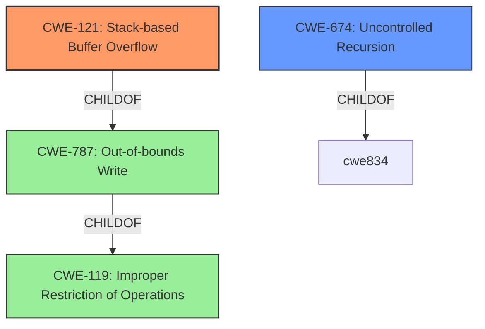

# Raw Analyzer Response for CVE-2021-3622

# Summary
| CWE ID    | CWE Name                                            | Confidence | CWE Abstraction Level | CWE Vulnerability Mapping Label | CWE-Vulnerability Mapping Notes |
| :--------- | :-------------------------------------------------- | :--------- | :-------------------- | :------------------------------ | :------------------------------ |
| CWE-121   | Stack-based Buffer Overflow                         | 0.95       | Variant               | Allowed                       | Primary CWE                     |
| CWE-674   | Uncontrolled Recursion                              | 0.80       | Class                 | Allowed-with-Review         | Secondary Candidate             |

## Evidence and Confidence

*   **Confidence Score:** 0.90
*   **Evidence Strength:** HIGH

## Relationship Analysis
The primary CWE is CWE-121 Stack-based Buffer Overflow, which is a variant of CWE-787 Out-of-bounds Write and CWE-119 Improper Restriction of Operations within the Bounds of a Memory Buffer. The vulnerability involves recursive function calls leading to a stack overflow, which is directly linked to a stack-based buffer overflow. CWE-674 Uncontrolled Recursion is a related Class-level CWE, as the uncontrolled recursion is the mechanism that triggers the stack overflow.

## Vulnerability Chain
The vulnerability chain starts with a **specially crafted Windows Registry file** provided by an attacker. This input causes the **_get_children() function** in the hivex library to be called recursively without proper control, leading to a **stack overflow**. The stack overflow results in the **crash of the program** utilizing the library, causing a denial of service.

## Summary of Analysis
The initial analysis correctly identified the main components of the vulnerability: a **recursive function call** leading to a **stack overflow**. The evidence strongly supports mapping this to CWE-121 Stack-based Buffer Overflow, as the overflow occurs on the stack due to the recursive nature of the function calls.

The "**recursive function call**" in the "Vulnerability Description Key Phrases" section aligns directly with the root cause identified in the CVE Reference Links Content Summary: "The vulnerability is caused by a recursive call to the `_get_children()` function...". The "**stack overflow**" weakness in the "Vulnerability Description Key Phrases" is a result of the uncontrolled recursion.

The graph relationships show that CWE-121 is a specific type of out-of-bounds write (CWE-787) that occurs on the stack. CWE-674 (Uncontrolled Recursion) is a contributing factor, explaining *how* the stack overflow occurs.

The selected CWEs are at the optimal level of specificity. CWE-121 precisely describes the stack-based nature of the buffer overflow. While CWE-119 and CWE-787 are related, they are more general. CWE-674 is relevant as it describes the uncontrolled recursion but is a class-level CWE, making it less specific than CWE-121.

Relevant CWE Information:

# Enhanced Context (25 CWEs)
The following CWEs were identified as potentially relevant to this vulnerability:

## CWE-824: Access of Uninitialized Pointer
**Abstraction Level**: Base
**Similarity Score**: 0.78
**Source**: dense

**Description**:
The product accesses or uses a pointer that has not been initialized.

**Mapping Guidance**:
- Usage: Allowed
- Rationale: This CWE entry is at the Base level of abstraction, which is a preferred level of abstraction for mapping to the root causes of vulnerabilities.

*Not Selected*: While pointers may be involved, the primary issue is the stack overflow due to uncontrolled recursion, not an uninitialized pointer.

## CWE-191: Integer Underflow (Wrap or Wraparound)
**Abstraction Level**: Base
**Similarity Score**: 0.77
**Source**: dense

**Description**:
The product subtracts one value from another, such that the result is less than the minimum allowable integer value, which produces a value that is not equal to the correct result.

**Mapping Guidance**:
- Usage: Allowed
- Rationale: This CWE entry is at the Base level of abstraction, which is a preferred level of abstraction for mapping to the root causes of vulnerabilities.

*Not Selected*: There is no evidence of integer underflow in the vulnerability description.

## CWE-667: Improper Locking
**Abstraction Level**: Class
**Similarity Score**: 0.77
**Source**: dense

**Description**:
The product does not properly acquire or release a lock on a resource, leading to unexpected resource state changes and behaviors.

**Mapping Guidance**:
- Usage: Allowed-with-Review
- Rationale: This CWE entry is a Class and might have Base-level children that would be more appropriate

*Not Selected*: Locking issues are not mentioned in the vulnerability description.

## CWE-131: Incorrect Calculation of Buffer Size
**Abstraction Level**: Base
**Similarity Score**: 0.77
**Source**: dense

**Description**:
The product does not correctly calculate the size to be used when allocating a buffer, which could lead to a buffer overflow.

**Mapping Guidance**:
- Usage: Allowed
- Rationale: This CWE entry is at the Base level of abstraction, which is a preferred level of abstraction for mapping to the root causes of vulnerabilities.

*Not Selected*: While a buffer overflow occurs, it's due to uncontrolled recursion, not an incorrect calculation of buffer size.

## CWE-125: Out-of-bounds Read
**Abstraction Level**: Base
**Similarity Score**: 0.77
**Source**: dense

**Description**:
The product reads data past the end, or before the beginning, of the intended buffer.

**Mapping Guidance**:
- Usage: Allowed
- Rationale: This CWE entry is at the Base level of abstraction, which is a preferred level of abstraction for mapping to the root causes of vulnerabilities.

*Not Selected*: The vulnerability is about writing beyond buffer bounds, not reading.

## CWE-822: Untrusted Pointer Dereference
**Abstraction Level**: Base
**Similarity Score**: 0.77
**Source**: dense

**Description**:
The product obtains a value from an untrusted source, converts this value to a pointer, and dereferences the resulting pointer.

**Mapping Guidance**:
- Usage: Allowed
- Rationale: This CWE entry is at the Base level of abstraction, which is a preferred level of abstraction for mapping to the root causes of vulnerabilities.

*Not Selected*: The vulnerability doesn't involve untrusted pointer dereference.

## CWE-823: Use of Out-of-range Pointer Offset
**Abstraction Level**: Base
**Similarity Score**: 0.76
**Source**: dense

**Description**:
The product performs pointer arithmetic on a valid pointer, but it uses an offset that can point outside of the intended range of valid memory locations for the resulting pointer.

**Mapping Guidance**:
- Usage: Allowed
- Rationale: This CWE entry is at the Base level of abstraction, which is a preferred level of abstraction for mapping to the root causes of vulnerabilities.

*Not Selected*: The vulnerability doesn't involve out-of-range pointer offsets.

## CWE-404: Improper Resource Shutdown or Release
**Abstraction Level**: Class
**Similarity Score**: 0.76
**Source**: dense

**Description**:
The product does not release or incorrectly releases a resource before it is made available for re-use.

**Mapping Guidance**:
- Usage: Allowed-with-Review
- Rationale: This CWE entry is a Class and might have Base-level children that would be more appropriate

*Not Selected*: Resource shutdown or release issues are not mentioned in the vulnerability description.

## CWE-226: Sensitive Information in Resource Not Removed Before Reuse
**Abstraction Level**: Base
**Similarity Score**: 0.76
**Source**: dense

**Description**:
The product releases a resource such as memory or a file so that it can be made available for reuse, but it does not clear or "zeroize" the information contained in the resource before the product performs a critical state transition or makes the resource available for reuse by other entities.

**Mapping Guidance**:
- Usage: Allowed
- Rationale: This CWE entry is at the Base level of abstraction, which is a preferred level of abstraction for mapping to the root causes of vulnerabilities.

*Not Selected*: This CWE is not related to the vulnerability.

## CWE-908: Use of Uninitialized Resource