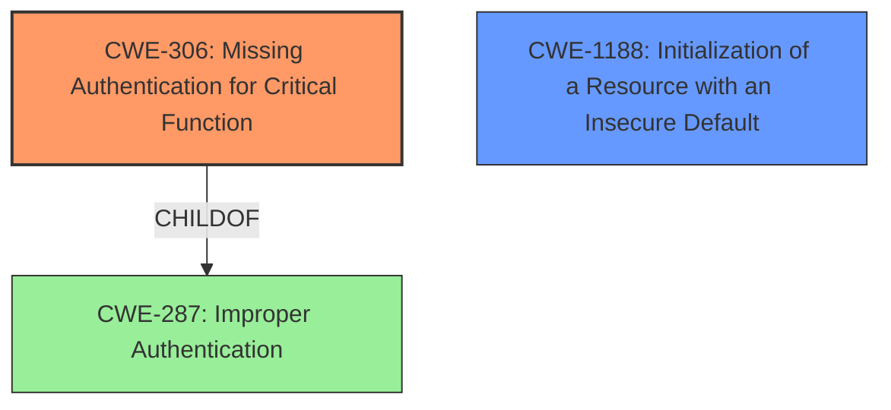

# Raw Analyzer Response for CVE-2021-36225

# Summary

| CWE ID | CWE Name | Confidence | CWE Abstraction Level | CWE Vulnerability Mapping Label | CWE-Vulnerability Mapping Notes |
|---|---|---|---|---|---|
| CWE-306 | Missing Authentication for Critical Function | 1.0 | Base | Primary | Allowed |
| CWE-1188 | Initialization of a Resource with an Insecure Default | 0.7 | Base | Secondary | Allowed |

## Evidence and Confidence

*   **Confidence Score:** 0.9
*   **Evidence Strength:** HIGH

## Relationship Analysis

The primary relationship is that CWE-306 [Missing Authentication for Critical Function] is a child of CWE-287 [Improper Authentication]. While CWE-287 could be considered, CWE-306 is more specific and directly addresses the **missing authentication** for the firmware update functionality. CWE-1188 [Initialization of a Resource with an Insecure Default] represents a less direct but potentially contributing factor, related to the insecure default configuration.

## Vulnerability Chain

The vulnerability chain starts with the **lack of authentication** for the firmware update REST API endpoint (CWE-306), potentially exacerbated by an **insecure default configuration** (CWE-1188), leading to the ability for a low-privileged user to initiate a firmware update, and ultimately allowing remote code execution.

## Summary of Analysis

The analysis is based on the detailed information provided in the "CVE Reference Links Content Summary" section. The root cause is the **missing authentication** for the firmware update REST API endpoint, allowing a low-privileged user to initiate firmware updates. This is directly supported by the following excerpt: "A low-privileged user (`nobody`) can initiate firmware updates via the REST API endpoint `/api/2.1/rest/firmware_update`. This endpoint should require administrative privileges." This aligns perfectly with the description of CWE-306 [Missing Authentication for Critical Function]: "The product does not perform any authentication for functionality that requires a provable user identity or consumes a significant amount of resources."

CWE-306 [Missing Authentication for Critical Function] is chosen as the primary CWE because it accurately reflects the **root cause** of the vulnerability: the **lack of authentication** for a critical function (firmware updates). The retriever results also list CWE-306 with a decent score.

CWE-1188 [Initialization of a Resource with an Insecure Default] is considered a secondary CWE because the hard-coded, blank password for the `nobody` user can be seen as an **insecure default**. However, the **missing authentication** is the more direct and impactful vulnerability.

Other CWEs considered but not used:

*   CWE-287 [Improper Authentication]: This is a parent of CWE-306, and while applicable, CWE-306 is more specific.
*   CWE-22 [Improper Limitation of a Pathname to a Restricted Directory ('Path Traversal')]: Not applicable as the vulnerability is not related to path traversal.
*   CWE-522 [Insufficiently Protected Credentials]: While the hardcoded password could be considered this, the primary issue is the lack of authentication, not the protection of credentials.
*   CWE-269 [Improper Privilege Management]: While privilege escalation is the impact, the root cause is the missing authentication, not improper privilege management.
*   CWE-912 [Hidden Functionality]: Not applicable as there is no evidence of hidden functionality being exploited.
*   CWE-78 [Improper Neutralization of Special Elements used in an OS Command ('OS Command Injection')]: Not applicable as the vulnerability is not related to OS command injection.