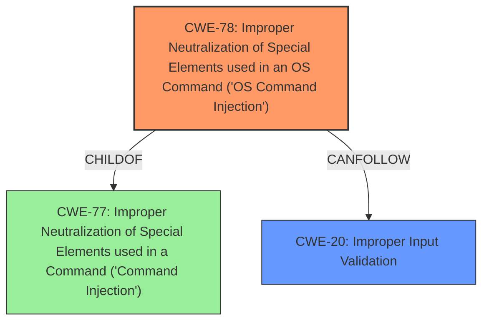

# Analysis Report for CVE-2021-36260

# Vulnerability Analysis Report: CVE-2021-36260

## Description


## Analysis (with Relationship Data)

# Summary
| CWE ID | CWE Name | Confidence | CWE Abstraction Level | CWE Vulnerability Mapping Label | CWE-Vulnerability Mapping Notes |
|---|---|---|---|---|---|
| CWE-78 | Improper Neutralization of Special Elements used in an OS Command ('OS Command Injection') | 1.0 | Base | Primary | Allowed |
| CWE-20 | Improper Input Validation | 0.7 | Class | Secondary | Discouraged |

## Evidence and Confidence

*   **Confidence Score:** 0.9
*   **Evidence Strength:** HIGH

## Relationship Analysis
The primary CWE is CWE-78, which is a base-level CWE. It is a child of CWE-77 ('Command Injection'), which is more general. CWE-78 is related to CWE-20 because **improper input validation** is a common precursor to command injection vulnerabilities. CWE-20 is a class-level CWE.



## Vulnerability Chain
The vulnerability chain starts with **insufficient input validation** (CWE-20), which allows an attacker to inject malicious commands. This leads to the execution of arbitrary OS commands (CWE-78).

## Summary of Analysis
The vulnerability is a **command injection** vulnerability in the web server of some Hikvision product. Due to the **insufficient input validation**, attacker can exploit the vulnerability to launch a **command injection** attack by sending some messages with malicious commands.

The root cause of this vulnerability is **insufficient input validation**, which enables the **command injection**. The primary weakness is CWE-78, which is **Improper Neutralization of Special Elements used in an OS Command ('OS Command Injection')**. This is because the vulnerability allows the attacker to execute arbitrary OS commands.

The vulnerability description key phrases indicate that the root cause is "**insufficient input validation**" and the weakness is "**command injection**". The CVE Reference Links Content Summary section states: "The vulnerability is a command injection flaw in Hikvision cameras" and "The system allows for the execution of arbitrary commands due to insufficient input sanitization or validation."

CWE-78 is the most specific and relevant CWE for this vulnerability because it describes the exact type of **command injection** that is occurring (OS command injection). CWE-20 is a more general CWE that describes the **improper input validation** that is allowing the **command injection** to occur.

I considered CWE-77, but it is a Class-level CWE and less specific than CWE-78, which is a Base-level CWE. The mapping guidance for CWE-77 also suggests using CWE-78 when OS command injection is intended.

CWE-74, Improper Neutralization of Special Elements in Output Used by a Downstream Component ('Injection'), was also considered but deemed less accurate. While command injection can be viewed as a form of injection, CWE-78 directly addresses the specific type of injection occurring here (OS Command Injection).

CWE-116, Improper Encoding or Escaping of Output, was considered, but the primary issue is the lack of proper input validation rather than improper encoding or escaping of output.

CWE-20, Improper Input Validation, was considered as a secondary CWE because the root cause is **insufficient input validation**. However, the primary weakness is the ability to execute arbitrary OS commands (CWE-78).


## CWE Relationship Analysis

Current CWEs represent these abstraction levels: .


### Vulnerability Chain Analysis

**Chain starting from CWE-20:**
- 20 (Improper Input Validation) - ROOT


**Chain starting from CWE-78:**
- 78 (Improper Neutralization of Special Elements used in an OS Command ('OS Command Injection')) - ROOT


### CWE Relationship Diagram

```mermaid
graph TD
    classDef primary fill:#f96,stroke:#333,stroke-width:2px
    classDef secondary fill:#69f,stroke:#333
    classDef tertiary fill:#9e9,stroke:#333
```


*Report generated on 2025-03-31 09:39:45*
