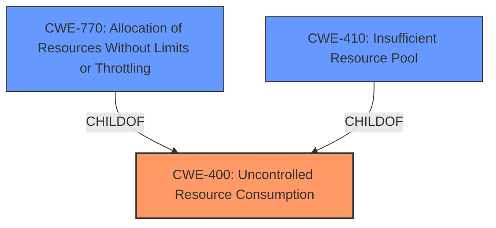

# Analysis Report for CVE-2021-3629

# Vulnerability Analysis Report: CVE-2021-3629

## Description


## Analysis (with Relationship Data)

# Summary
| CWE ID    | CWE Name                                                       | Confidence | CWE Abstraction Level | CWE Vulnerability Mapping Label | CWE-Vulnerability Mapping Notes |
| --------- | ------------------------------------------------------------- | ---------- | --------------------- | ------------------------------- | ----------------------------- |
| CWE-400   | Uncontrolled Resource Consumption                           | 0.85       | Class                  | Primary CWE                   | Discouraged                   |
| CWE-770   | Allocation of Resources Without Limits or Throttling         | 0.75       | Base                   | Secondary Candidate               | Allowed                       |
| CWE-410   | Insufficient Resource Pool                                    | 0.60       | Base                   | Secondary Candidate               | Allowed                       |

## Evidence and Confidence

*   **Confidence Score:** 0.80
*   **Evidence Strength:** MEDIUM

## Relationship Analysis
The primary CWE selected is CWE-400 (Uncontrolled Resource Consumption), which is a Class-level CWE. While it's generally discouraged to map to Class-level CWEs when more specific ones exist, the evidence points to a general resource consumption issue due to **improper flow control handling**. Several child CWEs of CWE-400 were considered, including CWE-770 (Allocation of Resources Without Limits or Throttling) and CWE-410 (Insufficient Resource Pool). CWE-770 describes a scenario where resources are allocated without limits, while CWE-410 points to a resource pool that is too small for peak demand.



## Vulnerability Chain
The vulnerability chain starts with **improper flow control handling** in the HTTP/2 protocol implementation. This leads to a potential for overhead or denial of service due to uncontrolled resource consumption.

Improper Flow Control Handling --> Uncontrolled Resource Consumption --> Denial of Service

## Summary of Analysis
The initial analysis identified CWE-400 (Uncontrolled Resource Consumption) as the primary weakness, with supporting evidence from the vulnerability description indicating a potential for overhead or denial of service due to a flaw in Undertow's flow control handling over HTTP/2.

The selection of CWE-400 is primarily based on the CVE Reference Links Content Summary which indicates:
*   **Root Cause:** A flaw in Undertow's flow control handling over HTTP/2.
*   **Weakness:** Improper flow control handling in HTTP/2 protocol implementation.
*   **Impact:** Denial of Service (DoS). A potential security issue in flow control handling by the browser over http/2 may potentially cause overhead or a denial of service in the server.

While CWE-400 is a Class-level CWE and discouraged, in this case, it is the most appropriate because the **improper flow control handling** specifically leads to uncontrolled resource consumption, making it the direct cause of the DoS.

The evidence supports a more general resource consumption issue rather than a specific allocation or pool size problem. Therefore, while CWE-770 and CWE-410 were considered, CWE-400 provides the best fit at this level of detail.

Relevant CWE Information:

# Enhanced Context (25 CWEs)

## CWE-404: Improper Resource Shutdown or Release
**Abstraction Level**: Class
**Similarity Score**: 0.77
**Source**: dense

**Description**:
The product does not release or incorrectly releases a resource before it is made available for re-use.

**Mapping Guidance**:
- Usage: Allowed-with-Review
- Rationale: This CWE entry is a Class and might have Base-level children that would be more appropriate
- Not used because the vulnerability description doesn't specify an issue of shutdown or release of a resource.

## CWE-1325: Improperly Controlled Sequential Memory Allocation
**Abstraction Level**: Base
**Similarity Score**: 0.76
**Source**: dense

**Description**:
The product manages a group of objects or resources and performs a separate memory allocation for each object, but it does not properly limit the total amount of memory that is consumed by all of the combined objects.

**Mapping Guidance**:
- Usage: Allowed
- Rationale: This CWE entry is at the Base level of abstraction, which is a preferred level of abstraction for mapping to the root causes of vulnerabilities.
- Not used because the vulnerability description doesn't specify an issue of memory allocation.

## CWE-789: Memory Allocation with Excessive Size Value
**Abstraction Level**: Variant
**Similarity Score**: 0.76
**Source**: dense

**Description**:
The product allocates memory based on an untrusted, large size value, but it does not ensure that the size is within expected limits, allowing arbitrary amounts of memory to be allocated.

**Mapping Guidance**:
- Usage: Allowed
- Rationale: This CWE entry is at the Variant level of abstraction, which is a preferred level of abstraction for mapping to the root causes of vulnerabilities.
- Not used because the vulnerability description doesn't specify an issue of memory allocation.

## CWE-226: Sensitive Information in Resource Not Removed Before Reuse
**Abstraction Level**: Base
**Similarity Score**: 0.76
**Source**: dense

**Description**:
The product releases a resource such as memory or a file so that it can be made available for reuse, but it does not clear or "zeroize" the information contained in the resource before the product performs a critical state transition or makes the resource available for reuse by other entities.

**Mapping Guidance**:
- Usage: Allowed
- Rationale: This CWE entry is at the Base level of abstraction, which is a preferred level of abstraction for mapping to the root causes of vulnerabilities.
- Not used because the vulnerability description doesn't specify an issue of data leakage.

## CWE-405: Asymmetric Resource Consumption (Amplification)
**Abstraction Level**: Class
**Similarity Score**: 0.76
**Source**: dense

**Description**:
The product does not properly control situations in which an adversary can cause the product to consume or produce excessive resources without requiring the adversary to invest equivalent work or otherwise prove authorization, i.e., the adversary's influence is "asymmetric."

**Mapping Guidance**:
- Usage: Allowed-with-Review
- Rationale: This CWE entry is a Class and might have Base-level children that would be more appropriate
- Not used because the description doesn't mention anything about asymmetric resource consumption.

## CWE-124: Buffer Underwrite ('Buffer Underflow')
**Abstraction Level**: Base
**Similarity Score**: 0.76
**Source**: dense

**Description**:
The product writes to a buffer using an index or pointer that references a memory location prior to the beginning of the buffer.

**Mapping Guidance**:
- Usage: Allowed
- Rationale: This CWE entry is at the Base level of abstraction, which is a preferred level of abstraction for mapping to the root causes of vulnerabilities.
- Not used because the vulnerability description doesn't specify an issue of writing to a buffer.

## CWE-191: Integer Underflow (Wrap or Wraparound)
**Abstraction Level**: Base
**Similarity Score**: 0.75
**Source**: dense

**Description**:
The product subtracts one value from another, such that the result is less than the minimum allowable integer value, which produces a value that is not equal to the correct result.

**Mapping Guidance**:
- Usage: Allowed
- Rationale: This CWE entry is at the Base level of abstraction, which is a preferred level of abstraction for mapping to the root causes of vulnerabilities.
- Not used because the vulnerability description doesn't specify an issue of an integer underflow.

## CWE-805: Buffer Access with Incorrect Length Value
**Abstraction Level**: Base
**Similarity Score**: 0.75
**Source**: dense

**Description**:
The product uses a sequential operation to read or write a buffer, but it uses an incorrect length value that causes it to access memory that is outside of the bounds of the buffer.

**Mapping Guidance**:
- Usage: Allowed
- Rationale: This CWE entry is at the Base level of abstraction, which is a preferred level of abstraction for mapping to the root causes of vulnerabilities.
- Not used because the vulnerability description doesn't specify an issue of accessing a buffer with an incorrect length value.

## CWE-131: Incorrect Calculation of Buffer Size
**Abstraction Level**: Base
**Similarity Score**: 0.75
**Source**: dense

**Description**:
The product does not correctly calculate the size to be used when allocating a buffer, which could lead to a buffer overflow.

**Mapping Guidance**:
- Usage: Allowed
- Rationale: This CWE entry is at the Base level of abstraction, which is a preferred level of abstraction for mapping to the root causes of vulnerabilities


## CWE Relationship Analysis

Current CWEs represent these abstraction levels: .


### Vulnerability Chain Analysis

**Chain starting from CWE-131:**
- 131 (Incorrect Calculation of Buffer Size) - ROOT


**Chain starting from CWE-1325:**
- 1325 (Improperly Controlled Sequential Memory Allocation) - ROOT


### CWE Relationship Diagram

```mermaid
graph TD
    classDef primary fill:#f96,stroke:#333,stroke-width:2px
    classDef secondary fill:#69f,stroke:#333
    classDef tertiary fill:#9e9,stroke:#333
```


*Report generated on 2025-03-30 15:16:17*
