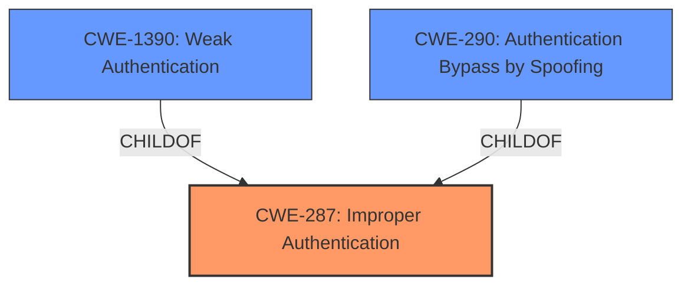

# Analysis Report for CVE-2021-36369

# Vulnerability Analysis Report: CVE-2021-36369

## Description


## Analysis (with Relationship Data)

# Summary
| CWE ID | CWE Name | Confidence | CWE Abstraction Level | CWE Vulnerability Mapping Label | CWE-Vulnerability Mapping Notes |
|---|---|---|---|---|---|
| CWE-287 | Improper Authentication | 0.8 | Class | Primary | Discouraged |
| CWE-1390 | Weak Authentication | 0.7 | Class | Secondary | Allowed-with-Review |
| CWE-290 | Authentication Bypass by Spoofing | 0.6 | Base | Secondary | Allowed |

## Evidence and Confidence

*   **Confidence Score:** 0.8
*   **Evidence Strength:** HIGH

## Relationship Analysis
The primary CWE selected is CWE-287 (Improper Authentication), which is a class-level CWE. CWE-1390 (Weak Authentication) and CWE-290 (Authentication Bypass by Spoofing) are both children of CWE-287 and represent more specific cases. Since the vulnerability involves a **non-RFC-compliant check of the available authentication methods**, leading to a bypass of security measures, CWE-287 serves as a reasonable initial classification. However, the description also suggests a weakness in the authentication mechanism itself (CWE-1390) and a possibility of spoofing attacks (CWE-290), making them relevant secondary considerations. The abstraction level guided the choice; while more specific CWEs exist, the provided information does not fully support their selection as the primary CWE.



## Vulnerability Chain
The vulnerability chain starts with the **non-RFC-compliant check of authentication methods** which leads to the **bypass of security measures** like FIDO2 tokens. This, in turn, allows an attacker to **abuse a forwarded agent for logging on to another server unnoticed**.

Root Cause: **Non-RFC-compliant check of authentication methods**
Weakness: Improper Authentication
Impact: Bypassing security measures and unauthorized access.

## Summary of Analysis
The initial assessment, guided by the vulnerability description and the retriever results, pointed towards CWE-287 (Improper Authentication) as the primary weakness. The description highlights the **non-RFC-compliant check of the available authentication methods**, which directly relates to the product's failure to properly validate the authentication process. The CVE Reference Links Content Summary explicitly mentions CWE-287 as the tracked CWE.

However, considering the hierarchical relationships, CWE-1390 (Weak Authentication) and CWE-290 (Authentication Bypass by Spoofing) were also considered. The possibility of bypassing security measures suggests a weakness in the authentication mechanism itself, making CWE-1390 relevant. Additionally, the potential for a malicious server to manipulate the login process hints at the possibility of spoofing attacks, aligning with CWE-290.

The final decision leans towards CWE-287 as the primary CWE due to its direct alignment with the identified root cause and its explicit mention in the CVE summary. However, CWE-1390 and CWE-290 are included as secondary CWEs to capture the nuances of the vulnerability. This approach provides a more comprehensive understanding of the weaknesses involved.

The selected CWEs are at the optimal level of specificity, given the available information. While more specific CWEs might exist, the current evidence does not fully support their selection.

Relevant CWE Information:

# Enhanced Context (25 CWEs)
The following CWEs were identified as potentially relevant to this vulnerability:

## CWE-303: Incorrect Implementation of Authentication Algorithm
**Abstraction Level**: Base
**Similarity Score**: 0.78
**Source**: dense

**Description**:
The requirements for the product dictate the use of an established authentication algorithm, but the implementation of the algorithm is incorrect.

**Mapping Guidance**:
- Usage: Allowed
- Rationale: This CWE entry is at the Base level of abstraction, which is a preferred level of abstraction for mapping to the root causes of vulnerabilities.

CWE-303 was considered but not selected because the vulnerability description does not explicitly state that an authentication algorithm was incorrectly implemented. It focuses more on the **non-RFC-compliant check of available authentication methods**, which is a broader issue than just the implementation of an algorithm.

## CWE-274: Improper Handling of Insufficient Privileges
**Abstraction Level**: Base
**Similarity Score**: 0.77
**Source**: dense

**Description**:
The product does not handle or incorrectly handles when it has insufficient privileges to perform an operation, leading to resultant weaknesses.

**Mapping Guidance**:
- Usage: Discouraged
- Rationale: This CWE entry could be deprecated in a future version of CWE.

CWE-274 was considered but not selected because the vulnerability is not related to insufficient privileges.

## CWE-807: Reliance on Untrusted Inputs in a Security Decision
**Abstraction Level**: Base
**Similarity Score**: 0.77
**Source**: dense

**Description**:
The product uses a protection mechanism that relies on the existence or values of an input, but the input can be modified by an untrusted actor in a way that bypasses the protection mechanism.

**Mapping Guidance**:
- Usage: Allowed
- Rationale: This CWE entry is at the Base level of abstraction, which is a preferred level of abstraction for mapping to the root causes of vulnerabilities.

CWE-807 was considered but not selected because the vulnerability is not explicitly about relying on untrusted inputs in a security decision, even though the **non-RFC-compliant check of the available authentication methods** could be seen as related.

## CWE-1390: Weak Authentication
**Abstraction Level**: Class
**Similarity Score**: 0.76
**Source**: dense

**Description**:
The product uses an authentication mechanism to restrict access to specific users or identities, but the mechanism does not sufficiently prove that the claimed identity is correct.

**Mapping Guidance**:
- Usage: Allowed-with-Review
- Rationale: This CWE entry is a Class and might have Base-level children that would be more appropriate

CWE-1390 was selected as a secondary CWE. See explanation above.

## CWE-280: Improper Handling of Insufficient Permissions or Privileges 
**Abstraction Level**: Base
**Similarity Score**: 0.76
**Source**: dense

**Description**:
The product does not handle or incorrectly handles when it has insufficient privileges to access resources or functionality as specified by their permissions. This may cause it to follow unexpected code paths that may leave the product in an invalid state.

**Mapping Guidance**:
- Usage: Allowed
- Rationale: This CWE entry is at the Base level of abstraction, which is a preferred level of abstraction for mapping to the root causes of vulnerabilities.

CWE-280 was considered but not selected because the vulnerability is not related to insufficient permissions or privileges.

## CWE-1391: Use of Weak Credentials
**Abstraction Level**: Class
**Similarity Score**: 0.76
**Source**: dense

**Description**:
The product uses weak credentials (such as a default key or hard-coded password) that can be calculated, derived, reused, or guessed by an attacker.

**Mapping Guidance**:
- Usage: Allowed-with-Review
- Rationale: This CWE entry is a Class and might have Base-level children that would be more appropriate

CWE-1391 was considered but not selected because the vulnerability is not related to the use of weak credentials.

## CWE-288: Authentication Bypass Using an Alternate Path or Channel
**Abstraction Level**: Base
**Similarity Score**: 0.75
**Source**: dense

**Description**:
The product requires authentication, but the product has an alternate path or channel that does not require authentication.

**Mapping Guidance**:
- Usage: Allowed
- Rationale: This CWE entry is at the Base level of abstraction, which is a preferred level of abstraction for mapping to the root causes of vulnerabilities.

CWE-288 was considered but not selected because the vulnerability is not about bypassing authentication using an alternate path or channel.

## CWE-345: Insufficient Verification of Data Authenticity
**Abstraction Level**: Class
**Similarity Score**: 0.75
**Source**: dense

**Description**:
The product does not sufficiently verify the origin or authenticity of data, in a way that causes it to accept invalid data.

**Mapping Guidance**:
- Usage: Discouraged
- Rationale: This CWE entry is a level-1 Class (i.e., a child of a Pillar). It might have lower-level children that would be more appropriate

CWE-345 was considered but not selected because the vulnerability is not primarily about insufficient verification of data authenticity.

##


## CWE Relationship Analysis

Current CWEs represent these abstraction levels: .


### Vulnerability Chain Analysis

**Chain starting from CWE-290:**
- 290 (Authentication Bypass by Spoofing) - ROOT


**Chain starting from CWE-280:**
- 280 (Improper Handling of Insufficient Permissions or Privileges ) - ROOT


### CWE Relationship Diagram

```mermaid
graph TD
    classDef primary fill:#f96,stroke:#333,stroke-width:2px
    classDef secondary fill:#69f,stroke:#333
    classDef tertiary fill:#9e9,stroke:#333
```


*Report generated on 2025-03-31 02:11:28*
