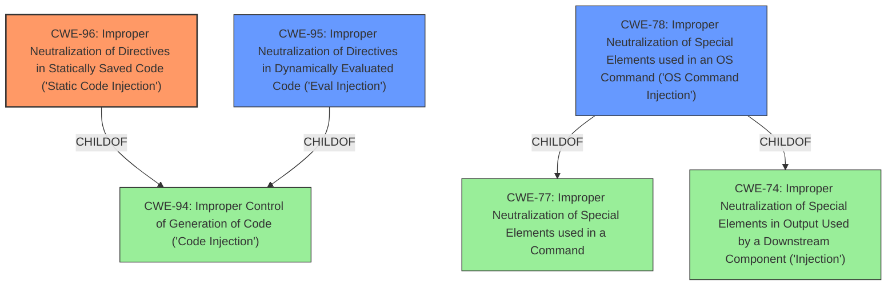

# Raw Analyzer Response for CVE-2021-36424

# Summary
| CWE ID | CWE Name | Confidence | CWE Abstraction Level | CWE Vulnerability Mapping Label | CWE-Vulnerability Mapping Notes |
|---|---|---|---|---|---|
| CWE-96 | Improper Neutralization of Directives in Statically Saved Code ('Static Code Injection') | 0.8 | Base | Allowed | Primary CWE |
| CWE-95 | Improper Neutralization of Directives in Dynamically Evaluated Code ('Eval Injection') | 0.6 | Variant | Allowed | Secondary Candidate |
| CWE-78 | Improper Neutralization of Special Elements used in an OS Command ('OS Command Injection') | 0.5 | Base | Allowed | Secondary Candidate |

## Evidence and Confidence

*   **Confidence Score:** 0.8
*   **Evidence Strength:** HIGH

## Relationship Analysis
The primary CWE is CWE-96, which is a base-level CWE. CWE-96 is a child of CWE-94 (Improper Control of Generation of Code ('Code Injection')). CWE-95 is a variant of CWE-94. CWE-78 is a child of CWE-77 (Improper Neutralization of Special Elements used in a Command) and CWE-74 (Improper Neutralization of Special Elements in Output Used by a Downstream Component ('Injection')). The abstraction levels influenced the decision to select CWE-96 as the primary because it fits the description most accurately and is at the Base level of abstraction.

## Vulnerability Chain
The chain of events is:
1.  **Improper Input Sanitization:** The `write_conf_file` function fails to properly neutralize special elements (single quotes and backslashes).
2.  **Static Code Injection (CWE-96):** Malicious code is injected into a configuration file.
3.  **Arbitrary Code Execution:** The injected code is executed, leading to arbitrary code execution on the server.

## Summary of Analysis
The initial assessment indicated a code injection vulnerability due to **improper input sanitization** during the installation process of phpwcms. The `write_conf_file` function's flawed logic in handling backslashes and single quotes allows for the injection of malicious code into the database settings field.

The evidence from the "CVE Reference Links Content Summary" states:
"The vulnerability stems from **insufficient input sanitization** during the installation process of phpwcms. Specifically, the `write_conf_file` function in `setup/inc/setup.func.inc.php` attempts to filter user input by replacing single quotes (`'`) with escaped single quotes (`\'`). However, it fails to account for pre-existing backslashes. When a user inputs `\'`, the function replaces it with `\\'`, effectively escaping the backslash itself and allowing the single quote to remain unescaped."

The primary CWE is CWE-96 (Improper Neutralization of Directives in Statically Saved Code ('Static Code Injection')). This is because the injected code is directly written into a configuration file, which is then interpreted by the application. The **improper input sanitization** leads to the **static code injection**.

CWE-95 (Improper Neutralization of Directives in Dynamically Evaluated Code ('Eval Injection')) was considered, but it is more appropriate for cases where the injected code is dynamically evaluated using functions like `eval()`. While the injected code is eventually executed, it is first written to a file.

CWE-78 (Improper Neutralization of Special Elements used in an OS Command ('OS Command Injection')) was also considered, but it is more appropriate for cases where the injected code is directly used in an OS command. In this case, the injected code is written to a configuration file, and then the application interprets that code.

The selection of CWE-96 is at the optimal level of specificity, as it accurately describes the vulnerability: malicious code being injected into a statically saved code file due to insufficient input sanitization.