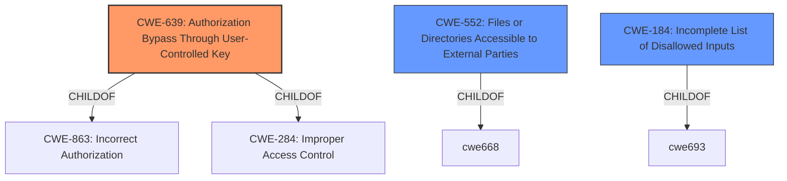

# Enhanced Analysis for CVE-2021-36539

# Summary
| CWE ID | CWE Name | Confidence | CWE Abstraction Level | CWE Vulnerability Mapping Label | CWE-Vulnerability Mapping Notes |
|---|---|---|---|---|---|
| CWE-639 | Authorization Bypass Through User-Controlled Key | 0.9 | Base | Primary | Allowed |
| CWE-552 | Files or Directories Accessible to External Parties | 0.7 | Base | Secondary | Allowed |
| CWE-184 | Incomplete List of Disallowed Inputs | 0.6 | Base | Secondary | Allowed |

## Evidence and Confidence

*   **Confidence Score:** 0.8
*   **Evidence Strength:** HIGH

## Relationship Analysis
The primary CWE selected is CWE-639, which is a base-level CWE and a child of CWE-863 (Incorrect Authorization) and CWE-284 (Improper Access Control). The vulnerability involves bypassing authorization by accessing files via a user-controlled key (`canvadoc_session_url`). CWE-552 (Files or Directories Accessible to External Parties) is a related weakness, as the authorization bypass leads to unauthorized file access. CWE-184 (Incomplete List of Disallowed Inputs) is also relevant, as the system **fails to properly deny access** to locked/unpublished files, suggesting an incomplete access control list.



## Vulnerability Chain
The vulnerability chain starts with **the Canvas LMS not properly denying access to locked/unpublished files**. This **failure** leads to **insufficient access control**, allowing an unprivileged user to access files they should not have access to through the `canvadoc_session_url`. The chain progresses from a **root cause of missing or improper authorization checks** to the impact of **unauthorized information disclosure**.

## Summary of Analysis
The initial analysis focused on the **root cause** of the vulnerability: **Canvas LMS didnt properly deny access to locked/unpublished files**. The retriever results suggested CWE-639 (Authorization Bypass Through User-Controlled Key) as the top candidate, which aligns well with the vulnerability description and the CVE Reference Links Content Summary indicating that the `canvadoc_session_url` grants access regardless of user role or file publication status. The vulnerability involves an authorization **bypass** where an unprivileged user is able to access locked/unpublished files. The system **fails** to properly check permissions before granting access to the files via the `canvadoc_session_url`.

The decision to select CWE-639 as the primary CWE is based on the following evidence:

*   The **Vulnerability Description Key Phrases** highlights that the **root cause** is that the "Canvas LMS didnt properly deny access to locked/unpublished files".
*   The **CVE Reference Links Content Summary** states that the "API fails to enforce proper access controls when generating the `canvadoc_session_url`" and that "the URL can be accessed by any user (even students) to view a file regardless of its status."

CWE-552 (Files or Directories Accessible to External Parties) is selected as a secondary CWE because the authorization bypass ultimately leads to files being accessible to unauthorized users.

CWE-184 (Incomplete List of Disallowed Inputs) is also selected as a secondary CWE because the system's **failure to properly deny access** to certain files suggests an incomplete or **incorrect** list of disallowed resources.

The selected CWEs are at the optimal level of specificity, as they represent the underlying weaknesses that lead to the vulnerability. CWE-639 is a base-level CWE that directly addresses the authorization bypass, while CWE-552 and CWE-184 capture the resulting impact and contributing factor, respectively.

Other CWEs considered but not used:

*   CWE-1391 (Use of Weak Credentials): While weak credentials could contribute to authorization bypass, the primary issue is the lack of proper access control, not the credentials themselves.
*   CWE-863 (Incorrect Authorization): This is a parent of CWE-639. Since CWE-639 is more specific, it is a better fit.
*   CWE-22 (Improper Limitation of a Pathname to a Restricted Directory ('Path Traversal')): Not applicable, as the vulnerability does not involve path traversal.
*   CWE-73 (External Control of File Name or Path): Not applicable, as the vulnerability does not directly involve external control of file names or paths.


## CWE Relationship Analysis

Current CWEs represent these abstraction levels: .


### Vulnerability Chain Analysis

**Chain starting from CWE-552:**
- 552 (Files or Directories Accessible to External Parties) - ROOT


**Chain starting from CWE-184:**
- 184 (Incomplete List of Disallowed Inputs) - ROOT


### CWE Relationship Diagram

```mermaid
graph TD
    classDef primary fill:#f96,stroke:#333,stroke-width:2px
    classDef secondary fill:#69f,stroke:#333
    classDef tertiary fill:#9e9,stroke:#333
```