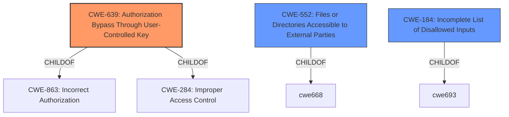

# Analysis for CVE-2021-36539

# Summary
| CWE ID | CWE Name | Confidence | CWE Abstraction Level | CWE Vulnerability Mapping Label | CWE-Vulnerability Mapping Notes |
|---|---|---|---|---|---|
| CWE-639 | Authorization Bypass Through User-Controlled Key | 0.9 | Base | Primary | Allowed |
| CWE-552 | Files or Directories Accessible to External Parties | 0.7 | Base | Secondary | Allowed |
| CWE-184 | Incomplete List of Disallowed Inputs | 0.6 | Base | Secondary | Allowed |

## Evidence and Confidence

*   **Confidence Score:** 0.8
*   **Evidence Strength:** HIGH

## Relationship Analysis
The primary CWE selected is CWE-639, which is a base-level CWE and a child of CWE-863 (Incorrect Authorization) and CWE-284 (Improper Access Control). The vulnerability involves bypassing authorization by accessing files via a user-controlled key (`canvadoc_session_url`). CWE-552 (Files or Directories Accessible to External Parties) is a related weakness, as the authorization bypass leads to unauthorized file access. CWE-184 (Incomplete List of Disallowed Inputs) is also relevant, as the system **fails to properly deny access** to locked/unpublished files, suggesting an incomplete access control list.



## Vulnerability Chain
The vulnerability chain starts with **the Canvas LMS not properly denying access to locked/unpublished files**. This **failure** leads to **insufficient access control**, allowing an unprivileged user to access files they should not have access to through the `canvadoc_session_url`. The chain progresses from a **root cause of missing or improper authorization checks** to the impact of **unauthorized information disclosure**.

## Summary of Analysis
The initial analysis focused on the **root cause** of the vulnerability: **Canvas LMS didnt properly deny access to locked/unpublished files**. The retriever results suggested CWE-639 (Authorization Bypass Through User-Controlled Key) as the top candidate, which aligns well with the vulnerability description and the CVE Reference Links Content Summary indicating that the `canvadoc_session_url` grants access regardless of user role or file publication status. The vulnerability involves an authorization **bypass** where an unprivileged user is able to access locked/unpublished files. The system **fails** to properly check permissions before granting access to the files via the `canvadoc_session_url`.

The decision to select CWE-639 as the primary CWE is based on the following evidence:

*   The **Vulnerability Description Key Phrases** highlights that the **root cause** is that the "Canvas LMS didnt properly deny access to locked/unpublished files".
*   The **CVE Reference Links Content Summary** states that the "API fails to enforce proper access controls when generating the `canvadoc_session_url`" and that "the URL can be accessed by any user (even students) to view a file regardless of its status."

CWE-552 (Files or Directories Accessible to External Parties) is selected as a secondary CWE because the authorization bypass ultimately leads to files being accessible to unauthorized users.

CWE-184 (Incomplete List of Disallowed Inputs) is also selected as a secondary CWE because the system's **failure to properly deny access** to certain files suggests an incomplete or **incorrect** list of disallowed resources.

The selected CWEs are at the optimal level of specificity, as they represent the underlying weaknesses that lead to the vulnerability. CWE-639 is a base-level CWE that directly addresses the authorization bypass, while CWE-552 and CWE-184 capture the resulting impact and contributing factor, respectively.

Other CWEs considered but not used:

*   CWE-1391 (Use of Weak Credentials): While weak credentials could contribute to authorization bypass, the primary issue is the lack of proper access control, not the credentials themselves.
*   CWE-863 (Incorrect Authorization): This is a parent of CWE-639. Since CWE-639 is more specific, it is a better fit.
*   CWE-22 (Improper Limitation of a Pathname to a Restricted Directory ('Path Traversal')): Not applicable, as the vulnerability does not involve path traversal.
*   CWE-73 (External Control of File Name or Path): Not applicable, as the vulnerability does not directly involve external control of file names or paths.

# Enhanced Query for CVE-2021-36539

## Vulnerability Description
Instructure **Canvas LMS didnt properly deny access to locked/unpublished files** when the unprivileged user access the DocViewer based file preview URL (canvadoc_session_url).

### Vulnerability Description Key Phrases
- **rootcause:** **Canvas LMS didnt properly deny access to locked/unpublished files**
- **attacker:** unprivileged user
- **product:** Canvas LMS
- **component:** DocViewer

## CVE Reference Links Content Summary
Based on the provided content, here's an analysis of the vulnerability described:

**Root Cause of Vulnerability:**

The vulnerability stems from a lack of proper permission checks in the Canvas LMS API (v1). Specifically, the `canvadoc_session_url` generated by the API grants access to files through DocViewer, regardless of the user's role (student, teacher, TA) or the file's publication status (unpublished, locked).

**Weaknesses/Vulnerabilities Present:**

*   **Insufficient Access Control:** The API fails to enforce proper access controls when generating the `canvadoc_session_url`.  It does not check if a student should have access to a file based on the file's publication status or module locks.
*   **Non-discriminatory Access Token:** The access token generated by Canvas LMS does not distinguish between roles, allowing students to retrieve the `canvadoc_session_url` for any file within a course they are enrolled in.
*   **`canvadoc_session_url` bypasses access controls:** The URL can be accessed by any user (even students) to view a file regardless of its status.

**Impact of Exploitation:**

*   **Unauthorized Access to Files:** Students can gain access to files that are not meant to be visible to them. This includes files within unpublished modules, locked files, and files within locked and unpublished modules.
*   **Information Disclosure:** Sensitive information contained within these files can be exposed to unauthorized users.
*   **Circumvention of Course Content Restrictions:** Students can bypass course restrictions and access materials that are intended to be released at a later time.

**Attack Vectors:**

*   **Direct API Access:** Attackers use the Canvas LMS API to request the file information, specifically targeting the `canvadoc_session_url`.
*   **Brute-Force File ID:** Attackers can brute-force file IDs to discover hidden files.
*   **Accessing `canvadoc_session_url`:** An attacker can use a valid `canvadoc_session_url` to directly access a document via a DocViewer page.

**Required Attacker Capabilities/Position:**

*   **Canvas LMS Account:** The attacker needs a valid student account in the target Canvas LMS course.
*   **API Access:** The attacker needs API access to Canvas LMS.
*   **Basic knowledge of API:** The attacker has to be able to craft API requests to access file information and use `canvadoc_session_url`.

**Additional Notes:**

*   The vulnerability was reported by `gaukas` on GitHub.
*   The exploit is described as being actively exploited and potentially used in the wild.
*   The vulnerability has been patched by Instructure, the company behind Canvas LMS, as of 10/15/2022. However, institutions may not have updated to the patched version, making them vulnerable.
*   The `poc_bruteforce.py` mentioned in the repository is a proof of concept for exploiting the vulnerability by brute-forcing file IDs.
*   The `canvadoc_session_url` redirects to a DocViewer page, allowing the student to view file contents.
*   The file ID is serialized, which means the attack could be optimized with an educated guess based on previous file IDs.
*   The GitHub issue also mentions that the exploit was discovered in a discussion with  `@yl4579`.

This information provides more detail than the generic description of CVE-2021-36539, outlining the specific technical details of the vulnerability and its exploit.

## Retriever Results

### Top Combined Results

| Rank | CWE ID | Name | Abstraction | Usage  | Retrievers | Individual Scores |
|------|--------|------|-------------|-------|------------|-------------------|
| 1 | 639 | Authorization Bypass Through User-Controlled Key | Base | Allowed | sparse | 0.191 |
| 2 | 1391 | Use of Weak Credentials | Class | Allowed-with-Review | sparse | 0.129 |
| 3 | 267 | Privilege Defined With Unsafe Actions | Base | Allowed | sparse | 0.127 |
| 4 | 645 | Overly Restrictive Account Lockout Mechanism | Base | Allowed | sparse | 0.122 |
| 5 | 647 | Use of Non-Canonical URL Paths for Authorization Decisions | Variant | Allowed | sparse | 0.122 |
| 6 | 552 | Files or Directories Accessible to External Parties | Base | Allowed | dense | 0.469 |
| 7 | 183 | Permissive List of Allowed Inputs | Base | Allowed | graph | 0.002 |
| 8 | 1188 | Initialization of a Resource with an Insecure Default | Base | Allowed | sparse | 0.120 |
| 9 | 908 | Use of Uninitialized Resource | Base | Allowed | sparse | 0.118 |
| 10 | 184 | Incomplete List of Disallowed Inputs | Base | Allowed | sparse | 0.117 |


# Complete CWE Specifications


## CWE-639: Authorization Bypass Through User-Controlled Key
**Abstraction:** Base
**Status:** Incomplete

### Description
The system's authorization functionality does not prevent one user from gaining access to another user's data or record by modifying the key value identifying the data.

### Extended Description


Retrieval of a user record occurs in the system based on some key value that is under user control. The key would typically identify a user-related record stored in the system and would be used to lookup that record for presentation to the user. It is likely that an attacker would have to be an authenticated user in the system. However, the authorization process would not properly check the data access operation to ensure that the authenticated user performing the operation has sufficient entitlements to perform the requested data access, hence bypassing any other authorization checks present in the system.


For example, attackers can look at places where user specific data is retrieved (e.g. search screens) and determine whether the key for the item being looked up is controllable externally. The key may be a hidden field in the HTML form field, might be passed as a URL parameter or as an unencrypted cookie variable, then in each of these cases it will be possible to tamper with the key value.


One manifestation of this weakness is when a system uses sequential or otherwise easily-guessable session IDs that would allow one user to easily switch to another user's session and read/modify their data.


### Alternative Terms
Insecure Direct Object Reference / IDOR: The "Insecure Direct Object Reference" term, as described in the OWASP Top Ten, is broader than this CWE because it also covers path traversal (CWE-22). Within the context of vulnerability theory, there is a similarity between the OWASP concept and CWE-706: Use of Incorrectly-Resolved Name or Reference.
Broken Object Level Authorization / BOLA: BOLA is used in the 2019 OWASP API Security Top 10 and is said to be the same as IDOR.
Horizontal Authorization: "Horizontal Authorization" is used to describe situations in which two users have the same privilege level, but must be prevented from accessing each other's resources. This is fairly common when using key-based access to resources in a multi-user context.

### Relationships
ChildOf -> CWE-863
ChildOf -> CWE-863
ChildOf -> CWE-284

### Mapping Guidance
**Usage:** Allowed
**Rationale:** This CWE entry is at the Base level of abstraction, which is a preferred level of abstraction for mapping to the root causes of vulnerabilities.
**Comments:** Carefully read both the name and description to ensure that this mapping is an appropriate fit. Do not try to 'force' a mapping to a lower-level Base/Variant simply to comply with this preferred level of abstraction.
**Reasons:**
- Acceptable-Use


### Observed Examples
- **CVE-2021-36539:** An educational application does not appropriately restrict file IDs to a particular user. The attacker can brute-force guess IDs, indicating IDOR.


## CWE-1391: Use of Weak Credentials
**Abstraction:** Class
**Status:** Incomplete

### Description
The product uses weak credentials (such as a default key or hard-coded password) that can be calculated, derived, reused, or guessed by an attacker.

### Extended Description


By design, authentication protocols try to ensure that attackers must perform brute force attacks if they do not know the credentials such as a key or password. However, when these credentials are easily predictable or even fixed (as with default or hard-coded passwords and keys), then the attacker can defeat the mechanism without relying on brute force.


Credentials may be weak for different reasons, such as:


  - Hard-coded (i.e., static and unchangeable by the administrator)

  - Default (i.e., the same static value across different deployments/installations, but able to be changed by the administrator)

  - Predictable (i.e., generated in a way that produces unique credentials across deployments/installations, but can still be guessed with reasonable efficiency)

Even if a new, unique credential is intended to be generated for each product installation, if the generation is predictable, then that may also simplify guessing attacks.

### Alternative Terms
None

### Relationships
ChildOf -> CWE-1390

### Mapping Guidance
**Usage:** Allowed-with-Review
**Rationale:** This CWE entry is a Class and might have Base-level children that would be more appropriate
**Comments:** Examine children of this entry to see if there is a better fit
**Reasons:**
- Abstraction


### Observed Examples
- **[REF-1374]:** Chain: JavaScript-based cryptocurrency library can fall back to the insecure Math.random() function instead of reporting a failure (CWE-392), thus reducing the entropy (CWE-332) and leading to generation of non-unique cryptographic keys for Bitcoin wallets (CWE-1391)
- **CVE-2022-30270:** Remote Terminal Unit (RTU) uses default credentials for some SSH accounts
- **CVE-2022-29965:** Distributed Control System (DCS) uses a deterministic algorithm to generate utility passwords


## CWE-267: Privilege Defined With Unsafe Actions
**Abstraction:** Base
**Status:** Incomplete

### Description
A particular privilege, role, capability, or right can be used to perform unsafe actions that were not intended, even when it is assigned to the correct entity.

### Extended Description
Not provided

### Alternative Terms
None

### Relationships
ChildOf -> CWE-269

### Mapping Guidance
**Usage:** Allowed
**Rationale:** This CWE entry is at the Base level of abstraction, which is a preferred level of abstraction for mapping to the root causes of vulnerabilities.
**Comments:** Carefully read both the name and description to ensure that this mapping is an appropriate fit. Do not try to 'force' a mapping to a lower-level Base/Variant simply to comply with this preferred level of abstraction.
**Reasons:**
- Acceptable-Use


### Additional Notes
**[Maintenance]** 

Note: there are 2 separate sub-categories here:

```
		- privilege incorrectly allows entities to perform certain actions
		- object is incorrectly accessible to entities with a given privilege
```


### Observed Examples
- **CVE-2002-1981:** Roles have access to dangerous procedures (Accessible entities).
- **CVE-2002-1671:** Untrusted object/method gets access to clipboard (Accessible entities).
- **CVE-2004-2204:** Gain privileges using functions/tags that should be restricted (Accessible entities).


## CWE-645: Overly Restrictive Account Lockout Mechanism
**Abstraction:** Base
**Status:** Incomplete

### Description
The product contains an account lockout protection mechanism, but the mechanism is too restrictive and can be triggered too easily, which allows attackers to deny service to legitimate users by causing their accounts to be locked out.

### Extended Description
Account lockout is a security feature often present in applications as a countermeasure to the brute force attack on the password based authentication mechanism of the system. After a certain number of failed login attempts, the users' account may be disabled for a certain period of time or until it is unlocked by an administrator. Other security events may also possibly trigger account lockout. However, an attacker may use this very security feature to deny service to legitimate system users. It is therefore important to ensure that the account lockout security mechanism is not overly restrictive.

### Alternative Terms
None

### Relationships
ChildOf -> CWE-287

### Mapping Guidance
**Usage:** Allowed
**Rationale:** This CWE entry is at the Base level of abstraction, which is a preferred level of abstraction for mapping to the root causes of vulnerabilities.
**Comments:** Carefully read both the name and description to ensure that this mapping is an appropriate fit. Do not try to 'force' a mapping to a lower-level Base/Variant simply to comply with this preferred level of abstraction.
**Reasons:**
- Acceptable-Use


## CWE-647: Use of Non-Canonical URL Paths for Authorization Decisions
**Abstraction:** Variant
**Status:** Incomplete

### Description
The product defines policy namespaces and makes authorization decisions based on the assumption that a URL is canonical. This can allow a non-canonical URL to bypass the authorization.

### Extended Description


If an application defines policy namespaces and makes authorization decisions based on the URL, but it does not require or convert to a canonical URL before making the authorization decision, then it opens the application to attack. For example, if the application only wants to allow access to http://www.example.com/mypage, then the attacker might be able to bypass this restriction using equivalent URLs such as:


  - http://WWW.EXAMPLE.COM/mypage

  - http://www.example.com/%6Dypage (alternate encoding)

  - http://192.168.1.1/mypage (IP address)

  - http://www.example.com/mypage/ (trailing /)

  - http://www.example.com:80/mypage

Therefore it is important to specify access control policy that is based on the path information in some canonical form with all alternate encodings rejected (which can be accomplished by a default deny rule).

### Alternative Terms
None

### Relationships
ChildOf -> CWE-863

### Mapping Guidance
**Usage:** Allowed
**Rationale:** This CWE entry is at the Variant level of abstraction, which is a preferred level of abstraction for mapping to the root causes of vulnerabilities.
**Comments:** Carefully read both the name and description to ensure that this mapping is an appropriate fit. Do not try to 'force' a mapping to a lower-level Base/Variant simply to comply with this preferred level of abstraction.
**Reasons:**
- Acceptable-Use


## CWE-552: Files or Directories Accessible to External Parties
**Abstraction:** Base
**Status:** Draft

### Description
The product makes files or directories accessible to unauthorized actors, even though they should not be.

### Extended Description


Web servers, FTP servers, and similar servers may store a set of files underneath a "root" directory that is accessible to the server's users. Applications may store sensitive files underneath this root without also using access control to limit which users may request those files, if any. Alternately, an application might package multiple files or directories into an archive file (e.g., ZIP or tar), but the application might not exclude sensitive files that are underneath those directories.


In cloud technologies and containers, this weakness might present itself in the form of misconfigured storage accounts that can be read or written by a public or anonymous user.


### Alternative Terms
None

### Relationships
ChildOf -> CWE-668
ChildOf -> CWE-668
ChildOf -> CWE-285

### Mapping Guidance
**Usage:** Allowed
**Rationale:** This CWE entry is at the Base level of abstraction, which is a preferred level of abstraction for mapping to the root causes of vulnerabilities.
**Comments:** Carefully read both the name and description to ensure that this mapping is an appropriate fit. Do not try to 'force' a mapping to a lower-level Base/Variant simply to comply with this preferred level of abstraction.
**Reasons:**
- Acceptable-Use


### Observed Examples
- **CVE-2005-1835:** Data file under web root.


## CWE-183: Permissive List of Allowed Inputs
**Abstraction:** Base
**Status:** Draft

### Description
The product implements a protection mechanism that relies on a list of inputs (or properties of inputs) that are explicitly allowed by policy because the inputs are assumed to be safe, but the list is too permissive - that is, it allows an input that is unsafe, leading to resultant weaknesses.

### Extended Description
Not provided

### Alternative Terms
Allowlist / Allow List: This is used by CWE and CAPEC instead of other commonly-used terms. Its counterpart is denylist.
Safelist / Safe List: This is often used by security tools such as firewalls, email or web gateways, proxies, etc.
Whitelist / White List: This term is frequently used, but usage has been declining as organizations have started to adopt other terms.

### Relationships
ChildOf -> CWE-697
CanPrecede -> CWE-434

### Mapping Guidance
**Usage:** Allowed
**Rationale:** This CWE entry is at the Base level of abstraction, which is a preferred level of abstraction for mapping to the root causes of vulnerabilities.
**Comments:** Carefully read both the name and description to ensure that this mapping is an appropriate fit. Do not try to 'force' a mapping to a lower-level Base/Variant simply to comply with this preferred level of abstraction.
**Reasons:**
- Acceptable-Use


### Observed Examples
- **CVE-2019-12799:** chain: bypass of untrusted deserialization issue (CWE-502) by using an assumed-trusted class (CWE-183)
- **CVE-2019-10458:** sandbox bypass using a method that is on an allowlist
- **CVE-2017-1000095:** sandbox bypass using unsafe methods that are on an allowlist


## CWE-1188: Initialization of a Resource with an Insecure Default
**Abstraction:** Base
**Status:** Incomplete

### Description
The product initializes or sets a resource with a default that is intended to be changed by the administrator, but the default is not secure.

### Extended Description


Developers often choose default values that leave the product as open and easy to use as possible out-of-the-box, under the assumption that the administrator can (or should) change the default value. However, this ease-of-use comes at a cost when the default is insecure and the administrator does not change it.


### Alternative Terms
None

### Relationships
ChildOf -> CWE-1419
ChildOf -> CWE-665

### Mapping Guidance
**Usage:** Allowed
**Rationale:** This CWE entry is at the Base level of abstraction, which is a preferred level of abstraction for mapping to the root causes of vulnerabilities.
**Comments:** Carefully read both the name and description to ensure that this mapping is an appropriate fit. Do not try to 'force' a mapping to a lower-level Base/Variant simply to comply with this preferred level of abstraction.
**Reasons:**
- Acceptable-Use


### Additional Notes
**[Maintenance]** This entry improves organization of concepts under initialization. The typical CWE model is to cover "Missing" and "Incorrect" behaviors. Arguably, this entry could be named as "Incorrect" instead of "Insecure." This might be changed in the near future.


### Observed Examples
- **CVE-2022-36349:** insecure default variable initialization in BIOS firmware for a hardware board allows DoS
- **CVE-2022-42467:** A generic database browser interface has a default mode that exposes a web server to the network, allowing queries to the database.


## CWE-908: Use of Uninitialized Resource
**Abstraction:** Base
**Status:** Incomplete

### Description
The product uses or accesses a resource that has not been initialized.

### Extended Description
When a resource has not been properly initialized, the product may behave unexpectedly. This may lead to a crash or invalid memory access, but the consequences vary depending on the type of resource and how it is used within the product.

### Alternative Terms
None

### Relationships
ChildOf -> CWE-665
ChildOf -> CWE-665

### Mapping Guidance
**Usage:** Allowed
**Rationale:** This CWE entry is at the Base level of abstraction, which is a preferred level of abstraction for mapping to the root causes of vulnerabilities.
**Comments:** Carefully read both the name and description to ensure that this mapping is an appropriate fit. Do not try to 'force' a mapping to a lower-level Base/Variant simply to comply with this preferred level of abstraction.
**Reasons:**
- Acceptable-Use


### Observed Examples
- **CVE-2019-9805:** Chain: Creation of the packet client occurs before initialization is complete (CWE-696) resulting in a read from uninitialized memory (CWE-908), causing memory corruption.
- **CVE-2008-4197:** Use of uninitialized memory may allow code execution.
- **CVE-2008-2934:** Free of an uninitialized pointer leads to crash and possible code execution.


## CWE-184: Incomplete List of Disallowed Inputs
**Abstraction:** Base
**Status:** Draft

### Description
The product implements a protection mechanism that relies on a list of inputs (or properties of inputs) that are not allowed by policy or otherwise require other action to neutralize before additional processing takes place, but the list is incomplete.

### Extended Description
Not provided

### Alternative Terms
Denylist / Deny List: This is used by CWE and CAPEC instead of other commonly-used terms. Its counterpart is allowlist.
Blocklist / Block List: This is often used by security tools such as firewalls, email or web gateways, proxies, etc.
Blacklist / Black List: This term is frequently used, but usage has been declining as organizations have started to adopt other terms.

### Relationships
ChildOf -> CWE-693
ChildOf -> CWE-1023
CanPrecede -> CWE-79
CanPrecede -> CWE-78
CanPrecede -> CWE-434
CanPrecede -> CWE-98

### Mapping Guidance
**Usage:** Allowed
**Rationale:** This CWE entry is at the Base level of abstraction, which is a preferred level of abstraction for mapping to the root causes of vulnerabilities.
**Comments:** Carefully read both the name and description to ensure that this mapping is an appropriate fit. Do not try to 'force' a mapping to a lower-level Base/Variant simply to comply with this preferred level of abstraction.
**Reasons:**
- Acceptable-Use


### Additional Notes
**[Relationship]** 

Multiple interpretation errors can indirectly introduce inputs that should be disallowed. For example, a list of dangerous shell metacharacters might not include a metacharacter that only has meaning in one particular shell, not all of them; or a check for XSS manipulations might ignore an unusual construct that is supported by one web browser, but not others.


### Observed Examples
- **CVE-2024-4315:** Chain: API for text generation using Large Language Models (LLMs) does not include the "\" Windows folder separator in its denylist (CWE-184) when attempting to prevent Local File Inclusion via path traversal (CWE-22), allowing deletion of arbitrary files on Windows systems.
- **CVE-2008-2309:** product uses a denylist to identify potentially dangerous content, allowing attacker to bypass a warning
- **CVE-2005-2782:** PHP remote file inclusion in web application that filters "http" and "https" URLs, but not "ftp".

