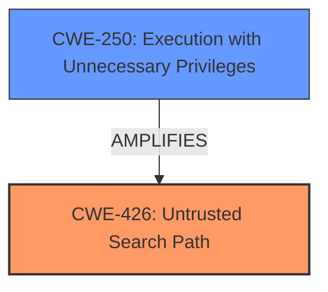

# Enhanced Analysis for CVE-2021-36666

# Summary
| CWE ID | CWE Name | Confidence | CWE Abstraction Level | CWE Vulnerability Mapping Label | CWE-Vulnerability Mapping Notes |
|---|---|---|---|---|---|
| CWE-426 | Untrusted Search Path | 0.9 | Base | Allowed | Primary CWE |
| CWE-250 | Execution with Unnecessary Privileges | 0.7 | Base | Allowed | Secondary CWE |

## Evidence and Confidence

*   **Confidence Score:** 0.8
*   **Evidence Strength:** MEDIUM

## Relationship Analysis
The primary CWE identified is CWE-426 (Untrusted Search Path), a Base level weakness, because the vulnerability allows for the injection of a malicious dynamic library by leveraging the `DYLD_INSERT_LIBRARIES` environment variable. This directly aligns with the description of CWE-426, where an attacker can modify a search path to point to a malicious program. The secondary CWE is CWE-250 (Execution with Unnecessary Privileges), which indicates that the application runs with privileges higher than necessary, amplifying the impact of the **code injection**. The relationship between the two is that the unnecessary privileges allow the injected code to perform actions it otherwise could not.



## Vulnerability Chain
The vulnerability chain starts with the **untrusted search path**, which allows an attacker to inject a malicious dynamic library. This injected library then executes with the **unnecessary privileges** of the application, leading to privilege escalation.

## Summary of Analysis
Initially, the analysis focused on identifying the root cause and impact of the vulnerability described as a local privilege escalation via `inSyncDecommission` in Druva 6.9.0 for MacOS. The "CVE Reference Links Content Summary" section highlighted the root cause as a **code injection vulnerability** due to **arbitrary dynamic library loading**. This injection is facilitated by the application's handling of the `DYLD_INSERT_LIBRARIES` environment variable, effectively creating an **untrusted search path**.

The evidence supporting CWE-426 is derived from the "CVE Reference Links Content Summary," which states, "The primary vulnerability is the ability of a user-level attacker to leverage the `DYLD_INSERT_LIBRARIES` environment variable to inject a malicious dynamic library into the inSync client process." This directly aligns with CWE-426's description: "The product searches for critical resources using an externally-supplied search path that can point to resources that are not under the product's direct control."

CWE-250, "Execution with Unnecessary Privileges," is included as a secondary weakness. The "CVE Reference Links Content Summary" also mentions that successful exploitation leads to "privilege escalation from a regular user to the root user on the system." This indicates that the application is running with elevated privileges, exacerbating the impact of the injected code.

The initial Retriever Results suggested CWE-426 as a candidate. The final decision prioritized CWE-426 and CWE-250 because they most accurately capture the root cause (**untrusted search path**) and contributing factor (**unnecessary privileges**) of the vulnerability, as described in the provided evidence. The selection is at the Base level of abstraction, which is the preferred level according to MITRE guidance.

Other considered CWEs:

*   **CWE-98: Improper Control of Filename for Include/Require Statement in PHP Program ('PHP Remote File Inclusion')** - While code injection is involved, this CWE is specific to PHP, which is not relevant here.
*   **CWE-787: Out-of-bounds Write** - This is a potential impact of code execution but not the root cause in this scenario.
*   **CWE-863: Incorrect Authorization** - This is a higher level class that can be caused by the injected code but not the root cause.
*   **CWE-22: Improper Limitation of a Pathname to a Restricted Directory ('Path Traversal')** - This is not directly relevant as the vulnerability involves dynamic library loading rather than file path manipulation.
*   **CWE-284: Improper Access Control** - While privilege escalation is a form of access control bypass, this is a very high-level categorization.
*   **CWE-73: External Control of File Name or Path** - While related to path handling, this CWE does not fit as precisely as CWE-426, which specifically targets untrusted search paths.

The chosen CWEs are at the optimal level of specificity because they pinpoint the exact mechanism exploited (**untrusted search path**) and a contributing factor (**unnecessary privileges**) leading to the vulnerability.


## CWE Relationship Analysis

Current CWEs represent these abstraction levels: .


### Vulnerability Chain Analysis

**Chain starting from CWE-98:**
- 98 (Improper Control of Filename for Include/Require Statement in PHP Program ('PHP Remote File Inclusion')) - ROOT


**Chain starting from CWE-250:**
- 250 (Execution with Unnecessary Privileges) - ROOT


### CWE Relationship Diagram

```mermaid
graph TD
    classDef primary fill:#f96,stroke:#333,stroke-width:2px
    classDef secondary fill:#69f,stroke:#333
    classDef tertiary fill:#9e9,stroke:#333
```