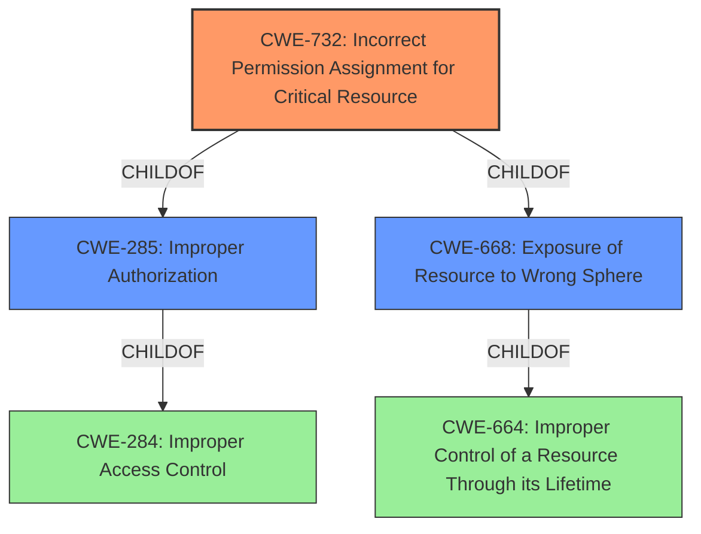

# Raw Analyzer Response for CVE-2021-36710

# Summary
| CWE ID    | CWE Name                                                                                    | Confidence | CWE Abstraction Level | CWE Vulnerability Mapping Label | CWE-Vulnerability Mapping Notes |
| :-------- | :------------------------------------------------------------------------------------------ | :--------- | :---------------------- | :------------------------------ | :------------------------------ |
| CWE-732 | Incorrect Permission Assignment for Critical Resource                                                       | 0.85         | Class                     | Allowed-with-Review                               | Primary CWE                     |
| CWE-668   | Exposure of Resource to Wrong Sphere                                                               | 0.75         | Class                     | Discouraged                               | Secondary Candidate              |
| CWE-285   | Improper Authorization                                                                   | 0.65         | Class                     | Discouraged                               | Secondary Candidate              |
| CWE-269   | Improper Privilege Management                                                                | 0.65         | Class                     | Discouraged                               | Secondary Candidate              |

## Evidence and Confidence

*   **Confidence Score:** 0.8
*   **Evidence Strength:** HIGH

## Relationship Analysis
The primary CWE is CWE-732, which is a child of both CWE-285 (Improper Authorization) and CWE-668 (Exposure of Resource to Wrong Sphere). This indicates that the vulnerability involves both incorrect authorization and exposing a resource to the wrong control sphere. The relationship suggests that the incorrect permission assignment leads to the exposure, and is caused by a failure in the authorization process. Since CWE-732 is more specific than its parents, it's a better fit.

## Vulnerability Chain
The vulnerability chain starts with **improper MMU management**, leading to a low GDT address, which allows it to be mapped in userland. This, in turn, allows a call gate to be written, escalating to CPL 0 and gaining root privileges.

`Improper MMU Management` -> `Low GDT Address` -> `Mapped in Userland` -> `Call Gate Write` -> `Escalate to CPL 0` -> `Gain Root Privileges`

## Summary of Analysis
The initial analysis considered several CWEs related to access control and privilege management. The final decision to map to CWE-732 is based on the root cause evidence pointing to an **incorrect permission assignment** for a critical resource (the GDT). The `TOARU_SYS_FUNC_MMAP` system call allows remapping of memory regions, including the GDT page, indicating that the kernel does not properly validate the memory regions being remapped. This allows a user-mode process to modify the GDT, a privileged kernel resource.

The vulnerability description key phrases highlight the root cause as "**Improper MMU management**" and the impact as "escalate to CPL 0". The CVE Reference Links Content Summary further supports this by stating:

*   "The vulnerability lies in the ToaruOS kernel's handling of the GDT (Global Descriptor Table) and TSS (Task State Segment)."
*   "Specifically, the exploit leverages the ability to remap the GDT page in the lower memory region using the `TOARU_SYS_FUNC_MMAP` system call."
*   "Lack of proper validation/protection: The kernel does not properly validate the memory regions being remapped. Specifically, it fails to prevent a user-mode process from remapping and modifying the GDT, which should be a privileged kernel resource."

CWE-732 is the most specific and accurate representation of the vulnerability, as it directly addresses the incorrect permission assignment for a critical resource, the GDT.

**CWE Considerations:**

*   **CWE-732: Incorrect Permission Assignment for Critical Resource** - This is the primary CWE. The vulnerability involves the incorrect assignment of permissions to the GDT, allowing user-mode processes to remap and modify it.
*   **CWE-668: Exposure of Resource to Wrong Sphere** - Considered as a secondary CWE. The incorrect permission assignment leads to the exposure of the GDT to the userland, which should not have access to it.
*   **CWE-285: Improper Authorization** - Considered as a secondary CWE. The kernel does not properly authorize the remapping of the GDT, leading to the vulnerability.
*   **CWE-269: Improper Privilege Management** - Considered as a secondary CWE. The **improper MMU management** results in an **improper privilege management**, allowing escalation to CPL 0.

**Why other CWEs were not selected:**

*   CWE-284 (Improper Access Control): Too high-level. While technically true, it doesn't capture the specific nature of the vulnerability.
*   CWE-285 (Improper Authorization): While related, the core issue is the incorrect *assignment* of permissions rather than a general lack of authorization.
*   CWE-668 (Exposure of Resource to Wrong Sphere): This is a consequence of the **incorrect permission assignment** but not the root cause.
*   CWE-269 (Improper Privilege Management): This is also a consequence of the **incorrect permission assignment** rather than the root cause.
*   CWE-662, CWE-667, CWE-362: These relate to concurrency issues, which are not relevant to this vulnerability.
*   CWE-1262: While this relates to register interfaces, the vulnerability isn't directly about improper access control to a register interface, but rather about the ability to remap memory regions containing critical kernel structures.
*   CWE-942: Pertains to cross-domain policies which is irrelevant in this context.
*   CWE-863: Similar to CWE-285 but still not as specific as CWE-732.

The final selection of CWE-732 is at the optimal level of specificity, as it directly addresses the root cause of the vulnerability: the incorrect assignment of permissions for the GDT, allowing unauthorized modification and privilege escalation.