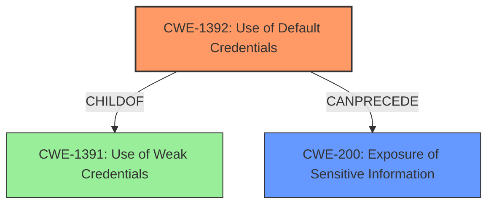

# Analysis Report for CVE-2021-36718

# Vulnerability Analysis Report: CVE-2021-36718

## Description


## Analysis (with Relationship Data)

# Summary
| CWE ID  | CWE Name                      | Confidence | CWE Abstraction Level | CWE Vulnerability Mapping Label | CWE-Vulnerability Mapping Notes |
|---------|-------------------------------|------------|-----------------------|---------------------------------|-------------------------------|
| CWE-1392 | Use of Default Credentials    | 1          | Base                  | Primary                           | Allowed                       |
| CWE-200 | Exposure of Sensitive Information | 0.8      | Class                 | Secondary                         | Allowed                       |

## Evidence and Confidence

*   **Confidence Score:** 0.9
*   **Evidence Strength:** HIGH

## Relationship Analysis
The primary CWE identified is CWE-1392 (Use of Default Credentials), which is a Base level CWE. It has a parent CWE-1391 (Use of Weak Credentials) that is a Class level CWE. The vulnerability leads to exposure of sensitive information, thus the secondary CWE is CWE-200 (Exposure of Sensitive Information) because the attacker was able to log in to the system with **default credentials** and export a report of the eharmony system with sensitive data.



## Vulnerability Chain
The vulnerability chain starts with the **use of default credentials (CWE-1392)**, which allows an attacker to log into the system. This leads to the **exposure of sensitive information (CWE-200)** because the attacker can then export reports containing employee data.

## Summary of Analysis
The initial analysis focused on identifying the root cause and the resulting impact. The vulnerability description clearly states that the attacker can log in with **default credentials**, making CWE-1392 the most appropriate primary CWE. The subsequent exposure of sensitive information is a direct consequence of this initial weakness, supporting the inclusion of CWE-200 as a secondary CWE. The relationship graph highlights how the use of default credentials can lead to the exposure of sensitive information.

The decision to use CWE-1392 is strongly supported by the vulnerability description, which explicitly mentions **default credentials** as the means of access. This aligns perfectly with the CWE's description of products using default credentials for critical functionality. The evidence is clear: "The attacker can log in to the system with **default credentials** and export a report of eharmony system with sensetive data."

The other CWEs that were considered but not used are:

*   CWE-639: Authorization Bypass Through User-Controlled Key - While the attacker is bypassing authorization, it's not through a user-controlled key but through default credentials.
*   CWE-532: Insertion of Sensitive Information into Log File - The sensitive information is not being inserted into a log file, but rather exposed through reports.
*   CWE-201: Insertion of Sensitive Information Into Sent Data - The sensitive information is not necessarily being "sent" but exposed via report generation.
*   CWE-321: Use of Hard-coded Cryptographic Key - The vulnerability description specifies **default credentials**, not necessarily cryptographic keys.
*   CWE-89: Improper Neutralization of Special Elements used in an SQL Command ('SQL Injection') - There is no mention of SQL injection in the vulnerability description.
*   CWE-306: Missing Authentication for Critical Function - There is authentication, but it relies on default credentials.
*   CWE-522: Insufficiently Protected Credentials - While related, the core issue is the use of default credentials, not necessarily their protection.
*   CWE-256: Plaintext Storage of a Password - The primary problem isn't the storage of the password but the use of default credentials in the first place.

Relevant CWE Information:

# Enhanced Context (25 CWEs)
The following CWEs were identified as potentially relevant to this vulnerability:

## CWE-312: Cleartext Storage of Sensitive Information
**Abstraction Level**: Base
**Similarity Score**: 0.79
**Source**: dense

**Description**:
The product stores sensitive information in cleartext within a resource that might be accessible to another control sphere.

**Mapping Guidance**:
- Usage: Allowed
- Rationale: This CWE entry is at the Base level of abstraction, which is a preferred level of abstraction for mapping to the root causes of vulnerabilities.

## CWE-1391: Use of Weak Credentials
**Abstraction Level**: Class
**Similarity Score**: 0.77
**Source**: dense

**Description**:
The product uses weak credentials (such as a default key or hard-coded password) that can be calculated, derived, reused, or guessed by an attacker.

**Mapping Guidance**:
- Usage: Allowed-with-Review
- Rationale: This CWE entry is a Class and might have Base-level children that would be more appropriate

## CWE-798: Use of Hard-coded Credentials
**Abstraction Level**: Base
**Similarity Score**: 0.77
**Source**: dense

**Description**:
The product contains hard-coded credentials, such as a password or cryptographic key.

**Mapping Guidance**:
- Usage: Allowed
- Rationale: This CWE entry is at the Base level of abstraction, which is a preferred level of abstraction for mapping to the root causes of vulnerabilities.

## CWE-538: Insertion of Sensitive Information into Externally-Accessible File or Directory
**Abstraction Level**: Base
**Similarity Score**: 0.77
**Source**: dense

**Description**:
The product places sensitive information into files or directories that are accessible to actors who are allowed to have access to the files, but not to the sensitive information.

**Mapping Guidance**:
- Usage: Allowed
- Rationale: This CWE entry is at the Base level of abstraction, which is a preferred level of abstraction for mapping to the root causes of vulnerabilities.

## CWE-319: Cleartext Transmission of Sensitive Information
**Abstraction Level**: Base
**Similarity Score**: 0.77
**Source**: dense

**Description**:
The product transmits sensitive or security-critical data in cleartext in a communication channel that can be sniffed by unauthorized actors.

**Mapping Guidance**:
- Usage: Allowed
- Rationale: This CWE entry is at the Base level of abstraction, which is a preferred level of abstraction for mapping to the root causes of vulnerabilities.

## CWE-345: Insufficient Verification of Data Authenticity
**Abstraction Level**: Class
**Similarity Score**: 0.76
**Source**: dense

**Description**:
The product does not sufficiently verify the origin or authenticity of data, in a way that causes it to accept invalid data.

**Mapping Guidance**:
- Usage: Discouraged
- Rationale: This CWE entry is a level-1 Class (i.e., a child of a Pillar). It might have lower-level children that would be more appropriate

## CWE-212: Improper Removal of Sensitive Information Before Storage or Transfer
**Abstraction Level**: Base
**Similarity Score**: 0.76
**Source**: dense

**Description**:
The product stores, transfers, or shares a resource that contains sensitive information, but it does not properly remove that information before the product makes the resource available to unauthorized actors.

**Mapping Guidance**:
- Usage: Allowed
- Rationale: This CWE entry is at the Base level of abstraction, which is a preferred level of abstraction for mapping to the root causes of vulnerabilities.

## CWE-311: Missing Encryption of Sensitive Data
**Abstraction Level**: Class
**Similarity Score**: 0.76
**Source**: dense

**Description**:
The product does not encrypt sensitive or critical information before storage or transmission.

**Mapping Guidance**:
- Usage: Discouraged
- Rationale: CWE-311 is high-level with more precise children available. It is a level-1 Class (i.e., a child of a Pillar).

## CWE-807: Reliance on Untrusted Inputs in a Security Decision
**Abstraction Level**: Base
**Similarity Score**: 0.76
**Source**: dense

**Description**:
The product uses a protection mechanism that relies on the existence or values of an input, but the input can be modified by an untrusted actor in a way that bypasses the protection mechanism.

**Mapping Guidance**:
- Usage: Allowed
- Rationale: This CWE entry is at the Base level of abstraction, which is a preferred level of abstraction for mapping to the root causes of vulnerabilities.

## CWE-1392: Use of Default Credentials
**Abstraction Level**: Base
**Similarity Score**: 0.76
**Source**: dense

**Description**:
The product uses default credentials (such as passwords or cryptographic keys) for potentially critical functionality


## CWE Relationship Analysis

Current CWEs represent these abstraction levels: .


### Vulnerability Chain Analysis

**Chain starting from CWE-89:**
- 89 (Improper Neutralization of Special Elements used in an SQL Command ('SQL Injection')) - ROOT


**Chain starting from CWE-1392:**
- 1392 (Use of Default Credentials) - ROOT


### CWE Relationship Diagram

```mermaid
graph TD
    classDef primary fill:#f96,stroke:#333,stroke-width:2px
    classDef secondary fill:#69f,stroke:#333
    classDef tertiary fill:#9e9,stroke:#333
```


*Report generated on 2025-03-30 17:04:49*
