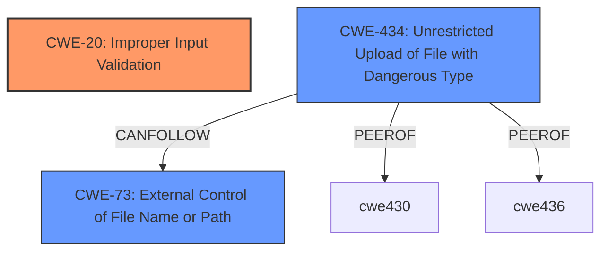

# Enhanced Analysis for CVE-2021-36741

# Summary
| CWE ID | CWE Name | Confidence | CWE Abstraction Level | CWE Vulnerability Mapping Label | CWE-Vulnerability Mapping Notes |
|---|---|---|---|---|---|
| CWE-20 | Improper Input Validation | 0.9 | Class | Discouraged | The vulnerability description states "**improper input validation**" which aligns directly with CWE-20. However, due to the discouraged usage of CWE-20, a more specific child is considered. |
| CWE-434 | Unrestricted Upload of File with Dangerous Type | 0.7 | Base | Allowed | The vulnerability allows a remote attacker to "upload arbitrary files," aligning with the dangerous file type aspect of CWE-434. This is a secondary candidate pending further evidence of the dangerous type. |
| CWE-73 | External Control of File Name or Path | 0.6 | Base | Allowed | An attacker can upload arbitrary files. This suggests external control over the file name or path. This is a secondary candidate. |

## Evidence and Confidence

*   **Confidence Score:** 0.7
*   **Evidence Strength:** MEDIUM

## Relationship Analysis
- CWE-20 is a Class-level CWE, and the guidance recommends using more specific children if possible.
- CWE-434 and CWE-73 are both potential children or related CWEs that describe aspects of the vulnerability.
- CWE-434 (Unrestricted Upload of File with Dangerous Type) is PEEROF to CWE-430 and CWE-436.
- CWE-73 (External Control of File Name or Path) can precede several file-related weaknesses like CWE-59, CWE-434, CWE-98, and CWE-41.



## Vulnerability Chain
The chain of events is as follows:
1.  **Improper Input Validation (CWE-20):** The system fails to properly validate the uploaded file.
2.  **Unrestricted Upload of File with Dangerous Type (CWE-434) or External Control of File Name or Path (CWE-73):** This leads to the ability to upload arbitrary files, possibly with dangerous types or to specific locations.
3.  **Impact:** Remote attacker can upload arbitrary files on affected installations.

## Summary of Analysis
Initially, CWE-20 (Improper Input Validation) was selected due to the "**improper input validation**" statement in the vulnerability description. However, the guidance for CWE-20 discourages its use when more specific CWEs are available. Thus, CWE-434 (Unrestricted Upload of File with Dangerous Type) and CWE-73 (External Control of File Name or Path) were considered as potential candidates.

The vulnerability description states: "An **improper input validation** vulnerability in Trend Micro Apex One, Apex One as a Service, OfficeScan XG, and Worry-Free Business Security 10.0 SP1 allows a remote attached to upload arbitrary files on affected installations."

The choice of CWE-20 is justified as the primary weakness since the core issue is the lack of proper validation. While CWE-434 and CWE-73 represent potential consequences or aspects of the improper validation, CWE-20 directly reflects the **root cause**. Further information about the type of files being uploaded and the control over their paths would strengthen the case for including CWE-434 or CWE-73 as additional CWEs.

The evidence is somewhat limited, as the CVE Reference Links Content Summary indicates "UNRELATED". This limits the ability to confirm the exact nature of the uploaded files and their potential impact.

Relevant CWE Information:

# Enhanced Context (25 CWEs)

## CWE-59: Improper Link Resolution Before File Access ('Link Following')
**Abstraction Level**: Base
**Similarity Score**: 0.80
**Source**: dense

**Description**:
The product attempts to access a file based on the filename, but it does not properly prevent that filename from identifying a link or shortcut that resolves to an unintended resource.

**Mapping Guidance**:
- Usage: Allowed
- Rationale: This CWE entry is at the Base level of abstraction, which is a preferred level of abstraction for mapping to the root causes of vulnerabilities.

## CWE-41: Improper Resolution of Path Equivalence
**Abstraction Level**: Base
**Similarity Score**: 0.79
**Source**: dense

**Description**:
The product is vulnerable to file system contents disclosure through path equivalence. Path equivalence involves the use of special characters in file and directory names. The associated manipulations are intended to generate multiple names for the same object.

**Mapping Guidance**:
- Usage: Allowed
- Rationale: This CWE entry is at the Base level of abstraction, which is a preferred level of abstraction for mapping to the root causes of vulnerabilities.

## CWE-73: External Control of File Name or Path
**Abstraction Level**: Base
**Similarity Score**: 0.77
**Source**: dense

**Description**:
The product allows user input to control or influence paths or file names that are used in filesystem operations.

**Mapping Guidance**:
- Usage: Allowed
- Rationale: This CWE entry is at the Base level of abstraction, which is a preferred level of abstraction for mapping to the root causes of vulnerabilities.

## CWE-23: Relative Path Traversal
**Abstraction Level**: Base
**Similarity Score**: 0.77
**Source**: dense

**Description**:
The product uses external input to construct a pathname that should be within a restricted directory, but it does not properly neutralize sequences such as ".." that can resolve to a location that is outside of that directory.

**Mapping Guidance**:
- Usage: Allowed
- Rationale: This CWE entry is at the Base level of abstraction, which is a preferred level of abstraction for mapping to the root causes of vulnerabilities.

## CWE-1289: Improper Validation of Unsafe Equivalence in Input
**Abstraction Level**: Base
**Similarity Score**: 0.76
**Source**: dense

**Description**:
The product receives an input value that is used as a resource identifier or other type of reference, but it does not validate or incorrectly validates that the input is equivalent to a potentially-unsafe value.

**Mapping Guidance**:
- Usage: Allowed
- Rationale: This CWE entry is at the Base level of abstraction, which is a preferred level of abstraction for mapping to the root causes of vulnerabilities.

## CWE-61: UNIX Symbolic Link (Symlink) Following
**Abstraction Level**: Compound
**Similarity Score**: 0.76
**Source**: dense

**Description**:
The product, when opening a file or directory, does not sufficiently account for when the file is a symbolic link that resolves to a target outside of the intended control sphere. This could allow an attacker to cause the product to operate on unauthorized files.

**Mapping Guidance**:
- Usage: Allowed
- Rationale: This is a well-known Composite of multiple weaknesses that must all occur simultaneously, although it is attack-oriented in nature.

## CWE-184: Incomplete List of Disallowed Inputs
**Abstraction Level**: Base
**Similarity Score**: 0.75
**Source**: dense

**Description**:
The product implements a protection mechanism that relies on a list of inputs (or properties of inputs) that are not allowed by policy or otherwise require other action to neutralize before additional processing takes place, but the list is incomplete.

**Mapping Guidance**:
- Usage: Allowed
- Rationale: This CWE entry is at the Base level of abstraction, which is a preferred level of abstraction for mapping to the root causes of vulnerabilities.

## CWE-668: Exposure of Resource to Wrong Sphere
**Abstraction Level**: Class
**Similarity Score**: 0.75
**Source**: dense

**Description**:
The product exposes a resource to the wrong control sphere, providing unintended actors with inappropriate access to the resource.

**Mapping Guidance**:
- Usage: Discouraged
- Rationale: CWE-668 is high-level and is often misused as a catch-all when lower-level CWE IDs might be applicable. It is sometimes used for low-information vulnerability reports [REF-1287]. It is a level-1 Class (i.e., a child of a Pillar). It is not useful for trend analysis.

## CWE-610: Externally Controlled Reference to a Resource in Another Sphere
**Abstraction Level**: Class
**Similarity Score**: 0.75
**Source**: dense

**Description**:
The product uses an externally controlled name or reference that resolves to a resource that is outside of the intended control sphere.

**Mapping Guidance**:


## CWE Relationship Analysis

Current CWEs represent these abstraction levels: .


### Vulnerability Chain Analysis

**Chain starting from CWE-73:**
- 73 (External Control of File Name or Path) - ROOT


**Chain starting from CWE-41:**
- 41 (Improper Resolution of Path Equivalence) - ROOT


### CWE Relationship Diagram

```mermaid
graph TD
    classDef primary fill:#f96,stroke:#333,stroke-width:2px
    classDef secondary fill:#69f,stroke:#333
    classDef tertiary fill:#9e9,stroke:#333
```