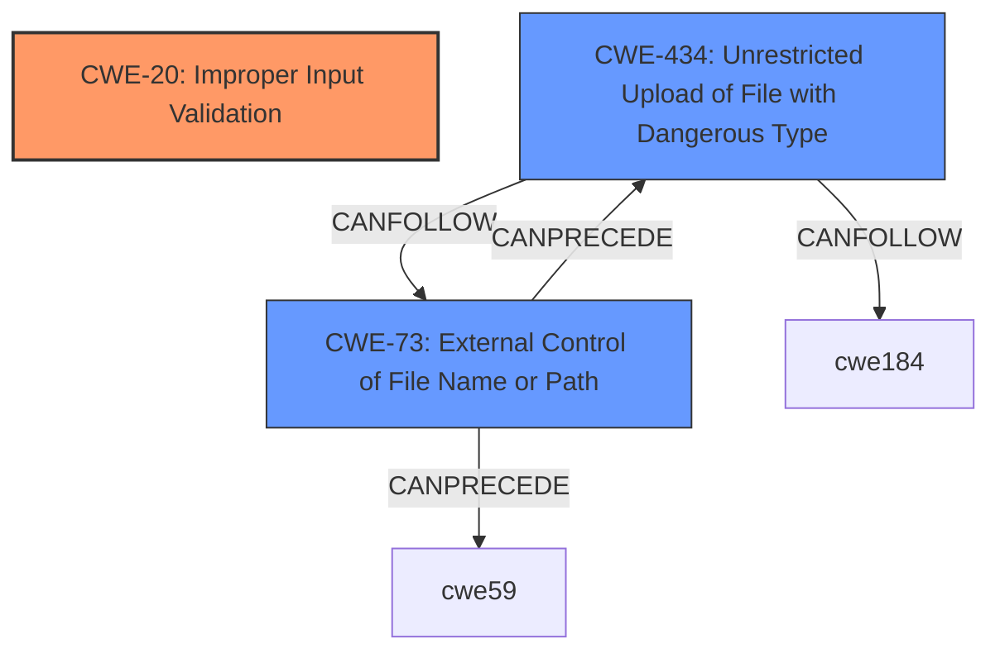

# Analysis Report for CVE-2021-36741

# Vulnerability Analysis Report: CVE-2021-36741

## Description


## Analysis (with Relationship Data)

# Summary
| CWE ID | CWE Name | Confidence | CWE Abstraction Level | CWE Vulnerability Mapping Label | CWE-Vulnerability Mapping Notes |
|---|---|---|---|---|---|
| CWE-20 | Improper Input Validation | 0.8 | Class | Primary | Discouraged |
| CWE-434 | Unrestricted Upload of File with Dangerous Type | 0.5 | Base | Secondary | Allowed |
| CWE-73 | External Control of File Name or Path | 0.3 | Base | Secondary | Allowed |

## Evidence and Confidence

*   **Confidence Score:** 0.8
*   **Evidence Strength:** MEDIUM

## Relationship Analysis
The primary relationship impacting the decision is that CWE-20 [CWE-20: Improper Input Validation] is a high-level Class CWE, and while it directly matches the provided root cause, there are more specific Base CWEs to consider. The secondary CWEs, CWE-434 [CWE-434: Unrestricted Upload of File with Dangerous Type] and CWE-73 [CWE-73: External Control of File Name or Path], represent more specific weaknesses related to file uploads, but their connection is less direct based on the evidence.



## Vulnerability Chain
The chain of root cause and weakness is as follows:
1.  **Root Cause:** CWE-20 [CWE-20: Improper Input Validation] - The system **fails to validate input**, allowing for potentially malicious data to be processed.
2.  CWE-434 [CWE-434: Unrestricted Upload of File with Dangerous Type] - The **improper input validation** leads to the ability to upload files of dangerous types.
3.  CWE-73 [CWE-73: External Control of File Name or Path] - This might lead to external control of file name or path.

## Summary of Analysis
The initial analysis identified CWE-20 [CWE-20: Improper Input Validation] as the primary weakness due to the explicit mention of "**improper input validation**" in the vulnerability description. However, CWE-20 [CWE-20: Improper Input Validation] is a Class CWE, and the description also mentions that this leads to the ability to "upload arbitrary files," which suggests CWE-434 [CWE-434: Unrestricted Upload of File with Dangerous Type] might be a more specific fit as a secondary CWE.

The retriever results also list several relevant CWEs such as CWE-73 [CWE-73: External Control of File Name or Path] and CWE-59 [CWE-59: Improper Link Resolution Before File Access ('Link Following')], indicating potential file-related weaknesses.

The final decision is to keep CWE-20 [CWE-20: Improper Input Validation] as the primary CWE because it directly reflects the stated root cause. I've added CWE-434 [CWE-434: Unrestricted Upload of File with Dangerous Type] as a secondary CWE to represent the specific impact of uploading arbitrary files. CWE-73 [CWE-73: External Control of File Name or Path] is added because it could be a consequence of uploading arbitrary files.

The decision is based on the following evidence:

*   "**improper input validation**" is explicitly mentioned as the root cause.
*   The vulnerability allows a remote attacker "to upload arbitrary files on affected installations."

Therefore, the selected CWEs are at the optimal level of specificity, directly addressing the root cause and the immediate impact of the vulnerability.


## CWE Relationship Analysis

Current CWEs represent these abstraction levels: .


### Vulnerability Chain Analysis

**Chain starting from CWE-59:**
- 59 (Improper Link Resolution Before File Access ('Link Following')) - ROOT


**Chain starting from CWE-434:**
- 434 (Unrestricted Upload of File with Dangerous Type) - ROOT


### CWE Relationship Diagram

```mermaid
graph TD
    classDef primary fill:#f96,stroke:#333,stroke-width:2px
    classDef secondary fill:#69f,stroke:#333
    classDef tertiary fill:#9e9,stroke:#333
```


*Report generated on 2025-03-30 14:27:20*
