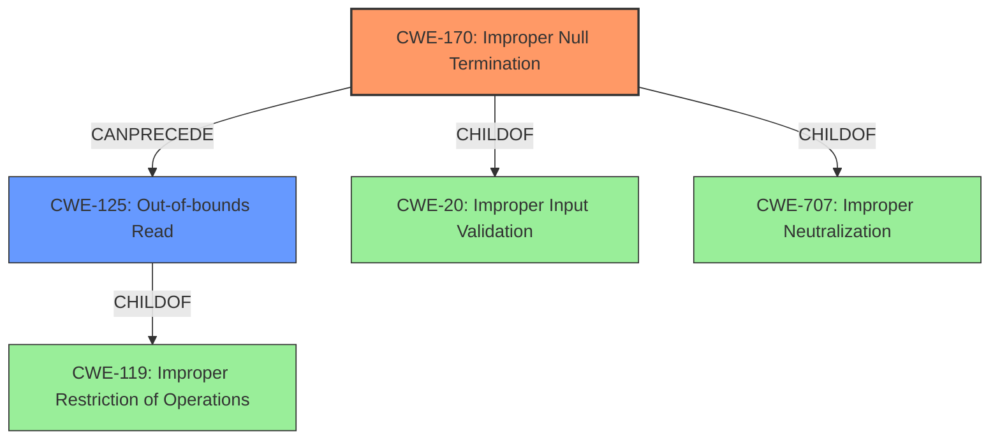

# Analysis Report for CVE-2021-36762

# Vulnerability Analysis Report: CVE-2021-36762

## Description


## Analysis (with Relationship Data)

# Summary
| CWE ID | CWE Name | Confidence | CWE Abstraction Level | CWE Vulnerability Mapping Label | CWE-Vulnerability Mapping Notes |
|---|---|---|---|---|---|
| **CWE-170** | **Improper Null Termination** | 1.0 | Base | Primary | Allowed |
| CWE-125 | Out-of-bounds Read | 0.9 | Base | Secondary | Allowed |

## Evidence and Confidence

*   **Confidence Score:** 0.95
*   **Evidence Strength:** HIGH

## Relationship Analysis
The primary weakness is CWE-170 Improper Null Termination. The secondary weakness is CWE-125 Out-of-bounds Read, which is a consequence of the missing null termination. CWE-170 is a child of CWE-20 and CWE-707, while CWE-125 is a child of CWE-119. The relationship here is that the **lack of null termination** can **lead to** an **out-of-bounds read** when functions like strlen are used.



## Vulnerability Chain
The vulnerability chain is as follows:
1.  **Missing null termination** (CWE-170)
2.  `strlen` reads out of bounds.
3.  **Out-of-bounds read** (CWE-125), leading to a denial of service.

## Summary of Analysis
The vulnerability is primarily due to **improper null termination** (CWE-170). The `tfshnd()` function in `tftpsrv.c` does not ensure that the filename is adequately null-terminated. As a result, a subsequent call to `strlen` might read out of bounds of the protocol packet buffer (CWE-125) if no null byte exists within a reasonable range.

The evidence from the vulnerability description is: "tfshnd()tftpsrv.c TFTP packet processing function doesnt ensure that a filename is adequately \0 terminated therefore, a subsequent call to strlen for the filename might read out of bounds of the protocol packet buffer (if no \0 byte exists within a reasonable range)."

The CVE Reference Links Content Summary confirms this:
"Root cause of vulnerability: The TFTP packet processing function in NicheStack does not ensure that a filename is null-terminated."
"Weaknesses/vulnerabilities present: Missing null termination: The code fails to ensure that the filename within a TFTP packet is properly null-terminated. Out-of-bounds read: When `strlen()` is subsequently called on the filename, it may read beyond the bounds of the protocol packet buffer if the filename is not null-terminated."

CWE-170 is the most specific and accurate representation of the root cause. The out-of-bounds read (CWE-125) is a direct consequence of the missing null termination.

CWE-119 is a higher level class, and the guidance discourages its use when more specific information is available.

Relevant CWE Information:
### CWE-170: Improper Null Termination
**Abstraction:** Base
**Status:** Incomplete

### Description
The product does not terminate or incorrectly terminates a string or array with a null character or equivalent terminator.

### Mapping Guidance
**Usage:** Allowed
**Rationale:** This CWE entry is at the Base level of abstraction, which is a preferred level of abstraction for mapping to the root causes of vulnerabilities.

### CWE-125: Out-of-bounds Read
**Abstraction:** Base
**Status:** Draft

### Description
The product reads data past the end, or before the beginning, of the intended buffer.

### Mapping Guidance
**Usage:** Allowed
**Rationale:** This CWE entry is at the Base level of abstraction, which is a preferred level of abstraction for mapping to the root causes of vulnerabilities.


## CWE Relationship Analysis

Current CWEs represent these abstraction levels: .


### Vulnerability Chain Analysis

**Chain starting from CWE-170:**
- 170 (Improper Null Termination) - ROOT


**Chain starting from CWE-20:**
- 20 (Improper Input Validation) - ROOT


### CWE Relationship Diagram

```mermaid
graph TD
    classDef primary fill:#f96,stroke:#333,stroke-width:2px
    classDef secondary fill:#69f,stroke:#333
    classDef tertiary fill:#9e9,stroke:#333
```


*Report generated on 2025-03-31 06:39:25*
