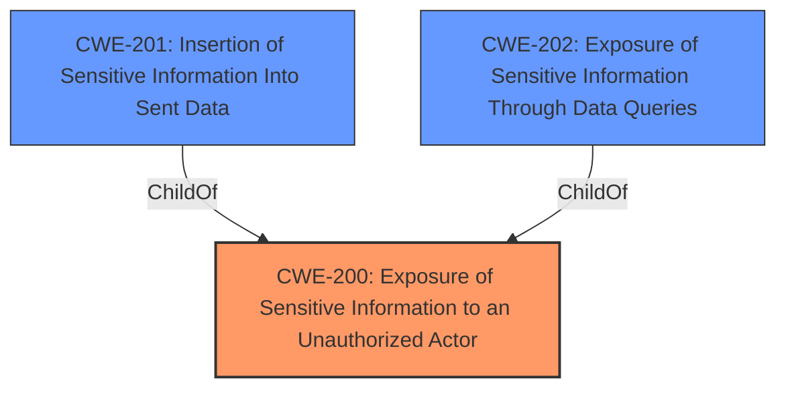

# Enhanced Analysis for CVE-2021-3677

# Summary
| CWE ID | CWE Name | Confidence | CWE Abstraction Level | CWE Vulnerability Mapping Label | CWE-Vulnerability Mapping Notes |
|---|---|---|---|---|---|
| CWE-200 | Exposure of Sensitive Information to an Unauthorized Actor | 0.8 | Class | Primary | Allowed-with-Review, but considered best fit due to the explicit mention of reading arbitrary bytes of server memory.|

## Evidence and Confidence

*   **Confidence Score:** 0.8
*   **Evidence Strength:** HIGH

## Relationship Analysis
The primary CWE is CWE-200, which is a Class-level CWE. While it has children CWEs, none of them precisely fit the vulnerability description. CWE-200 is the parent of CWE-201 (Insertion of Sensitive Information Into Sent Data), but the vulnerability is about reading memory, not inserting data.



## Vulnerability Chain
The vulnerability involves a **purpose-crafted query** that allows an authenticated user to **read arbitrary bytes of server memory**, resulting in the **exposure of sensitive information**.

## Summary of Analysis
The initial analysis focused on identifying a CWE that best describes the vulnerability where a crafted query allows an authenticated user to read arbitrary bytes of server memory. The key phrase here is "**A purpose-crafted query can read arbitrary bytes of server memory**." The CVE Reference Links Content Summary supports this with the statement: "A specifically crafted query can cause the PostgreSQL server to disclose arbitrary bytes of its memory."

CWE-200 (Exposure of Sensitive Information to an Unauthorized Actor) is a Class-level CWE and is typically discouraged because it's often misused. However, in this case, the vulnerability explicitly involves the reading of memory, which directly leads to the exposure of sensitive information. While a more specific CWE would be ideal, none of the children of CWE-200 or other suggested CWEs from the Retriever Results accurately capture the root cause.

CWE-125 (Out-of-bounds Read) was considered because the attack involves reading memory, but the description focuses on the mechanism (crafted query) leading to the read, not the read itself. Also, CWE-125 would be more appropriate if the vulnerability was directly about reading past the end of a buffer, which is not explicitly stated.

CWE-789 (Memory Allocation with Excessive Size Value) was also considered, but it focuses on allocating memory, not reading it.

CWE-202 (Exposure of Sensitive Information Through Data Queries) was considered as well because a crafted query is used. However, the description of CWE-202 focuses on statistical inference, not direct memory reads.

Therefore, I am selecting CWE-200 because it directly addresses the exposure of sensitive information. While it is a Class-level CWE and generally discouraged, the specifics of the vulnerability align well with its description, making it the most appropriate choice.


## CWE Relationship Analysis

Current CWEs represent these abstraction levels: .


### Vulnerability Chain Analysis

**Chain starting from CWE-201:**
- 201 (Insertion of Sensitive Information Into Sent Data) - ROOT


**Chain starting from CWE-200:**
- 200 (Exposure of Sensitive Information to an Unauthorized Actor) - ROOT


### CWE Relationship Diagram

```mermaid
graph TD
    classDef primary fill:#f96,stroke:#333,stroke-width:2px
    classDef secondary fill:#69f,stroke:#333
    classDef tertiary fill:#9e9,stroke:#333
```